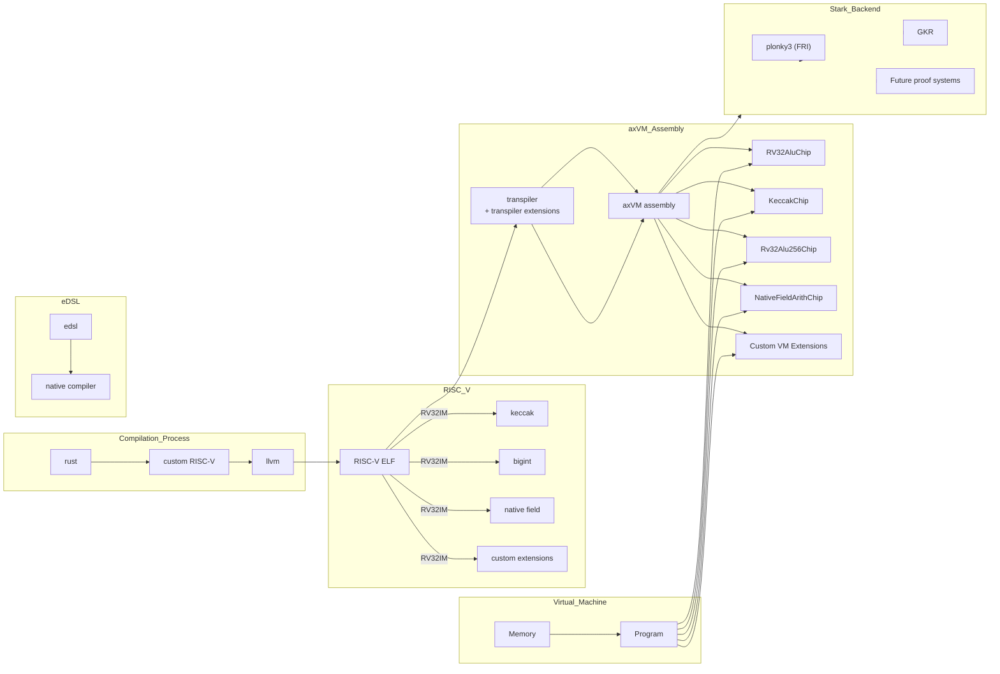

## axVM Contributor Documentation

This directory contains documentation for contributors.

- [Repository and Project Structure](./repo)
- [Design and Specification](./specs)
- [Crates](./crates)

```mermaid
flowchart LR
    subgraph Compilation_Process
        rust --> custom_riscv["custom RISC-V"]
        custom_riscv --> llvm
    end

    subgraph RISC_V
        direction TB
        llvm --> riscv_elf["RISC-V ELF"]
        riscv_elf -->|RV32IM| keccak["keccak"]
        riscv_elf -->|RV32IM| bigint["bigint"]
        riscv_elf -->|RV32IM| native_field["native field"]
        riscv_elf -->|RV32IM| custom_extensions["custom extensions"]
    end

    subgraph axVM_Assembly
        direction TB
        transpiler["transpiler\n+ transpiler extensions"] --> axvm_asm["axVM assembly"]
        axvm_asm --> rv32alu["RV32AluChip"]
        axvm_asm --> keccak_chip["KeccakChip"]
        axvm_asm --> rv32alu256["Rv32Alu256Chip"]
        axvm_asm --> native_field_chip["NativeFieldArithChip"]
        axvm_asm --> custom_vm["Custom VM Extensions"]
    end

    riscv_elf --> transpiler
    transpiler --> axvm_asm

    subgraph Virtual_Machine
        memory["Memory"] --> program["Program"]
        program --> rv32alu
        program --> keccak_chip
        program --> rv32alu256
        program --> native_field_chip
        program --> custom_vm
    end

    subgraph Stark_Backend
        plonky3["plonky3 (FRI)"]
        gkr["GKR"]
        future_proof["Future proof systems"]
    end

    axvm_asm --> Stark_Backend
    Stark_Backend --> plonky3
    Stark_Backend --> gkr
    Stark_Backend --> future_proof

    subgraph eDSL
        edsl --> native_compiler["native compiler"]
    end
```
