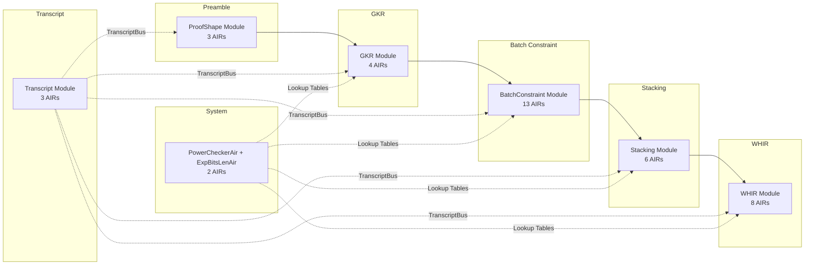

# Recursion Circuit Documentation

## Purpose

The recursion circuit verifies SWIRL proofs inside a SWIRL circuit. The circuit is parameterized by a child verifying key `vk_child`: given `vk_child`, the circuit definition constrains the full SWIRL verification protocol (preamble, GKR, batch constraint evaluation, stacking reduction, and WHIR polynomial commitment). Given a list of valid child proofs (up to a predefined maximum), there is an efficient algorithm to produce a satisfying witness. If any child proof does not verify, no efficient algorithm should be able to find a satisfying witness. This enables proof composition: a single recursive proof can attest to arbitrarily many layers of computation.

The circuit is implemented as a collection of 39 AIRs organized into protocol modules plus
shared lookup/provider AIRs. AIRs communicate through buses (permutation checks and lookups).

For the formal correspondence claim and correctness argument, see [verifier-mapping.md](./verifier-mapping.md).

## Conventions

Unless noted otherwise, this documentation uses the following constants:

- `D_EF = 4` — extension field degree (the BabyBear quartic extension)
- `DIGEST_SIZE = 8` — Poseidon2 digest size in base-field elements
- `CHUNK = 8` — Poseidon2 sponge rate

## Module Organization

The 39 AIRs are organized into modules that mirror the structure of the reference verifier.
The reference verifier (`verify()`) processes a child proof in sequential phases; the circuit
constrains the same relationships via AIR constraints and bus interactions. The module names
and arrows below reflect data-flow dependencies between verifier stages, not a temporal
sequence.

```
ProofShape --> GKR --> BatchConstraint --> Stacking --> WHIR
                                                        |
                                          Transcript (shared by all)
```

- **ProofShape (Preamble)** -- Validates proof structure, observes metadata into the Fiat-Shamir transcript, populates global data buses.
- **GKR** -- Constrains the fractional sumcheck (LogUp) reduction to evaluation claims on the input layer polynomials.
- **BatchConstraint** -- Constrains constraint and interaction expression evaluation at the sumcheck point, verifies the batched claim.
- **Stacking + WHIR** -- Constrains column opening reduction via stacked polynomial commitment and the WHIR polynomial commitment protocol (folding sumcheck, query verification, Merkle proofs, final polynomial check).
- **Transcript** -- Constrains the Poseidon2-based Fiat-Shamir sponge and Merkle tree verification. Shared by all modules via `TranscriptBus`.



## Documentation Map

The top-level module docs are the main correspondence documents for the recursive verifier:

- **[Transcript](./modules/transcript/README.md)** (TranscriptAir, Poseidon2Air, MerkleVerifyAir)
- **[ProofShape](./modules/proof-shape/README.md)** (ProofShapeAir, PublicValuesAir, RangeCheckerAir)
- **[Primitive Lookup Tables](./modules/primitives/README.md)** (PowerCheckerAir, ExpBitsLenAir; also covers Poseidon2Air and RangeCheckerAir lookup contracts)
- **[GKR](./modules/gkr/README.md)** (GkrInputAir, GkrLayerAir, GkrLayerSumcheckAir, GkrXiSamplerAir)
- **[BatchConstraint](./modules/batch-constraint/README.md)** (13 AIRs)
- **[Stacking](./modules/stacking/README.md)** (OpeningClaimsAir, UnivariateRoundAir, SumcheckRoundsAir, StackingClaimsAir, EqBaseAir, EqBitsAir)
- **[WHIR](./modules/whir/README.md)** (8 AIRs)

These module docs follow a common template:

1. **Interface.** External buses forming the module boundary: VK constants, inputs (with receiving AIR), outputs (with sending AIR).
2. **Extraction.** Which AIR traces to read, and how to assemble them into a reference verifier proof fragment.
3. **Contract.** The transcript schedule and reference verifier steps the module encodes.
4. **Module-level argument.** Verification correspondence: mapping each reference verifier check to the responsible AIR.
5. **Lookup dependencies.** Which lookup-table AIRs the module depends on.

**Shared extraction assumption.** Every module's extraction assumes the witness `W`
satisfies all AIR constraints and bus balancing, and that the Transcript contract
establishes a single consistent Fiat-Shamir sponge.

If you want the AIR-level breakdown rather than the module-level correspondence docs, use each module's `airs.md` page:

- **[Transcript AIRs](./modules/transcript/airs.md)**
- **[ProofShape AIRs](./modules/proof-shape/airs.md)**
- **[Primitive AIRs](./modules/primitives/airs.md)**
- **[GKR AIRs](./modules/gkr/airs.md)**
- **[BatchConstraint AIRs](./modules/batch-constraint/airs.md)**
- **[Stacking AIRs](./modules/stacking/airs.md)**
- **[WHIR AIRs](./modules/whir/airs.md)**

Reference and cross-reference documents:

- **[Bus Inventory](./bus-inventory.md)** -- bus definitions, message formats, producers, and consumers
- **[AIR Map](./AIR_MAP.md)** -- complete AIR inventory and bus connectivity by AIR
- **[Verifier Mapping](./verifier-mapping.md)** -- top-level correspondence claim and mapping to the reference verifier
- **[Proof Shape Validation](./proof-shape-validation.md)** -- `verify_proof_shape` correspondence

## Correspondence Decomposition

The main claim decomposes into:

**(T) Transcript consistency.** All transcript interactions across all modules embed into a
single linear transcript indexed by `tidx`, with no duplicated index and no gaps.

**(PS) ProofShape consistency.** The structural messages broadcast by ProofShape
encode `vk_child` and the child proof metadata.

**(LT) Primitive lookup-table correctness.** Each lookup-table AIR's constraints force valid
table entries. This covers:
- *Cryptographic providers:* `Poseidon2Air` (permutation and compression tables).
- *Arithmetic providers:* `PowerCheckerAir` (power-of-two), `ExpBitsLenAir` (exponentiation).
- *Range/bit providers:* `RangeCheckerAir` (range check table).

**(M-GKR, M-BC, M-Stack, M-WHIR) Module extraction.** For each module, given
the incoming bus messages and the transcript, we can extract a proof fragment from
the satisfying trace such that the corresponding reference verification function accepts.
See the per-module documentation linked below.

### Bus semantics

There are two kinds of bus:

**Permutation buses** enforce exact multiset equality between sends and receives.
If a module's AIR constraints require it to send (or receive) a specific message,
then a matching receive (or send) must exist in some other AIR.

**Lookup buses** enforce that every queried key exists in the table (bus
balancing requires it). The table-side multiplicity may or may not be constrained:
- **Unconstrained multiplicity** (common case): the prover sets the table-side
  multiplicity to match however many lookups occur, so the bus always balances as long
  as the key exists.
- **Constrained multiplicity**: the table AIR constrains the multiplicity (e.g., to
  exactly 1 per entry), bounding the number of lookups per key.

In either case, the table entries are prover-controlled, so the table AIR's constraints
must ensure all entries are valid. This is why the Primitive Lookup Tables section
separately establishes that each table AIR's constraints force valid entries.

For full bus definitions and message formats, see [bus-inventory.md](./bus-inventory.md).

## Witness Extraction

`Extract(W)` is a deterministic function from a satisfying witness `W` to a list of
`Proof` objects -- one per `proof_idx`. The `Proof` type (defined in
`stark-backend/src/proof.rs`) contains these top-level fields:

| `Proof` field | Extracted from | Module doc |
| --- | --- | --- |
| `common_main_commit` | ProofShapeAir trace | [ProofShape](./modules/proof-shape/README.md) PS2 (`CommitmentsBus`) |
| `trace_vdata[air_idx]` | ProofShapeAir trace | [ProofShape](./modules/proof-shape/README.md) PS1a-PS1b |
| `public_values[air_idx]` | PublicValuesAir trace | [ProofShape](./modules/proof-shape/README.md) PS4 |
| `gkr_proof` | GkrInputAir, GkrLayerAir, GkrLayerSumcheckAir | [GKR](./modules/gkr/README.md) Extraction |
| `batch_constraint_proof` | FractionsFolderAir, UnivariateSumcheckAir, MultilinearSumcheckAir; `column_openings` from Stacking's OpeningClaimsAir (*) | [BatchConstraint](./modules/batch-constraint/README.md) Extraction |
| `stacking_proof` | UnivariateRoundAir, SumcheckRoundsAir, StackingClaimsAir | [Stacking](./modules/stacking/README.md) Extraction |
| `whir_proof` | WhirRoundAir, SumcheckAir, InitialOpenedValuesAir, NonInitialOpenedValuesAir, FinalPolyMleEvalAir; `mu_pow_witness` from Stacking's StackingClaimsAir (*) | [WHIR](./modules/whir/README.md) Extraction |

(*) Some fields of `BatchConstraintProof` and `WhirProof` are extracted from Stacking AIRs
rather than from the eponymous module's AIRs. This reflects module-boundary differences
between the circuit and the reference verifier: the circuit attributes column opening
observations and mu PoW to the Stacking module, while the reference verifier performs them
in `verify_zerocheck_and_logup` and `verify_whir` respectively. The transcript positions
are identical in both cases. See [Stacking](./modules/stacking/README.md) Extraction for details.

Most proof attributes are **observed** on the transcript (and therefore appear as
`TranscriptBus` messages with `is_sample = 0`). These are directly readable from the
transcript -- any satisfying witness pins their values. **Sampled** values (challenges) are
deterministic functions of preceding observations via the Poseidon2 sponge.

Some attributes are **hinted** rather than observed: Merkle proofs and initial-round opened
rows appear in WHIR AIR traces but are not observed on the transcript. Their correctness is
enforced by `MerkleVerifyBus` (which sends to MerkleVerifyAir, which checks the path via
`Poseidon2CompressBus`) and by the WHIR folding/query constraints.

## AIR Connectivity

Modules are the primary documentation unit. Some module `airs.md` pages use local
implementation sub-sections such as "sumcheck pipeline" or "query verification" for
readability, but the docs no longer use a separate global numbered-group layer across the
whole recursion circuit.

For flat cross-reference material:

- [AIR_MAP.md](./AIR_MAP.md) gives the complete AIR inventory, source paths, per-AIR bus
  connectivity, and major inter-AIR bus connections.
- [bus-inventory.md](./bus-inventory.md) gives the bus definitions, message formats,
  producers, consumers, and invariants.

## Modules and AIRs

### ProofShape Module (3 AIRs)
| AIR | Role |
|-----|------|
| ProofShapeAir | Validates proof structure; observes VK/commitments into transcript; populates global data buses |
| PublicValuesAir | Observes public values into transcript |
| RangeCheckerAir | 8-bit range check lookup table |

### GKR Module (4 AIRs)
| AIR | Role |
|-----|------|
| GkrInputAir | Initializes GKR from ProofShapeAir, outputs claims to batch constraint |
| GkrLayerAir | Layer-by-layer GKR recursive reduction |
| GkrLayerSumcheckAir | Per-layer sumcheck with cubic interpolation |
| GkrXiSamplerAir | Samples additional xi randomness challenges |

### BatchConstraint Module (13 AIRs)
| AIR | Role |
|-----|------|
| SymbolicExpressionAir | Evaluates the constraint/interaction DAG |
| FractionsFolderAir | Bridges GKR claims to batch constraint sumcheck |
| UnivariateSumcheckAir | Front-loaded univariate sumcheck (handles l_skip) |
| MultilinearSumcheckAir | Multilinear sumcheck rounds |
| ExpressionClaimAir | Folds expression claims with mu batching |
| InteractionsFoldingAir | Folds interaction evaluations |
| ConstraintsFoldingAir | Folds constraint evaluations |
| EqNsAir | Multivariate eq polynomial evaluation |
| Eq3bAir | 3-bit equality for interaction indexing |
| EqSharpUniAir | Sharp univariate eq with roots of unity |
| EqSharpUniReceiverAir | Accumulates EqSharpUni products |
| EqUniAir | Univariate eq polynomial evaluation |
| EqNegAir | Negative hypercube eq polynomial evaluation |

### Stacking Module (6 AIRs)
| AIR | Role |
|-----|------|
| OpeningClaimsAir | Processes column opening claims from stacked traces |
| UnivariateRoundAir | Univariate sumcheck for stacking |
| SumcheckRoundsAir | Quadratic sumcheck rounds for stacking |
| StackingClaimsAir | Finalizes stacking; bridges to WHIR |
| EqBaseAir | Base eq polynomial with rotation support |
| EqBitsAir | Bit-decomposed eq polynomial for stacking |

### WHIR Module (8 AIRs)
| AIR | Role |
|-----|------|
| WhirRoundAir | Per-round WHIR control (commitments, challenges, dispatch) |
| SumcheckAir | WHIR folding sumcheck with alpha challenges |
| WhirQueryAir | Generates and dispatches WHIR queries |
| InitialOpenedValuesAir | First-round openings (Poseidon2 permute + Merkle) |
| NonInitialOpenedValuesAir | Subsequent-round openings (Poseidon2 compress + Merkle) |
| WhirFoldingAir | Binary polynomial folding tree |
| FinalPolyMleEvalAir | MLE evaluation of final polynomial |
| FinalPolyQueryEvalAir | Query evaluation of final polynomial |

### Transcript Module (3 AIRs)
| AIR | Role |
|-----|------|
| TranscriptAir | Fiat-Shamir sponge: observe/sample with Poseidon2 |
| Poseidon2Air | Poseidon2 permutation and compression lookups |
| MerkleVerifyAir | Merkle tree path verification |

### System-Level (2 AIRs)
| AIR | Role |
|-----|------|
| PowerCheckerAir | Power-of-base lookup table (used for range-checked exponentiation) |
| ExpBitsLenAir | Bit-length exponentiation for proof-of-work checks |

## Documentation Index

| Document | Description |
|----------|-------------|
| [README.md](./README.md) | This file -- overview, module listing, reading guide |
| [AIR_MAP.md](./AIR_MAP.md) | Complete AIR inventory with source paths, per-AIR bus connectivity, and major inter-AIR bus connection table |
| [bus-inventory.md](./bus-inventory.md) | Comprehensive bus inventory: all buses with types, message formats, invariants, mathematical send/receive set definitions |
| [verifier-mapping.md](./verifier-mapping.md) | Maps each step of the stark-backend `verify()` function to the responsible AIR(s). Includes glue logic correspondence, module chaining, and correctness concerns |
| **Module Documentation** | |
| [Transcript](./modules/transcript/README.md) | Transcript module: interface, contract, sponge correctness |
| [ProofShape](./modules/proof-shape/README.md) | ProofShape module: interface, extraction, statement (PS1-PS4), module-level argument |
| [Primitive Lookup Tables](./modules/primitives/README.md) | Primitive lookup tables: per-table contracts |
| [GKR](./modules/gkr/README.md) | GKR module: interface, extraction, contract, module-level argument |
| [BatchConstraint](./modules/batch-constraint/README.md) | BatchConstraint module: interface, extraction, contract, module-level argument |
| [Stacking](./modules/stacking/README.md) | Stacking module: interface, extraction, contract, module-level argument |
| [WHIR](./modules/whir/README.md) | WHIR module: interface, extraction, contract, module-level argument |
| [proof-shape-validation.md](./proof-shape-validation.md) | Per-check correspondence for `verify_proof_shape` |
| **AIR Documentation** | |
| [Transcript AIRs](./modules/transcript/airs.md) | TranscriptAir, Poseidon2Air, MerkleVerifyAir -- per-AIR details, trace columns, walkthroughs |
| [ProofShape AIRs](./modules/proof-shape/airs.md) | ProofShapeAir, PublicValuesAir, RangeCheckerAir |
| [Primitive AIRs](./modules/primitives/airs.md) | PowerCheckerAir, ExpBitsLenAir |
| [GKR AIRs](./modules/gkr/airs.md) | GkrInputAir, GkrLayerAir, GkrLayerSumcheckAir, GkrXiSamplerAir |
| [BatchConstraint AIRs](./modules/batch-constraint/airs.md) | FractionsFolderAir, UnivariateSumcheckAir, MultilinearSumcheckAir, ExpressionClaimAir, SymbolicExpressionAir, InteractionsFoldingAir, ConstraintsFoldingAir, EqUniAir, EqSharpUniAir, EqSharpUniReceiverAir, Eq3bAir, EqNsAir, EqNegAir |
| [Stacking AIRs](./modules/stacking/airs.md) | OpeningClaimsAir, UnivariateRoundAir, SumcheckRoundsAir, StackingClaimsAir, EqBaseAir, EqBitsAir |
| [WHIR AIRs](./modules/whir/airs.md) | WhirRoundAir, SumcheckAir, WhirQueryAir, InitialOpenedValuesAir, NonInitialOpenedValuesAir, WhirFoldingAir, FinalPolyMleEvalAir, FinalPolyQueryEvalAir |

## Documentation Organization

The documentation has three layers:

- **Module docs** (`modules/<name>/README.md`) describe the correspondence between the circuit and the reference verifier. Each follows a uniform template: interface, extraction, contract (transcript schedule), and module-level argument mapping reference verifier steps to responsible AIRs.

- **AIR docs** (`modules/<name>/airs.md`) describe per-AIR implementation: trace columns, walkthroughs with example data, and bus summaries. Larger modules collect multiple internal AIR subgroups into the same `airs.md` page so the layout stays uniform.

- **[verifier-mapping.md](./verifier-mapping.md)** maps the stark-backend verifier's `verify()` function step-by-step to the recursion circuit AIRs. It also addresses correctness concerns: transcript ordering, LogUp soundness, bus completeness, boundary conditions, and challenge independence.

Reference docs: [AIR_MAP.md](./AIR_MAP.md) for per-AIR bus connectivity, [bus-inventory.md](./bus-inventory.md) for bus definitions and message formats.

## Source Code Location

The recursion circuit source code is at `crates/recursion/src/`. The stark-backend verifier it
constrains is in the [stark-backend](https://github.com/openvm-org/stark-backend) repository at
`crates/stark-backend/src/verifier/`.

Unless explicitly stated otherwise, all `verifier/*.rs` paths referenced throughout these docs
are relative to `crates/stark-backend/src/verifier/` in that external `stark-backend`
repository.
