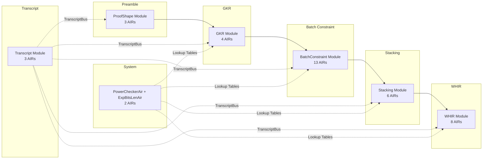
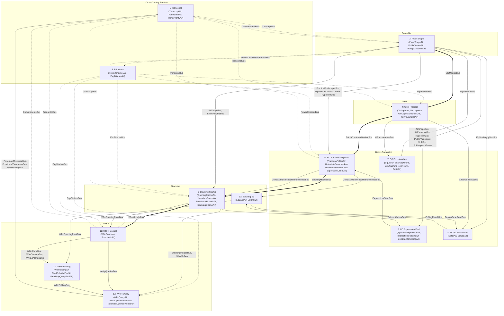

# Recursion Circuit Documentation

## Purpose

The recursion circuit verifies STARK proofs inside a STARK circuit. Given a child proof and its verifying key, the recursion circuit constrains the full SWIRL/STARK verification protocol -- preamble, GKR, batch constraint evaluation, stacking reduction, and WHIR polynomial commitment -- so that a valid recursion proof attests to the validity of the child proof. This enables proof composition: a single recursive proof can attest to arbitrarily many layers of computation.

The circuit is implemented as a collection of 39 AIRs organized into 6 modules plus 2 system-level AIRs. AIRs communicate through typed buses (permutation checks and lookups) with no out-of-band data flow.

## Overall Pipeline

```
ProofShape --> GKR --> BatchConstraint --> Stacking --> WHIR
                                                        |
                                          Transcript (shared by all)
```

The verifier processes a child proof in four sequential phases:

1. **ProofShape (Preamble)** -- Observe proof metadata into the Fiat-Shamir transcript, validate proof structure, populate global data buses.
2. **GKR** -- Reduce the fractional sumcheck claim (LogUp) to evaluation claims on the input layer polynomials.
3. **BatchConstraint** -- Evaluate constraint and interaction expressions at the sumcheck point, verify the batched claim.
4. **Stacking + WHIR** -- Reduce column opening claims via stacked polynomial commitment, then verify the WHIR polynomial commitment protocol (folding sumcheck, query verification, Merkle proofs, final polynomial check).

The **Transcript** module runs alongside all phases, constraining the Poseidon2-based Fiat-Shamir sponge and Merkle tree verification.



## AIR Group Architecture

The 39 AIRs are organized into 13 logical groups, partitioned by bus connectivity. While the module view above shows the high-level pipeline, the group view reflects how AIRs are actually coupled through shared buses and matches the [per-group documentation](#documentation-index) below.



**Diagram key:** Thick arrows (`==>`) are pipeline handoff buses. Solid arrows (`-->`) are permutation/data buses. Dashed arrows (`-.->`) are lookup buses. TranscriptBus reaches all groups but is shown only for the primary pipeline groups.

### Group Summary

| Group | Name | AIRs | Role |
|-------|------|------|------|
| 1 | Transcript Infrastructure | TranscriptAir, Poseidon2Air, MerkleVerifyAir | Fiat-Shamir sponge, Poseidon2 lookups, Merkle verification |
| 2 | Proof Shape & Range Check | ProofShapeAir, PublicValuesAir, RangeCheckerAir | Proof metadata, public values, 8-bit range check table |
| 3 | Primitive Lookup Tables | PowerCheckerAir, ExpBitsLenAir | Power-of-two and bit-length exponentiation tables |
| 4 | GKR Protocol | GkrInputAir, GkrLayerAir, GkrLayerSumcheckAir, GkrXiSamplerAir | Layer-by-layer GKR reduction, xi challenge sampling |
| 5 | BC Sumcheck Pipeline | FractionsFolderAir, UnivariateSumcheckAir, MultilinearSumcheckAir, ExpressionClaimAir | Univariate then multilinear sumcheck, claim folding |
| 6 | BC Expression Evaluation | SymbolicExpressionAir, InteractionsFoldingAir, ConstraintsFoldingAir | DAG-based constraint/interaction evaluation |
| 7 | BC Eq Univariate | EqUniAir, EqSharpUniAir, EqSharpUniReceiverAir, Eq3bAir | Univariate equality polynomials |
| 8 | BC Eq Multivariate | EqNsAir, EqNegAir | Multivariate and negative-dim equality polynomials |
| 9 | Stacking Claims & Opening | OpeningClaimsAir, UnivariateRoundAir, SumcheckRoundsAir, StackingClaimsAir | Column opening, stacking sumcheck, WHIR handoff |
| 10 | Stacking Eq Helpers | EqBaseAir, EqBitsAir | Base and bit-decomposed eq polynomials for stacking |
| 11 | WHIR Control | WhirRoundAir, SumcheckAir (WHIR) | Per-round WHIR control, folding sumcheck |
| 12 | WHIR Query Verification | WhirQueryAir, InitialOpenedValuesAir, NonInitialOpenedValuesAir | Query dispatch, Merkle opening, Poseidon2 hashing |
| 13 | WHIR Folding & Final Poly | WhirFoldingAir, FinalPolyMleEvalAir, FinalPolyQueryEvalAir | Polynomial folding tree, final poly evaluation |

For complete per-AIR bus connectivity and the full cross-group bus connection table, see [AIR_MAP.md](./AIR_MAP.md). For individual bus definitions and message formats, see [bus-inventory.md](./bus-inventory.md).

## Modules and AIRs

### ProofShape Module (3 AIRs)
| AIR | Role |
|-----|------|
| ProofShapeAir | Validates proof structure; observes VK/commitments into transcript; populates global data buses |
| PublicValuesAir | Observes public values into transcript |
| RangeCheckerAir | 8-bit range check lookup table |

### GKR Module (4 AIRs)
| AIR | Role |
|-----|------|
| GkrInputAir | Initializes GKR from ProofShapeAir, outputs claims to batch constraint |
| GkrLayerAir | Layer-by-layer GKR recursive reduction |
| GkrLayerSumcheckAir | Per-layer sumcheck with cubic interpolation |
| GkrXiSamplerAir | Samples additional xi randomness challenges |

### BatchConstraint Module (13 AIRs)
| AIR | Role |
|-----|------|
| SymbolicExpressionAir | Evaluates the constraint/interaction DAG |
| FractionsFolderAir | Bridges GKR claims to batch constraint sumcheck |
| UnivariateSumcheckAir | Front-loaded univariate sumcheck (handles l_skip) |
| MultilinearSumcheckAir | Multilinear sumcheck rounds |
| ExpressionClaimAir | Folds expression claims with mu batching |
| InteractionsFoldingAir | Folds interaction evaluations |
| ConstraintsFoldingAir | Folds constraint evaluations |
| EqNsAir | Multivariate eq polynomial evaluation |
| Eq3bAir | 3-bit equality for interaction indexing |
| EqSharpUniAir | Sharp univariate eq with roots of unity |
| EqSharpUniReceiverAir | Accumulates EqSharpUni products |
| EqUniAir | Univariate eq polynomial evaluation |
| EqNegAir | Negative hypercube eq polynomial evaluation |

### Stacking Module (6 AIRs)
| AIR | Role |
|-----|------|
| OpeningClaimsAir | Processes column opening claims from stacked traces |
| UnivariateRoundAir | Univariate sumcheck for stacking |
| SumcheckRoundsAir | Quadratic sumcheck rounds for stacking |
| StackingClaimsAir | Finalizes stacking; bridges to WHIR |
| EqBaseAir | Base eq polynomial with rotation support |
| EqBitsAir | Bit-decomposed eq polynomial for stacking |

### WHIR Module (8 AIRs)
| AIR | Role |
|-----|------|
| WhirRoundAir | Per-round WHIR control (commitments, challenges, dispatch) |
| SumcheckAir | WHIR folding sumcheck with alpha challenges |
| WhirQueryAir | Generates and dispatches WHIR queries |
| InitialOpenedValuesAir | First-round openings (Poseidon2 permute + Merkle) |
| NonInitialOpenedValuesAir | Subsequent-round openings (Poseidon2 compress + Merkle) |
| WhirFoldingAir | Binary polynomial folding tree |
| FinalPolyMleEvalAir | MLE evaluation of final polynomial |
| FinalPolyQueryEvalAir | Query evaluation of final polynomial |

### Transcript Module (3 AIRs)
| AIR | Role |
|-----|------|
| TranscriptAir | Fiat-Shamir sponge: observe/sample with Poseidon2 |
| Poseidon2Air | Poseidon2 permutation and compression lookups |
| MerkleVerifyAir | Merkle tree path verification |

### System-Level (2 AIRs)
| AIR | Role |
|-----|------|
| PowerCheckerAir | Power-of-base lookup table (used for range-checked exponentiation) |
| ExpBitsLenAir | Bit-length exponentiation for proof-of-work checks |

## Documentation Index

| Document | Description |
|----------|-------------|
| [README.md](./README.md) | This file -- overview, module listing, pipeline diagram |
| [AIR_MAP.md](./AIR_MAP.md) | Complete AIR inventory with bus connectivity per AIR, logical grouping into 13 groups, and cross-group bus connection table |
| [bus-inventory.md](./bus-inventory.md) | Comprehensive bus inventory: all buses with types, message formats, invariants, mathematical send/receive set definitions |
| [verifier-mapping.md](./verifier-mapping.md) | Maps each step of the stark-backend `verify()` function to the responsible AIR(s). Addresses correctness concerns: transcript ordering, LogUp soundness, bus completeness, boundary conditions, and challenge independence |
| **Group Documentation** | |
| [group-01-transcript.md](./group-01-transcript.md) | TranscriptAir, Poseidon2Air, MerkleVerifyAir |
| [group-02-proof-shape.md](./group-02-proof-shape.md) | ProofShapeAir, PublicValuesAir, RangeCheckerAir |
| [group-03-primitives.md](./group-03-primitives.md) | PowerCheckerAir, ExpBitsLenAir |
| [group-04-gkr.md](./group-04-gkr.md) | GkrInputAir, GkrLayerAir, GkrLayerSumcheckAir, GkrXiSamplerAir |
| [group-05-batch-constraint-sumcheck.md](./group-05-batch-constraint-sumcheck.md) | FractionsFolderAir, UnivariateSumcheckAir, MultilinearSumcheckAir, ExpressionClaimAir |
| [group-06-batch-constraint-expr-eval.md](./group-06-batch-constraint-expr-eval.md) | SymbolicExpressionAir, InteractionsFoldingAir, ConstraintsFoldingAir |
| [group-07-eq-univariate.md](./group-07-eq-univariate.md) | EqUniAir, EqSharpUniAir, EqSharpUniReceiverAir, Eq3bAir |
| [group-08-eq-multivariate.md](./group-08-eq-multivariate.md) | EqNsAir, EqNegAir |
| [group-09-stacking-claims.md](./group-09-stacking-claims.md) | OpeningClaimsAir, UnivariateRoundAir, SumcheckRoundsAir, StackingClaimsAir |
| [group-10-stacking-eq.md](./group-10-stacking-eq.md) | EqBaseAir, EqBitsAir |
| [group-11-whir-control.md](./group-11-whir-control.md) | WhirRoundAir, SumcheckAir (WHIR) |
| [group-12-whir-query.md](./group-12-whir-query.md) | WhirQueryAir, InitialOpenedValuesAir, NonInitialOpenedValuesAir |
| [group-13-whir-folding.md](./group-13-whir-folding.md) | WhirFoldingAir, FinalPolyMleEvalAir, FinalPolyQueryEvalAir |

## How to Read the Documentation

**Start here** (README.md) for the high-level architecture: what the recursion circuit does, how many AIRs there are, and how they are organized into modules.

**For AIR-level detail**, read [AIR_MAP.md](./AIR_MAP.md). It lists every AIR with its file location, role, and complete bus connectivity. The 13 logical groups show which AIRs are tightly coupled and which buses bridge between groups.

**For correctness arguments**, read [verifier-mapping.md](./verifier-mapping.md). It maps the stark-backend verifier's `verify()` function step-by-step to the recursion circuit AIRs, demonstrating that every verifier computation is constrained. It also addresses five critical correctness concerns:

1. **Transcript ordering** -- How TranscriptAir ensures Fiat-Shamir consistency
2. **LogUp soundness** -- How ProofShapeAir enforces interaction count bounds
3. **Bus completeness** -- Why no data flows out-of-band
4. **Boundary conditions** -- How first/last row constraints work
5. **Challenge independence** -- How Poseidon2 ensures prover cannot influence challenges

## Source Code Location

The recursion circuit source code is at `openvm/crates/recursion/src/` within the v2-proof-system repository. The stark-backend verifier it constrains is at `stark-backend/crates/stark-backend/src/verifier/`.
