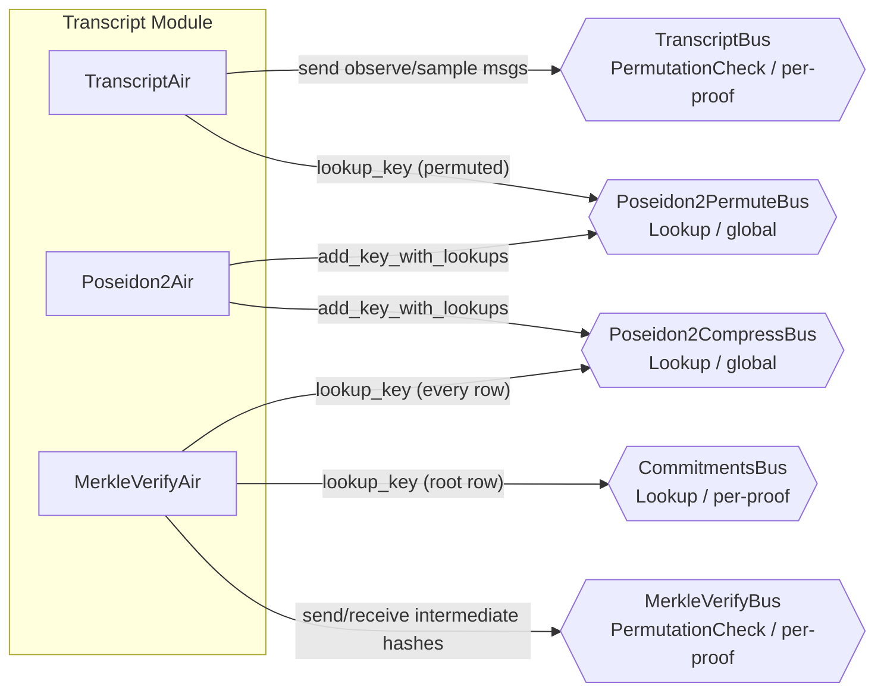

# Group 01 -- Transcript Infrastructure

The transcript group implements the Fiat-Shamir transcript, Poseidon2 hash computations, and Merkle tree verification. Together these three AIRs ensure that every observe and sample operation in the interactive proof protocol is deterministically bound to a Poseidon2 sponge state, that all hash evaluations are correct, and that every commitment opened via a Merkle path resolves to the claimed root.



---

## TranscriptAir

**Source:** `crates/recursion/src/transcript/transcript/air.rs`

### Executive Summary

TranscriptAir is the sponge-based Fiat-Shamir transcript. Each row represents one interaction with the Poseidon2 sponge: either absorbing up to CHUNK=8 field elements (observe) or squeezing up to 8 elements (sample). The AIR maintains a 16-element Poseidon2 state across rows. When a permutation is needed between rounds, it looks up the Poseidon2PermuteBus to prove the state transition.

### Public Values

None.

### AIR Guarantees

1. **Transcript messages (TranscriptBus — sends):** For each observe or sample operation, sends `(tidx, value, is_sample)` on TranscriptBus with sequential transcript indices within each proof. Observe messages carry absorbed field elements; sample messages carry squeezed field elements.
2. **Poseidon2 correctness (Poseidon2PermuteBus — lookup):** Every sponge state transition is verified via a lookup on Poseidon2PermuteBus, ensuring the Fiat-Shamir transcript is deterministically bound to a correct Poseidon2 permutation chain.

### Walkthrough

Consider a proof that observes 3 field elements then samples 2 elements.

```
Row | proof_idx | is_proof_start | tidx | is_sample | mask[0..7]       | prev_state[0..7]     | post_state[0..7]
----|-----------|----------------|------|-----------|------------------|----------------------|--------------------
 0  |     0     |       1        |   0  |     0     | 1 1 1 0 0 0 0 0  | v0 v1 v2 0 0 0 0 0  | p0 p1 p2 p3 ...
 1  |     0     |       0        |   3  |     1     | 1 1 0 0 0 0 0 0  | p0 p1 p2 p3 ...      | p0 p1 p2 p3 ...
```

- **Row 0 (observe 3 values):** `is_proof_start=1` forces `tidx=0`. Three mask bits are set. Sends `(0, v0, 0)`, `(1, v1, 0)`, `(2, v2, 0)` on TranscriptBus. The sponge is permuted (a mode transition or full CHUNK absorbed), so a lookup verifies `Poseidon2(prev_state) = post_state`.
- **Row 1 (sample 2 values):** `tidx=3` (previous tidx + 3 active bits). Two mask bits set with `is_sample=1`. Sends `(3, prev_state[7], 1)` and `(4, prev_state[6], 1)` -- note the reversed indexing (`prev_state[CHUNK-1-i]`) for squeeze. No permutation needed here, so `prev_state == post_state`.

### Trace Columns

```
TranscriptCols<T> {
    proof_idx: T,                  // Which child proof this row belongs to
    is_proof_start: T,             // Boolean: first row of a new proof
    tidx: T,                       // Transcript index (monotonically increasing within a proof)
    is_sample: T,                  // Boolean: 0=absorb/observe, 1=squeeze/sample
    mask: [T; CHUNK],              // CHUNK=8 boolean indicators for active positions
    prev_state: [T; POSEIDON2_WIDTH],  // Input state (WIDTH=16)
    post_state: [T; POSEIDON2_WIDTH],  // Output state after permutation
}
```

Whether a Poseidon2 permutation occurs is determined dynamically from the constraint logic: a permutation is enforced at observe-to-sample mode transitions and whenever a full CHUNK of observations has been absorbed. When no permutation occurs, `prev_state == post_state` is constrained.

### NestedForLoopSubAir

TranscriptAir uses `NestedForLoopSubAir<1>` for proof-index tracking. This sub-AIR manages the `proof_idx` counter and `is_proof_start` flag, ensuring correct sequencing across multiple child proofs.

### FinalTranscriptStateBus (Continuations)

When continuations are enabled, TranscriptAir sends the final Poseidon2 sponge state on the last row of each proof via `FinalTranscriptStateBus`. This allows the continuations circuit to resume the transcript state in the next segment.

### Observe vs Sample Ordering

A critical detail is that observe and sample use different element ordering within the rate portion of the sponge state:

- **Observe (absorb):** Elements map to positions 0, 1, 2, ..., CHUNK-1 in normal order.
- **Sample (squeeze):** Elements map to positions CHUNK-1, CHUNK-2, ..., 0 in reverse order.

This means `tidx+0` reads `prev_state[CHUNK-1]` during sample, `tidx+1` reads `prev_state[CHUNK-2]`, etc. The reversed ordering matches the transcript protocol specification.

### State Continuity Between Rows

The capacity portion of the state (indices CHUNK..WIDTH, i.e., positions 8..15) always carries over between consecutive rows of the same proof. The rate portion depends on the operation type and the mask:

- If the next row is an absorb and `mask[i]=0` for position i, the rate element carries over unchanged.
- If the next row is a squeeze, all rate elements carry over unchanged (squeeze reads from the current state without modifying it).

When no permutation is needed (determined by the constraint logic), `prev_state == post_state` is enforced. A Poseidon2 permutation is triggered at mode transitions (observe ↔ sample) and when a full CHUNK of observations has been absorbed. The permutation constraint ensures that on rows where `is_sample` changes between the current and next row (within the same proof) and `count == CHUNK`, the sponge state is permuted.

---

## Poseidon2Air

**Source:** `crates/recursion/src/transcript/poseidon2.rs`

### Executive Summary

Poseidon2Air is the central hash execution table. Each row contains a full Poseidon2 permutation with 16-element input and output, plus two multiplicity columns. The `permute_mult` column counts how many times this (input, output) pair is used as a full permutation (by TranscriptAir), while `compress_mult` counts compression uses (by MerkleVerifyAir). Duplicate inputs may be deduplicated across rows.

### Public Values

None.

### AIR Guarantees

1. **Permutation lookup (Poseidon2PermuteBus — provides):** Provides `(input[0..16], output[0..16])` where `output = Poseidon2(input)`.
2. **Compression lookup (Poseidon2CompressBus — provides):** Provides `(input[0..16], output[0..DIGEST_SIZE])` where `output = Poseidon2(input)[0..DIGEST_SIZE]`.

### Walkthrough

```
Row | input[0..15]                  | output[0..15]                 | permute_mult | compress_mult
----|-------------------------------|-------------------------------|--------------|---------------
 0  | v0 v1 v2 0 0 0 0 0 0...0     | p0 p1 p2 p3 p4 ... p15       |      1       |       0
 1  | h0 h1 h2 h3 h4 h5 h6 h7 s0.. | c0 c1 c2 c3 c4 c5 c6 c7 ... |      0       |       2
```

- **Row 0:** A full permutation used once by TranscriptAir (absorb). `permute_mult=1` means one lookup from TranscriptAir.
- **Row 1:** A compression used twice by MerkleVerifyAir (two Merkle paths share the same sibling pair). Input is `left || right` (each 8 elements). Output first 8 elements are the digest.

### Trace Columns

```
Poseidon2Cols<T, SBOX_REGISTERS> {
    inner: Poseidon2SubCols<T, SBOX_REGISTERS>,  // Full round-by-round permutation state
    permute_mult: T,                              // Lookup count for full permutation
    compress_mult: T,                             // Lookup count for compression (first 8 output)
}
```

The `inner` field contains the full Poseidon2 sub-AIR columns including inputs, beginning full rounds, partial rounds, and ending full rounds. The width depends on `SBOX_REGISTERS` which controls the degree of the S-box constraint decomposition.

### Deduplication

The transcript module (`mod.rs`) deduplicates identical Poseidon2 inputs before populating the trace. When multiple AIR rows across TranscriptAir and MerkleVerifyAir use the same input, only one Poseidon2Air row is created with accumulated multiplicity. This significantly reduces the Poseidon2 trace size in practice.

---

## MerkleVerifyAir

**Source:** `crates/recursion/src/transcript/merkle_verify/air.rs`

### Executive Summary

MerkleVerifyAir verifies Merkle authentication paths, with an extended leaf-combining phase. Each Merkle proof has two phases: (1) combining `2^k` leaf hashes into a single root via a binary tree of `2^k - 1` compressions, and (2) walking up `depth` levels of a standard Merkle proof using sibling hashes. Every row performs one Poseidon2 compression (`left || right -> output`). At the final row, the result is checked against a commitment via CommitmentsBus. MerkleVerifyAir uses **single-row constraints only** (no next-row access).

### Public Values

None.

### AIR Guarantees

1. **Leaf reception (MerkleVerifyBus — receives):** Receives leaf hashes `(merkle_idx_bit_src, current_idx_bit_src, total_depth, height=0, is_leaf=1, leaf_sub_idx, value, commit_major, commit_minor)` from InitialOpenedValuesAir and NonInitialOpenedValuesAir.
2. **Hash verification (Poseidon2CompressBus — lookup):** Every intermediate hash in each Merkle authentication path is verified via Poseidon2CompressBus.
3. **Commitment check (CommitmentsBus — lookup):** The root of each Merkle path is verified against a commitment `(commit_major, commit_minor, root_digest)` on CommitmentsBus.
4. **Index shifting (RightShiftBus — lookup):** Computes `current_idx_bit_src` by right-shifting `merkle_idx_bit_src` by `max(0, total_depth - k)`, separating the leaf tree index from the authentication path index.

### Walkthrough

Consider k=1 (2 leaves) and a Merkle proof of depth 2.

```
Row | is_first | is_last | is_leaf | height | merkle_idx_bit_src | left      | right     | output    | recv_flag
----|----------|---------|---------|--------|--------------------|-----------|-----------|-----------|----------
 0  |    1     |    0    |    1    |   0    |        5           | leaf0     | leaf1     | hash_01   |    2
 1  |    0     |    0    |    0    |   1    |        5           | hash_01   | sibling_1 | hash_1    |    0
 2  |    0     |    0    |    0    |   2    |        5           | sibling_2 | hash_1    | hash_2    |    1
 3  |    0     |    1    |    0    |   3    |        5           | root      | root      | _         |    0
```

- **Row 0 (leaf combining):** Compresses leaf0 and leaf1. Both are received from MerkleVerifyBus (`recv_flag=2` means both left and right). The `is_leaf=1` flag indicates this is the leaf-combining phase. `is_last_leaf=1` marks the root of the leaf hash tree.
- **Row 1 (Merkle proof):** `merkle_idx_bit_src=5` determines left/right placement via the parity of the shifted index at each height. `recv_flag=0` means left child is from the previous hash, right child is the sibling.
- **Row 3 (root):** `left == right` (both equal the root commitment). Lookups CommitmentsBus with `(commit_major, commit_minor, root)`.

Each row also performs a Poseidon2CompressBus lookup to verify the compression is correct.

### Key Design: recv_flag

A single ternary `recv_flag` column controls which children are received:
- `recv_flag = 0`: left child is received from MerkleVerifyBus (self-send from previous level)
- `recv_flag = 1`: right child is received from MerkleVerifyBus
- `recv_flag = 2`: both children are received (leaf combining phase)

### Key Design: Merkle Index Separation

The `merkle_idx_bit_src` field carries the raw Merkle index. The `current_idx_bit_src` field is derived by right-shifting `merkle_idx_bit_src` to separate the leaf tree portion from the authentication path portion. This right-shift is verified via the `RightShiftBus` lookup, ensuring that the index derivation is consistent without requiring multi-row constraints.

---

## Bus Summary

| Bus | Type | Direction in This Group | Participants |
|-----|------|------------------------|-------------|
| [TranscriptBus](bus-inventory.md#11-transcriptbus) | PermutationCheck (per-proof) | TranscriptAir sends | All other AIR groups receive |
| [Poseidon2PermuteBus](bus-inventory.md#21-poseidon2permutebus) | Lookup (global) | Poseidon2Air provides keys; TranscriptAir looks up | Internal |
| [Poseidon2CompressBus](bus-inventory.md#22-poseidon2compressbus) | Lookup (global) | Poseidon2Air provides keys; MerkleVerifyAir looks up | Internal |
| [CommitmentsBus](bus-inventory.md#34-commitmentsbus) | Lookup (per-proof) | MerkleVerifyAir looks up | ProofShapeAir provides keys |
| [MerkleVerifyBus](bus-inventory.md#17-merkleverifybus) | PermutationCheck (per-proof) | MerkleVerifyAir sends/receives internally | Internal |
| [FinalTranscriptStateBus](bus-inventory.md#515-finaltranscriptstatebus) | PermutationCheck (per-proof) | TranscriptAir sends (continuations only) | Continuations circuit |
