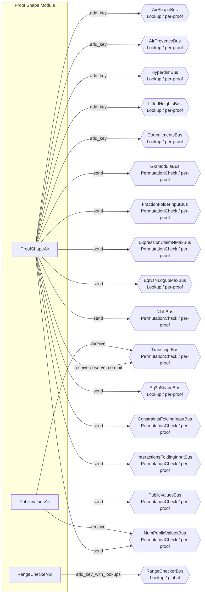

# Group 02 -- Proof Shape and Public Values

The proof shape group establishes the structure of each child proof being verified. ProofShapeAir iterates over AIRs in each child proof, populating lookup tables for air shapes, commitments, and hyperdimensional parameters. PublicValuesAir reads public values from the transcript and distributes them. RangeCheckerAir provides a simple 8-bit range-check lookup table used throughout the circuit.



---

## ProofShapeAir

**Source:** `openvm/crates/recursion/src/proof_shape/proof_shape/air.rs`

### Executive Summary

ProofShapeAir is the most complex AIR in the recursion circuit. It iterates over each child proof's AIRs (sorted by descending log_height) and establishes the lookup tables that the rest of the circuit uses. For each AIR, it publishes shape properties (air_id, num_interactions, need_rot), hyperdimensional parameters, lifted heights, and commitments. On the summary row (the last row for each proof), it validates that total interactions stay within bounds and sends module-level messages to kick off GKR and batch constraint verification.

### Public Values

None.

### AIR Guarantees

1. **Shape tables (AirShapeBus — provides):** For each child AIR, provides `(sort_idx, AirId, air_id)`, `(sort_idx, NumInteractions, num_interactions)`, and `(sort_idx, NeedRot, need_rot)`.
2. **AIR presence (AirPresenceBus — provides):** For each possible AIR index, provides `(air_idx, is_present)` indicating whether the AIR is present in the child proof.
3. **Hyperdimensional parameters (HyperdimBus — provides):** Provides `(sort_idx, n_abs, n_sign_bit)` for each child AIR.
4. **Lifted heights (LiftedHeightsBus — provides):** Provides `(sort_idx, part_idx, commit_idx, hypercube_dim, lifted_height, log_lifted_height)` for each AIR partition.
5. **Commitments (CommitmentsBus — provides):** Reads commitments from the transcript (TranscriptBus) and provides `(major_idx, minor_idx, commitment)` for each commitment.
6. **Interaction bound (RangeCheckerBus — lookup):** Enforces `total_interactions < max_interaction_count` via range checks.
7. **Height verification (PowerCheckerBus — lookup):** Verifies `height = 2^log_height` for each AIR via power-of-two lookup.
8. **Module handoffs:** Sends `(tidx, n_logup, n_max, is_n_max_greater)` on GkrModuleBus, `(num_present_airs)` on FractionFolderInputBus, `(n_max)` on ExpressionClaimNMaxBus, `(n_logup, n_max)` on EqNsNLogupMaxBus, and `(air_idx, n_lift)` on NLiftBus.
9. **Eq3b shape (Eq3bShapeBus — sends):** Sends `(sort_idx, n_lift, n_logup)` for each present AIR, providing shape parameters needed by Eq3bAir.
10. **Folding inputs (ConstraintsFoldingInputBus, InteractionsFoldingInputBus — sends):** Sends the transcript index for the lambda and beta challenges, respectively, to the folding AIRs.
11. **Cached commits (CachedCommitBus — sends):** Sends cached commitment data for continuations support.
12. **VK pre-hash (PreHashBus — sends):** Sends the child VK pre-hash for continuations support.
13. **Public values coordination (NumPublicValuesBus — sends):** Sends per-AIR public value counts to PublicValuesAir.
14. **Transcript (TranscriptBus — receives):** Receives commitment observations from the transcript.

### Walkthrough

For a child proof with 2 AIRs (air_id=0 at log_height=10, air_id=1 at log_height=8):

```
Row | proof_idx | is_first | is_last | sorted_idx | air_id | log_height | is_present | n_abs | n_sign
----|-----------|----------|---------|------------|--------|------------|------------|-------|-------
 0  |     0     |    1     |    0    |     0      |   0    |     10     |     1      |   2   |   0
 1  |     0     |    0     |    0    |     1      |   1    |      8     |     1      |   0   |   0
 2  |     0     |    0     |    1    |     -      |   -    |      -     |     0      |   -   |   -
```

- **Row 0:** First AIR (highest log_height). Publishes shape properties and hyperdim params. `n_abs = |10 - 8| = 2` (assuming l_skip=8).
- **Row 1:** Second AIR. `n_abs = |8 - 8| = 0`.
- **Row 2 (summary):** Validates total interaction count. Sends GkrModuleBus message with accumulated `n_logup` and `n_max`. Sends FractionFolderInputBus with `num_present_airs=2`. Also sends Eq3bShapeBus, ConstraintsFoldingInputBus, InteractionsFoldingInputBus, and EqNsNLogupMaxBus messages.

AIR selection uses an `idx_flags` encoder (flag columns that decode to the AIR index). The `need_rot` property is loaded from air_data metadata. The `n_logup` value is tracked as an explicit column on each row.

---

## PublicValuesAir

**Source:** `openvm/crates/recursion/src/proof_shape/pvs/air.rs`

### Executive Summary

PublicValuesAir reads public values from the transcript and distributes them to the rest of the circuit. It iterates over each proof's AIRs and their public values, reading each value from the transcript (via TranscriptBus receive) and publishing it on PublicValuesBus. It also coordinates with ProofShapeAir through NumPublicValuesBus.

### Public Values

None.

### AIR Guarantees

1. **Public value distribution (PublicValuesBus — sends):** Sends `(air_idx, pv_idx, value)` for every public value in every child AIR.
2. **Transcript reads (TranscriptBus — receives):** Receives each public value from TranscriptBus, confirming it was observed at the correct transcript position.
3. **Count coordination (NumPublicValuesBus — receives):** Receives per-AIR public value counts from ProofShapeAir, ensuring the correct number of values is distributed.

### Walkthrough

For a proof with AIR 0 having 2 public values and AIR 1 having 1 public value:

```
Row | is_valid | proof_idx | air_idx | pv_idx | is_first_proof | is_first_air | tidx | value
----|----------|-----------|---------|--------|----------------|--------------|------|------
 0  |    1     |     0     |    0    |   0    |       1        |      1       |  10  |  v0
 1  |    1     |     0     |    0    |   1    |       0        |      0       |  11  |  v1
 2  |    1     |     0     |    1    |   0    |       0        |      1       |  15  |  v2
 3  |    0     |     1     |    -    |   -    |       0        |      0       |   -  |   -
```

- **Row 0-1:** Public values for AIR 0. Receives `(10, v0, 0)` and `(11, v1, 0)` from TranscriptBus. Sends `(0, 0, v0)` and `(0, 1, v1)` on PublicValuesBus.
- **Row 2:** Public value for AIR 1. `is_first_in_air=1` triggers a NumPublicValuesBus receive for the previous AIR's count.

---

## RangeCheckerAir

**Source:** `openvm/crates/recursion/src/primitives/range/air.rs`

### Executive Summary

RangeCheckerAir is a fixed 256-row (2^NUM_BITS where NUM_BITS=8) lookup table. Row `i` contains the value `i` and a multiplicity count. Any AIR needing to prove a value is in `[0, 255]` performs a lookup on RangeCheckerBus. This is used by ProofShapeAir for limb decomposition, PowerCheckerAir for log range checks, and other AIRs throughout the circuit.

### Public Values

None.

### AIR Guarantees

1. **Range check table (RangeCheckerBus — provides):** Provides a complete lookup table of `(value, max_bits=NUM_BITS)` for all values 0 through `2^NUM_BITS - 1`, enabling any consumer to verify a value fits in NUM_BITS bits.

### Walkthrough

```
Row | value | mult
----|-------|------
  0 |   0   |  12
  1 |   1   |   5
  2 |   2   |   0
... | ...   |  ...
255 | 255   |   3
```

- Row 0: value=0 has been looked up 12 times across all other AIRs.
- Row 2: value=2 was never needed, so `mult=0`.
- The AIR constraints ensure this is exactly the table `{0, 1, ..., 255}` -- no gaps, no reordering.

### Trace Columns

```
RangeCheckerCols<T> {
    value: T,   // The value at this row (0..255)
    mult: T,    // Total number of lookups for this value
}
```

### Fixed Height

Unlike most AIRs in the recursion circuit, RangeCheckerAir has a fixed height of exactly `2^NUM_BITS` rows (256 for 8-bit). This is enforced by the first-row, transition, and last-row constraints together. The table cannot be padded or truncated. Every value from 0 to 255 appears exactly once.

### Thread Safety

Like PowerCheckerAir, the CPU trace generator uses `AtomicU32` counters for concurrent lookup registration. The `add_count` method increments the counter for a specific value, and `add_count_mult` adds an arbitrary multiplicity in one operation.

### Usage Across the Circuit

RangeCheckerAir is one of the most widely-used buses in the recursion circuit. Key consumers include:

- **ProofShapeAir:** Limb decomposition for bounding total interaction counts and comparing heights.
- **PowerCheckerAir:** Secondary range check on log values (verifying log fits in `log2(N)` bits).
- **Various comparison operations:** Any AIR that needs to prove a value fits in 8 bits.

Since the bus message includes `max_bits=NUM_BITS`, all lookups on this bus implicitly prove the value is in `[0, 2^NUM_BITS - 1]`.

---

## Bus Summary

| Bus | Type | Direction in This Group | Key Consumers |
|-----|------|------------------------|---------------|
| [TranscriptBus](bus-inventory.md#11-transcriptbus) | PermutationCheck (per-proof) | PSA receives (observe_commit); PVA receives (observe) | TranscriptAir sends |
| [AirShapeBus](bus-inventory.md#31-airshapebus) | Lookup (per-proof) | PSA provides keys | SymbolicExpressionAir, InteractionsFoldingAir, ConstraintsFoldingAir |
| [AirPresenceBus](bus-inventory.md#510-airpresencebus) | Lookup (per-proof) | PSA provides keys | SymbolicExpressionAir |
| [HyperdimBus](bus-inventory.md#32-hyperdimbus) | Lookup (per-proof) | PSA provides keys | SymbolicExpressionAir, ExpressionClaimAir |
| [LiftedHeightsBus](bus-inventory.md#33-liftedheightsbus) | Lookup (per-proof) | PSA provides keys | Stacking AIRs |
| [CommitmentsBus](bus-inventory.md#34-commitmentsbus) | Lookup (per-proof) | PSA provides keys | MerkleVerifyAir |
| [PublicValuesBus](bus-inventory.md#35-publicvaluesbus) | PermutationCheck (per-proof) | PVA sends | SymbolicExpressionAir receives |
| [NumPublicValuesBus](bus-inventory.md#613-numpublicvaluesbus) | PermutationCheck (per-proof) | PSA sends, PVA receives | Internal |
| [GkrModuleBus](bus-inventory.md#12-gkrmodulebus) | PermutationCheck (per-proof) | PSA sends | GkrInputAir receives |
| [FractionFolderInputBus](bus-inventory.md#58-fractionfolderinputbus) | PermutationCheck (per-proof) | PSA sends | FractionsFolderAir receives |
| [ExpressionClaimNMaxBus](bus-inventory.md#57-expressionclaimnmaxbus) | PermutationCheck (per-proof) | PSA sends | ExpressionClaimAir receives |
| [EqNsNLogupMaxBus](bus-inventory.md#512-eqnsnlogupmaxbus) | Lookup (per-proof) | PSA sends | EqNsAir receives |
| [NLiftBus](bus-inventory.md#59-nliftbus) | PermutationCheck (per-proof) | PSA sends | ConstraintsFoldingAir receives |
| [Eq3bShapeBus](bus-inventory.md#511-eq3bshapebus) | Lookup (per-proof) | PSA sends | Eq3bAir receives |
| [ConstraintsFoldingInputBus](bus-inventory.md#513-constraintsfoldinginputbus) | PermutationCheck (per-proof) | PSA sends | ConstraintsFoldingAir receives |
| [InteractionsFoldingInputBus](bus-inventory.md#514-interactionsfoldinginputbus) | PermutationCheck (per-proof) | PSA sends | InteractionsFoldingAir receives |
| [PreHashBus](bus-inventory.md#516-prehashbus) | PermutationCheck (per-proof) | PSA sends (continuations only) | Continuations circuit |
| [RangeCheckerBus](bus-inventory.md#52-rangecheckerbus) | Lookup (global) | RCA provides keys | PSA, PowerCheckerAir |
