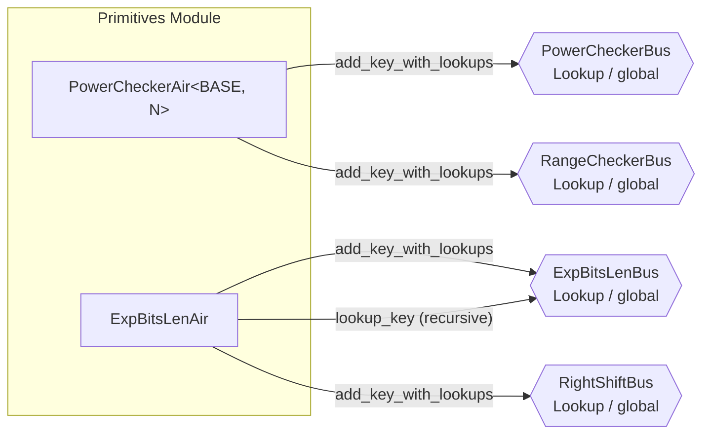

# Group 03 -- Primitive Lookup Tables

The primitives group provides two lookup tables used as building blocks by higher-level AIRs. PowerCheckerAir precomputes a table of powers (`BASE^i` for i in `0..N`) enabling other AIRs to look up that a value is a specific power of 2 (or another base). ExpBitsLenAir computes arbitrary base-exponent-length triples via recursive binary exponentiation, primarily used for proof-of-work checks.



---

## PowerCheckerAir

**Source:** `openvm/crates/recursion/src/primitives/pow/air.rs`

### Executive Summary

PowerCheckerAir is a fixed N-row lookup table parameterized by BASE and N (both compile-time constants). Row `i` contains `(log=i, pow=BASE^i)`. It serves two buses simultaneously: PowerCheckerBus for `(log, exp)` lookups and RangeCheckerBus for range checks on the log value. In the standard configuration, `BASE=2` and `N=32`, giving a table of powers of two from `2^0` to `2^31`.

### Public Values

None.

### AIR Guarantees

1. **Power lookup (PowerCheckerBus — provides):** Provides `(log, exp=BASE^log)` for all `log` in `[0, N)`, enabling consumers to verify that a value is a specific power of BASE.
2. **Range lookup (RangeCheckerBus — provides):** Provides `(log, max_bits=log2(N))` as a secondary range check for values in `[0, N)`.

### Walkthrough

With `BASE=2, N=32`:

```
Row | log | pow         | mult_pow | mult_range
----|-----|-------------|----------|-----------
  0 |  0  |           1 |     3    |     0
  1 |  1  |           2 |     2    |     1
  2 |  2  |           4 |     0    |     0
  3 |  3  |           8 |     5    |     2
... | ... |         ... |    ...   |    ...
 10 | 10  |        1024 |     8    |     4
... | ... |         ... |    ...   |    ...
 31 | 31  |           1 |     0    |     0
```

- **Row 0:** `pow = 2^0 = 1`. Three AIRs looked up `(0, 1)` to verify something is `2^0`.
- **Row 10:** `pow = 2^10 = 1024`. Eight lookups confirm various heights or sizes equal `2^10`.
- **Row 31:** `pow = 2^31 mod p = 1` since the BabyBear modulus is `p = 2^31 - 1`.
- The constraint `next.pow = local.pow * 2` ensures the table is exactly `{2^0, 2^1, ..., 2^31}` in BabyBear arithmetic.

### Trace Columns

```
PowerCheckerCols<T> {
    log: T,         // Row index i = 0..N-1
    pow: T,         // BASE^i
    mult_pow: T,    // Number of PowerCheckerBus lookups for this (log, pow) pair
    mult_range: T,  // Number of RangeCheckerBus lookups for this log value
}
```

### Constraint Details

The constraints are minimal but form a tight chain:

- **First row:** `log = 0`, `pow = 1`.
- **Transition:** `next.log = local.log + 1`, `next.pow = local.pow * BASE`.
- **Last row:** `log = N - 1`.

These three constraints together with the fixed height N mean the table is exactly the sequence `{(0, 1), (1, BASE), (2, BASE^2), ..., (N-1, BASE^(N-1))}`. No row can be duplicated, reordered, or omitted.

Note: `N` must be a power of two, as asserted during trace generation (`N.is_power_of_two()`). This is required because AIR trace heights must be powers of two.

### Lookup Usage

ExpressionClaimAir uses PowerCheckerBus to verify `n_abs_pow = 2^n_abs` when computing norm factors for interaction claims with negative hyperdimensional indices. ProofShapeAir also uses PowerCheckerBus to verify `height = 2^log_height` and to range-check auxiliary exponent values. ProofShapeAir additionally uses the secondary RangeCheckerBus to range-check limb decompositions of interaction counts and heights.

### Thread Safety

The CPU trace generator uses `AtomicU32` counters for both `count_pow` and `count_range`, allowing multiple threads to concurrently register lookups via `add_pow` and `add_range` with relaxed memory ordering. The `take_counts` method atomically swaps all counters to zero and returns the accumulated values.

---

## ExpBitsLenAir

**Source:** `openvm/crates/recursion/src/primitives/exp_bits_len/air.rs`

### Executive Summary

ExpBitsLenAir computes `base^bit_src` using recursive binary exponentiation, where `bit_src` is interpreted as a binary number of length `num_bits`. The AIR is self-referential: it both provides and consumes entries on ExpBitsLenBus. Each row processes one level of the exponentiation recursion. The primary use case is verifying proof-of-work: given a generator `g`, a sampled value `s`, and a target number of bits `b`, it checks that `g^s = 1` (i.e., the leading `b` bits of `s` in the exponent are zero).

### Public Values

None.

### AIR Guarantees

1. **Exponentiation lookup (ExpBitsLenBus — provides):** Provides `(base, bit_src, num_bits, result)` guaranteeing `result = base^bit_src` where `bit_src` is interpreted as a `num_bits`-bit binary number. Computed via self-referential recursive binary exponentiation internal to this AIR.
2. **Right shift lookup (RightShiftBus — provides):** Provides `(bit_src, bit_src_div_2)` pairs, enabling consumers to verify that a value is the floor division by 2 of another. Used by MerkleVerifyAir for index halving during Merkle path traversal.

### Walkthrough

Computing `3^5` where `5 = 101_binary` (num_bits=3, bit_src=5):

```
Row | is_valid | base | bit_src | num_bits | bit_src_mod_2 | bit_src_div_2 | sub_result | result
----|----------|------|---------|----------|---------------|---------------|------------|-------
 0  |    1     |   3  |    5    |    3     |       1       |       2       |     81     |  243
 1  |    1     |   9  |    2    |    2     |       0       |       1       |     81     |   81
 2  |    1     |  81  |    1    |    1     |       1       |       0       |      1     |   81
 3  |    1     |6561  |    0    |    0     |       -       |       -       |      -     |    1
```

- **Row 0:** `base=3, bit_src=5=101b, num_bits=3`. Current bit is 1, so `result = sub_result * 3 = 81 * 3 = 243`. Looks up `(9, 2, 2, 81)`.
- **Row 1:** `base=9, bit_src=2=10b, num_bits=2`. Current bit is 0, so `result = sub_result * 1 = 81`. Looks up `(81, 1, 1, 81)`.
- **Row 2:** `base=81, bit_src=1=1b, num_bits=1`. Current bit is 1, so `result = sub_result * 81 = 1 * 81 = 81`. Looks up `(6561, 0, 0, 1)`.
- **Row 3:** Base case. `num_bits=0` forces `result=1`. This row provides the entry `(6561, 0, 0, 1)` that row 2 looked up.

For proof-of-work verification, GkrInputAir looks up `(generator, pow_sample, pow_bits, 1)` to confirm `generator^pow_sample = 1`.

### Trace Columns

```
ExpBitsLenCols<T> {
    is_valid: T,         // Whether this row is active
    base: T,             // Current base (squares each recursion level)
    bit_src: T,          // The exponent bits remaining
    num_bits: T,         // Number of bits remaining to process
    num_bits_inv: T,     // Inverse of num_bits (or 0 when num_bits=0)
    result: T,           // The final exponentiation result for this sub-problem
    sub_result: T,       // Result from the recursive sub-problem (base^2, bit_src/2, num_bits-1)
    bit_src_div_2: T,    // floor(bit_src / 2)
    bit_src_mod_2: T,    // bit_src mod 2 (the current bit, boolean)
}
```

### Recursion Structure

The self-referential lookup pattern is the key design insight. Each row with `num_bits > 0` produces one lookup entry AND consumes one lookup entry:

- **Provides:** `(base, bit_src, num_bits, result)` with multiplicity `is_valid`
- **Consumes:** `(base^2, bit_src_div_2, num_bits-1, sub_result)` with multiplicity `is_num_bits_nonzero`

The recursion terminates at `num_bits = 0` where `result = 1` unconditionally. These base-case rows only provide entries, never consume, which balances the lookup bus. The order of rows in the trace does not matter -- the lookup bus enforces that for every consume there exists a matching provide.

### Multiple Independent Computations

The trace can contain multiple independent exponentiation chains simultaneously. For example, verifying proof-of-work for 4 child proofs results in 4 independent chains in the same trace. Each chain starts at its own `(base, bit_src, num_bits)` and recurses down to a base case. The self-referential bus ensures all chains are internally consistent.

### Proof-of-Work Verification

In GkrInputAir, proof-of-work is checked by looking up:

```
(base=generator, bit_src=pow_sample, num_bits=pow_bits, result=1)
```

This asserts that `generator^pow_sample` has its lowest `pow_bits` bits all zero when expressed in the multiplicative group, which is equivalent to grinding -- the prover had to find a `pow_witness` such that the sampled challenge has the required structure.

---

## Relationship Between Primitives

PowerCheckerAir and ExpBitsLenAir serve complementary roles:

- **PowerCheckerAir** is a static table. Its height is fixed at compile time (N rows). It is efficient for looking up a known discrete set of values. Every possible `(log, pow)` pair is enumerated. Unused rows still exist but with `mult=0`.

- **ExpBitsLenAir** is dynamic. Its height depends on the total number of exponentiation requests. It handles arbitrary base/exponent combinations through recursion. Each request adds `num_bits + 1` rows to the trace (one per recursion level plus the base case).

Neither AIR depends on the other. They are both global (not per-proof), meaning a single instance serves all child proofs being verified in the recursion circuit.

### Bus Protocol Distinction

Both AIRs use `LookupBus` (not `PermutationCheckBus`). This means they publish key-multiplicity pairs via `add_key_with_lookups`, and consumers use `lookup_key` to look up entries. The lookup bus protocol guarantees that the total number of lookups across all consumers equals the sum of multiplicities in the provider table -- ensuring no phantom lookups.

---

## Bus Summary

| Bus | Type | Direction in This Group | Key Consumers |
|-----|------|------------------------|---------------|
| [PowerCheckerBus](bus-inventory.md#53-powercheckerbus) | Lookup (global) | PCA provides keys | ExpressionClaimAir, ProofShapeAir |
| [RangeCheckerBus](bus-inventory.md#52-rangecheckerbus) | Lookup (global) | PCA provides keys (secondary) | ProofShapeAir, others |
| [ExpBitsLenBus](bus-inventory.md#51-expbitslenbus) | Lookup (global) | EBA provides and consumes (self-referential) | GkrInputAir |
| [RightShiftBus](bus-inventory.md#515-rightshiftbus) | Lookup (global) | EBA provides keys | MerkleVerifyAir |
