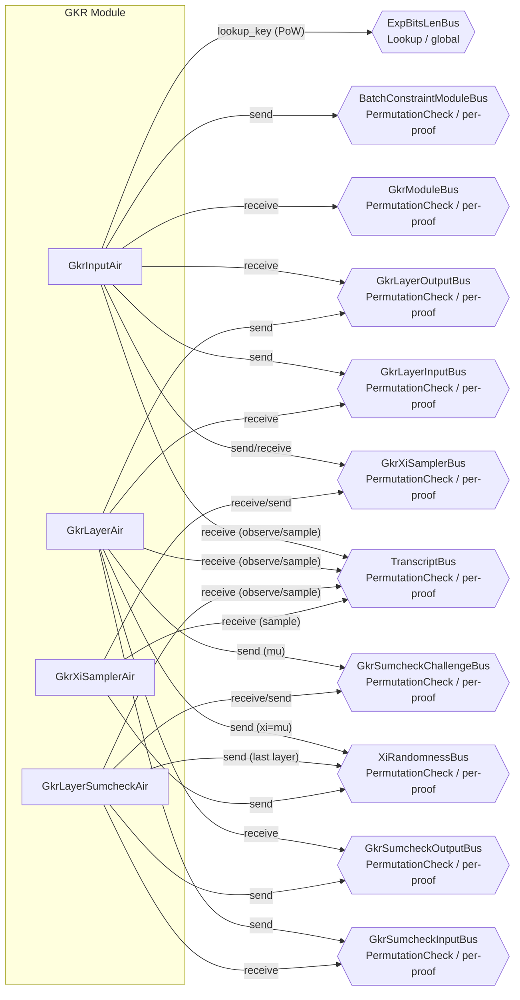

# Group 04 -- GKR Protocol

The GKR group implements the Goldwasser-Kalai-Rothblum fractional sumcheck protocol for verifying LogUp-based interaction arguments. GkrInputAir receives the initial GKR parameters, performs proof-of-work checking, and samples the alpha challenge. GkrLayerAir performs the layer-by-layer reduction, computing cross terms and reducing to single evaluation points. GkrLayerSumcheckAir runs a cubic sumcheck within each layer. GkrXiSamplerAir samples additional xi challenges when `n_max > n_logup`.



---

## GkrInputAir

**Source:** `crates/recursion/src/gkr/input/air.rs`

### Executive Summary

GkrInputAir is the entry point for the GKR protocol. For each child proof, it receives the GKR parameters (n_logup, n_max) from ProofShapeAir, optionally performs a proof-of-work check, samples the alpha_logup challenge, observes the root denominator claim q0_claim, and dispatches work to GkrLayerAir and GkrXiSamplerAir. After receiving the input layer claims back, it forwards them to the batch constraint module.

### Public Values

None.

### AIR Guarantees

1. **Module input (GkrModuleBus — receives):** Receives `(tidx, n_logup, n_max, is_n_max_greater)` from ProofShapeAir.
2. **Proof-of-work (ExpBitsLenBus — lookup, TranscriptBus — receives):** When `logup_pow_bits > 0`, verifies `generator^pow_sample = 1` via ExpBitsLenBus, where `pow_sample` is sampled from the transcript.
3. **Layer dispatch (GkrLayerInputBus — sends, GkrLayerOutputBus — receives):** Sends the initial GKR claim to GkrLayerAir and receives the final input-layer claim back.
4. **Xi sampling (GkrXiSamplerBus — sends/receives):** When additional xi challenges are needed (`n_max > n_logup` or `n_logup = 0`), coordinates with GkrXiSamplerAir.
5. **Module output (BatchConstraintModuleBus — sends):** Sends `(tidx_end, input_layer_claim)` to the batch constraint module.
6. **Transcript (TranscriptBus — receives):** Samples `alpha_logup` and observes `q0_claim` from the transcript.

### Walkthrough

```
Row | is_enabled | proof_idx | n_logup | n_max | tidx | q0_claim     | alpha_logup  | input_layer_claim
----|------------|-----------|---------|-------|------|--------------|--------------|------------------
 0  |     1      |     0     |    5    |   7   |   0  | [a,b,c,d]   | [e,f,g,h]    | [p0..., q0...]
 1  |     1      |     1     |    0    |   3   |  200 | [0,0,0,0]   | [e',f',g',h']| [0..., e'f'g'h']
```

- **Row 0:** Proof 0 has 5 logup layers and n_max=7. After PoW and alpha sampling, dispatches to GkrLayerAir. Two extra xi challenges will be sampled (7-5=2) via GkrXiSamplerAir.
- **Row 1:** Proof 1 has no interactions (n_logup=0). Input layer claim defaults to `[0, alpha]`. Needs `n_max + l_skip` xi challenges via GkrXiSamplerAir (since `has_interactions=0`, `num_challenges = n_max + l_skip`).

---

## GkrLayerAir

**Source:** `crates/recursion/src/gkr/layer/air.rs`

### Executive Summary

GkrLayerAir performs the core layer-by-layer GKR reduction. Each row represents one GKR layer (indexed from 0). At the root layer (layer 0), it verifies that the numerator cross term `p_cross = p(xi,0)*q(xi,1) + p(xi,1)*q(xi,0)` is zero and the denominator cross term `q_cross = q(xi,0)*q(xi,1)` equals the sumcheck claim. For each subsequent layer, it samples lambda, computes the new sumcheck claim as `numer + lambda * denom`, sends the claim to GkrLayerSumcheckAir, and receives back the result. On the final layer, it sends `xi = mu` on XiRandomnessBus.

### Public Values

None.

### AIR Guarantees

1. **Layer input/output (GkrLayerInputBus — receives, GkrLayerOutputBus — sends):** Receives the initial claim from GkrInputAir; returns the final input-layer claims after all GKR layers.
2. **Sumcheck dispatch (GkrSumcheckInputBus — sends, GkrSumcheckOutputBus — receives):** Sends per-layer claims to GkrLayerSumcheckAir and receives sumcheck results.
3. **Challenge sharing (GkrSumcheckChallengeBus — sends):** Sends `mu` challenges for cross-layer eq computation in GkrLayerSumcheckAir.
4. **Xi output (XiRandomnessBus — sends):** On the last layer, sends `(idx=0, xi=mu)` for the batch constraint module.
5. **Transcript (TranscriptBus — receives):** Observes layer claims and samples challenges (`lambda`, `mu`).

### Walkthrough

A 3-layer GKR for one proof:

```
Row | layer_idx | is_first | tidx  | lambda       | p_xi_0    | q_xi_0    | p_xi_1    | q_xi_1    | mu
----|-----------|----------|-------|--------------|-----------|-----------|-----------|-----------|------
 0  |     0     |    1     |  100  | [0,0,0,0]   | [...]     | [...]     | [...]     | [...]     | [...]
 1  |     1     |    0     |  180  | [l0,l1,..]  | [...]     | [...]     | [...]     | [...]     | [...]
 2  |     2     |    0     |  260  | [l0',l1',..]| [...]     | [...]     | [...]     | [...]     | [...]
```

- **Row 0 (root):** Verifies `p_cross=0` and `q_cross = sumcheck_claim`. Does NOT sample lambda (root has no prior layer). Does NOT send to or receive from GkrSumcheckAir (sumcheck dispatch only applies to non-root layers).
- **Row 1:** Samples lambda. Receives sumcheck output from its own layer's sumcheck. Computes new claim = `numer + lambda * denom`. Sends claim to GkrSumcheckAir.
- **Row 2 (last):** After receiving sumcheck output, computes final `numer_claim` and `denom_claim`. Sends these as input layer claims back to GkrInputAir via GkrLayerOutputBus. Sends `mu` on XiRandomnessBus.

---

## GkrLayerSumcheckAir

**Source:** `crates/recursion/src/gkr/sumcheck/air.rs`

### Executive Summary

GkrLayerSumcheckAir runs a cubic sumcheck for each GKR layer. Within each layer, it performs `layer_idx` rounds (one per variable). Each round observes three extension-field evaluations `(ev1, ev2, ev3)`, derives `ev0 = claim_in - ev1`, performs cubic Lagrange interpolation at the sampled challenge point, and propagates the resulting claim to the next round. It also incrementally updates an equality evaluation `eq_at_r_prime` that tracks `eq(xi, r)`.

### Public Values

None.

### AIR Guarantees

1. **Sumcheck input/output (GkrSumcheckInputBus — receives, GkrSumcheckOutputBus — sends):** Receives per-layer claims from GkrLayerAir; returns `(layer_idx, tidx, claim_out, eq_at_r_prime)` after completing a cubic sumcheck for each layer.
2. **Challenge exchange (GkrSumcheckChallengeBus — receives/sends):** Receives previous-layer challenges and sends current-layer challenges for cross-layer eq computation.
3. **Xi output (XiRandomnessBus — sends):** On the last layer, sends each round's sampled challenge for the batch constraint module.
4. **Transcript (TranscriptBus — receives):** Observes evaluations `(ev1, ev2, ev3)` and samples round challenges.

### Walkthrough

Layer 2 sumcheck (2 rounds) within one proof:

```
Row | layer_idx | round | claim_in      | ev1      | ev2      | ev3      | challenge | eq_in    | eq_out
----|-----------|-------|---------------|----------|----------|----------|-----------|----------|--------
 0  |     2     |   0   | [c0,c1,c2,c3]| [a,b,..]| [e,f,..]| [g,h,..]| [r0,...]  | [1,0,0,0]| [...]
 1  |     2     |   1   | [c0',..]      | [a',..]  | [e',..]  | [g',..]  | [r1,...]  | [eq0,..]  | [eq1,..]
```

- **Row 0 (round 0):** Receives initial claim from GkrLayerAir. `eq_in = 1`. Observes `(ev1, ev2, ev3)`. Computes `ev0 = claim_in - ev1`. Interpolates cubic at `r0` to get `claim_out`. Updates eq.
- **Row 1 (round 1, last):** Uses `claim_out` from round 0. Performs final interpolation. Sends `(layer_idx=2, claim_out, eq_out)` back to GkrLayerAir.

---

## GkrXiSamplerAir

**Source:** `crates/recursion/src/gkr/xi_sampler/air.rs`

### Executive Summary

GkrXiSamplerAir samples additional xi challenges from the transcript when `n_max > n_logup`. The GKR sumcheck produces challenges for indices `0..n_logup`, but the batch constraint system needs challenges for all indices up to `n_max + l_skip - 1`. This AIR fills the gap by sampling each additional challenge from the transcript and publishing it on XiRandomnessBus.

### Public Values

None.

### AIR Guarantees

1. **Coordination (GkrXiSamplerBus — receives/sends):** Receives starting `(idx, tidx)` from GkrInputAir and returns ending `(idx, tidx)`.
2. **Xi publication (XiRandomnessBus — sends):** Sends `(idx, xi)` for each additional challenge sampled.
3. **Transcript (TranscriptBus — receives):** Samples extension-field challenges from the transcript.

### Walkthrough

For a proof where n_logup=3 and n_max=5 (needs 2 extra challenges), starting at idx=3+l_skip:

```
Row | is_enabled | proof_idx | idx | tidx | xi
----|------------|-----------|-----|------|------------------
 0  |     1      |     0     | 11  |  400 | [x0, x1, x2, x3]
 1  |     1      |     0     | 12  |  404 | [y0, y1, y2, y3]
```

- **Row 0:** Receives `(idx=11, tidx=400)` from GkrXiSamplerBus (sent by GkrInputAir). Samples `xi` and publishes on XiRandomnessBus.
- **Row 1:** idx increments, tidx advances by D_EF=4. After this row, sends `(idx=12, tidx=408)` back to GkrInputAir.

---

## Bus Summary

| Bus | Type | Scope | Senders | Receivers |
|-----|------|-------|---------|-----------|
| [GkrModuleBus](bus-inventory.md#12-gkrmodulebus) | PermutationCheck | per-proof | ProofShapeAir | GkrInputAir |
| [GkrLayerInputBus](bus-inventory.md#622-gkrlayerinputbus) | PermutationCheck | per-proof | GkrInputAir | GkrLayerAir |
| [GkrLayerOutputBus](bus-inventory.md#623-gkrlayeroutputbus) | PermutationCheck | per-proof | GkrLayerAir | GkrInputAir |
| [GkrSumcheckInputBus](bus-inventory.md#624-gkrsumcheckinputbus) | PermutationCheck | per-proof | GkrLayerAir | GkrLayerSumcheckAir |
| [GkrSumcheckOutputBus](bus-inventory.md#625-gkrsumcheckoutputbus) | PermutationCheck | per-proof | GkrLayerSumcheckAir | GkrLayerAir |
| [GkrSumcheckChallengeBus](bus-inventory.md#626-gkrsumcheckchallengebus) | PermutationCheck | per-proof | GkrLayerAir, GkrLayerSumcheckAir | GkrLayerSumcheckAir |
| [GkrXiSamplerBus](bus-inventory.md#621-gkrxisamplerbus) | PermutationCheck | per-proof | GkrInputAir (send+receive), GkrXiSamplerAir (receive+send) | Round-trip: GkrInputAir sends input, GkrXiSamplerAir receives; GkrXiSamplerAir sends output, GkrInputAir receives |
| [XiRandomnessBus](bus-inventory.md#41-xirandomnessbus) | PermutationCheck | per-proof | GkrLayerAir, GkrLayerSumcheckAir, GkrXiSamplerAir | Batch constraint AIRs |
| [BatchConstraintModuleBus](bus-inventory.md#13-batchconstraintmodulebus) | PermutationCheck | per-proof | GkrInputAir | FractionsFolderAir |
| [TranscriptBus](bus-inventory.md#11-transcriptbus) | PermutationCheck | per-proof | All GKR AIRs receive (observe/sample) | TranscriptAir sends |
| [ExpBitsLenBus](bus-inventory.md#51-expbitslenbus) | Lookup | global | GkrInputAir looks up | ExpBitsLenAir provides |
