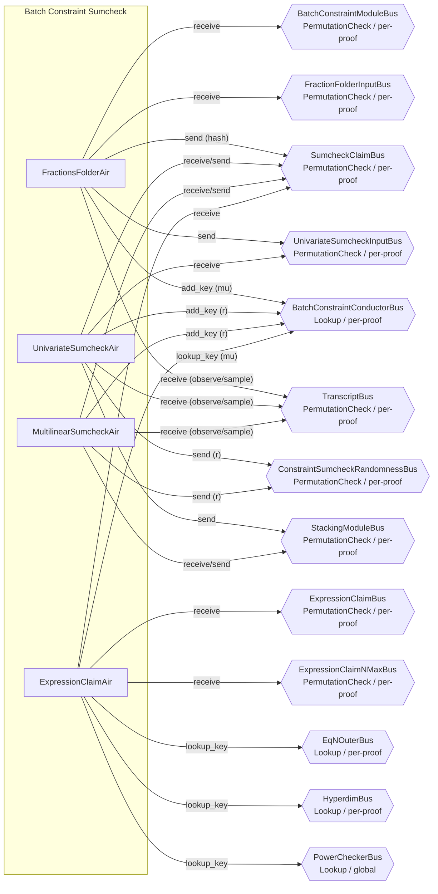

# Group 05 -- Batch Constraint Sumcheck Pipeline

The batch constraint sumcheck group reduces the aggregate constraint and interaction claims into a single evaluation claim. FractionsFolderAir folds GKR numerator/denominator claims across AIRs using a polynomial hash. UnivariateSumcheckAir handles the front-loaded univariate sumcheck round over the coset domain. MultilinearSumcheckAir performs n_max rounds of standard multilinear sumcheck reduction. ExpressionClaimAir verifies that the final evaluation matches the folded interaction and constraint claims.



---

## FractionsFolderAir

**Source:** `openvm/crates/recursion/src/batch_constraint/fractions_folder/air.rs`

### Executive Summary

FractionsFolderAir folds the per-AIR GKR numerator and denominator claims into a single polynomial hash using Horner's method with batching randomness mu. It iterates over AIRs in reverse order (highest air_idx first, decrementing to 0). For each AIR, it reads the sum claims `(sum_claim_p, sum_claim_q)` from the transcript. The polynomial hash accumulates as `h' = p + mu * (q + mu * h)`. At the end, it sends the hash as the initial sumcheck claim and forwards the GKR input layer claims for cross-checking.

### Public Values

None.

### AIR Guarantees

1. **GKR claims (BatchConstraintModuleBus — receives):** Receives `(tidx, [cur_p_sum, cur_q_sum])` from GkrInputAir on the last row. Both `cur_p_sum` and `cur_q_sum` are constrained as running sums across rows.
2. **AIR count (FractionFolderInputBus — receives):** Receives `(num_present_airs)` from ProofShapeAir.
3. **Sumcheck claim (SumcheckClaimBus — sends):** Sends the Horner-folded polynomial hash as the initial sumcheck claim (round=0).
4. **Mu publication (BatchConstraintConductorBus — provides):** Provides the batching randomness `mu`.
5. **Handoff (UnivariateSumcheckInputBus — sends):** Sends final tidx to UnivariateSumcheckAir.
6. **Transcript (TranscriptBus — receives):** Reads per-AIR sum claims and samples `mu`.

### Walkthrough

For a proof with 3 present AIRs:

```
Row | proof_idx | is_first | air_idx | tidx | sum_claim_p | sum_claim_q | cur_hash    | mu
----|-----------|----------|---------|------|-------------|-------------|-------------|------
 0  |     0     |    1     |    2    |  350 | [p2,...]    | [q2,...]    | p2+mu*q2    | [m,..]
 1  |     0     |    0     |    1    |  342 | [p1,...]    | [q1,...]    | p1+mu*(q1+mu*h0) | [m,..]
 2  |     0     |    0     |    0    |  334 | [p0,...]    | [q0,...]    | p0+mu*(q0+mu*h1) | [m,..]
```

- **Row 0:** First AIR (highest index). Initializes hash = `p2 + mu*q2`. Samples mu from transcript after observing claims.
- **Row 1:** Adds AIR 1. Hash updated via Horner: `p1 + mu*(q1 + mu*prev_hash)`.
- **Row 2 (last):** Final AIR. `air_idx=0`. Sends the final hash as the sumcheck claim. Verifies running sums match GKR output.

---

## UnivariateSumcheckAir

**Source:** `openvm/crates/recursion/src/batch_constraint/sumcheck/univariate/air.rs`

### Executive Summary

UnivariateSumcheckAir performs the front-loaded univariate sumcheck round. It processes a univariate polynomial of degree `univariate_deg` by iterating coefficients from highest to lowest degree. It computes (a) the sum of the polynomial at roots of unity of order `2^l_skip` (using periodic selector columns) and (b) the evaluation at a sampled point `r` via Horner's method. The sum at roots must match the initial sumcheck claim, and the evaluation at `r` becomes the new claim.

### Public Values

None.

### AIR Guarantees

1. **Claim verification (SumcheckClaimBus — receives/sends):** Receives the initial sumcheck claim (round=0) from FractionsFolderAir. Verifies the sum of the univariate polynomial at roots of unity equals this claim. Sends the polynomial evaluation at the sampled challenge as the new claim.
2. **Randomness (ConstraintSumcheckRandomnessBus, BatchConstraintConductorBus — provides):** Publishes the sampled challenge `r` on both buses.
3. **Handoff (UnivariateSumcheckInputBus — receives, StackingModuleBus — sends):** Receives tidx from FractionsFolderAir; sends tidx to the multilinear/stacking phase.
4. **Transcript (TranscriptBus — receives):** Observes coefficients and samples `r`.

### Walkthrough

For `univariate_deg=5` and `l_skip=2` (domain size=4):

```
Row | coeff_idx | omega_power | eq_to_1 | coeff    | sum_at_roots | value_at_r
----|-----------|-------------|---------|----------|--------------|----------
 0  |     5     |    w^5      |    0    | [c5,..]  | [0,...]      | [c5,...]
 1  |     4     |    w^4      |    1    | [c4,..]  | [4*c4,...]   | c5*r+c4
 2  |     3     |    w^3      |    0    | [c3,..]  | [4*c4,...]   | (c5*r+c4)*r+c3
 3  |     2     |    w^2      |    0    | [c2,..]  | [4*c4,...]   | ...
 4  |     1     |    w^1      |    0    | [c1,..]  | [4*c4,...]   | ...
 5  |     0     |    w^0=1    |    1    | [c0,..]  | [4*c4+4*c0]  | c5*r^5+...+c0
```

- Only `coeff_idx=4` and `coeff_idx=0` have `omega_power=1`, so `sum_at_roots = 4*(c4 + c0)`.
- `value_at_r` builds via Horner from highest to lowest coefficient.
- Final row verifies sum equals claim and sends evaluation as new claim.

---

## MultilinearSumcheckAir

**Source:** `openvm/crates/recursion/src/batch_constraint/sumcheck/multilinear/air.rs`

### Executive Summary

MultilinearSumcheckAir performs n_max rounds of multilinear sumcheck reduction. Each round receives the current claim, reads `s_deg+1` evaluations of the round polynomial (where `s_deg = max_constraint_degree`), computes Lagrange interpolation at a sampled point `r`, and propagates the result as the next round's claim. The Lagrange interpolation uses incrementally computed prefix/suffix products and factorial-based denominators.

### Public Values

None.

### AIR Guarantees

1. **Claim flow (SumcheckClaimBus — receives/sends):** For each round, receives the current claim (verifying sum property: `eval[0] + eval[1] = claim`), performs Lagrange interpolation of the round polynomial at the sampled challenge, and sends the interpolated value as the next round's claim.
2. **Randomness (ConstraintSumcheckRandomnessBus, BatchConstraintConductorBus — provides):** Publishes each round's sampled challenge `r` on both buses.
3. **Handoff (StackingModuleBus — receives/sends):** Receives/sends tidx for stacking phase coordination.
4. **Transcript (TranscriptBus — receives):** Observes round evaluations and samples challenges.

### Walkthrough

One round with `s_deg=2` (3 evaluations at points 0, 1, 2):

```
Row | round_idx | eval_idx | eval     | denom_inv | prefix | suffix | lagrange | cur_sum    | r
----|-----------|----------|----------|-----------|--------|--------|----------|------------|-----
 0  |     0     |    0     | [e0,..]  |   1/2     |  1     | r(r-1) | ...      | e0*L0      | [r..]
 1  |     0     |    1     | [e1,..]  |   -1      |  r     | (2-r)  | ...      | e0*L0+e1*L1| [r..]
 2  |     0     |    2     | [e2,..]  |   1/2     | r(r-1) |  1     | ...      | final_sum  | [r..]
```

- The Lagrange coefficients are `L_i(r) = prefix * suffix * denom_inv` for interpolating through points 0, 1, 2.
- `claim_in` is verified as `e0 + e1` (sum property).
- `cur_sum` at the last row is the interpolated value at `r`, sent as the next claim.

---

## ExpressionClaimAir

**Source:** `openvm/crates/recursion/src/batch_constraint/expression_claim/air.rs`

### Executive Summary

ExpressionClaimAir is the final verification stage of the batch constraint pipeline. For each proof, it receives `2t` interaction claims (numerator and denominator for each of `t` AIRs) and `t` constraint claims from the expression evaluation AIRs. These claims are folded in reverse order with the batching randomness `mu` into a single value via `cur_sum = value * multiplier + next.cur_sum * mu`. The resulting value must match the final sumcheck claim.

### Public Values

None.

### AIR Guarantees

1. **Expression claims (ExpressionClaimBus — receives):** Receives interaction claims (numerator/denominator per AIR) and constraint claims from InteractionsFoldingAir and ConstraintsFoldingAir.
2. **Sumcheck match (SumcheckClaimBus — receives):** Receives the final sumcheck claim and verifies it equals the mu-folded sum of all expression claims (with appropriate normalization multipliers).
3. **N_max (ExpressionClaimNMaxBus — receives):** Receives the number of multilinear sumcheck rounds from ProofShapeAir.
4. **Mu lookup (BatchConstraintConductorBus — lookup):** Looks up the batching randomness `mu`.
5. **Normalization lookups (EqNOuterBus — lookup, HyperdimBus — lookup, PowerCheckerBus — lookup):** Looks up equality polynomial evaluations, hyperdimensional parameters, and power values to compute per-claim multipliers.

### Walkthrough

For a proof with 2 AIRs (4 interaction claims + 2 constraint claims):

```
Row | is_first | is_interaction | idx | idx_parity | value    | multiplier | cur_sum
----|----------|----------------|-----|------------|----------|------------|--------
 0  |    1     |       1        |  0  |     0      | [num0..] | [eq_ns0..] | final
 1  |    0     |       1        |  1  |     1      | [den0..] | [eq_ns0..] | ...
 2  |    0     |       1        |  2  |     0      | [num1..] | [eq_ns1..] | ...
 3  |    0     |       1        |  3  |     1      | [den1..] | [eq_ns1..] | ...
 4  |    0     |       0        |  0  |     -      | [con0..] | [1,0,0,0]  | ...
 5  |    0     |       0        |  1  |     -      | [con1..] | [1,0,0,0]  | con1
```

- Rows are processed in reverse order for folding (row 5 first conceptually).
- Row 0 (`is_first`): Verifies `cur_sum` matches the sumcheck claim at the final round. Looks up `mu` from BatchConstraintConductorBus.

---

## Bus Summary

| Bus | Type | Scope | Key Role in This Group |
|-----|------|-------|----------------------|
| [BatchConstraintModuleBus](bus-inventory.md#13-batchconstraintmodulebus) | PermutationCheck | per-proof | FFA receives from GkrInputAir |
| [FractionFolderInputBus](bus-inventory.md#58-fractionfolderinputbus) | PermutationCheck | per-proof | FFA receives from ProofShapeAir |
| [SumcheckClaimBus](bus-inventory.md#632-sumcheckclaimbus) | PermutationCheck | per-proof | Claims flow: FFA -> USA -> MSA -> ECA |
| [UnivariateSumcheckInputBus](bus-inventory.md#6312-univariatesumcheckinputbus) | PermutationCheck | per-proof | FFA sends tidx to USA |
| [StackingModuleBus](bus-inventory.md#14-stackingmodulebus) | PermutationCheck | per-proof | USA sends to MSA, MSA sends to stacking |
| [ConstraintSumcheckRandomnessBus](bus-inventory.md#42-constraintsumcheckrandomnessbus) | PermutationCheck | per-proof | USA/MSA send challenges |
| [BatchConstraintConductorBus](bus-inventory.md#631-batchconstraintconductorbus) | Lookup | per-proof | FFA provides mu, USA/MSA provide r |
| [ExpressionClaimBus](bus-inventory.md#634-expressionclaimbus) | PermutationCheck | per-proof | ECA receives from InteractionsFolding/ConstraintsFolding |
| [ExpressionClaimNMaxBus](bus-inventory.md#57-expressionclaimnmaxbus) | PermutationCheck | per-proof | ECA receives from ProofShapeAir |
| [TranscriptBus](bus-inventory.md#11-transcriptbus) | PermutationCheck | per-proof | All AIRs receive (observe/sample) |
