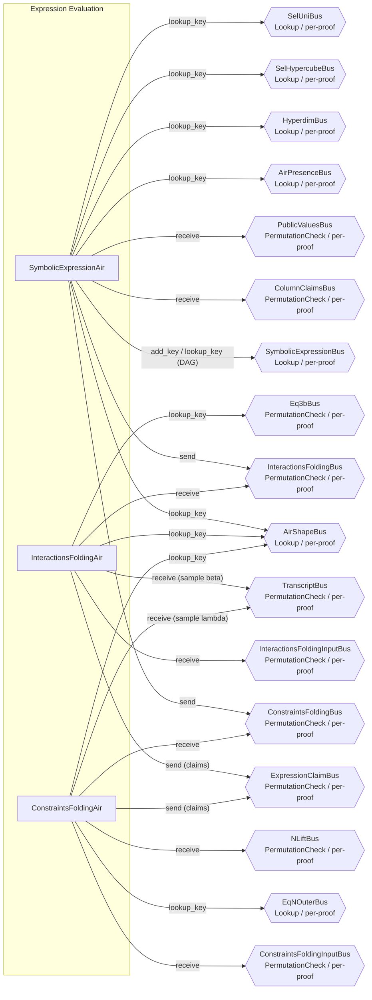

# Group 06 -- Batch Constraint Expression Evaluation

The expression evaluation group computes and folds all constraint and interaction evaluations at the sumcheck challenge point. SymbolicExpressionAir evaluates the constraint DAG for each child AIR, producing intermediate node values and dispatching interaction/constraint nodes to their respective folding AIRs. InteractionsFoldingAir folds interaction evaluations with beta to produce per-AIR numerator and denominator claims. ConstraintsFoldingAir folds constraint evaluations with lambda to produce per-AIR constraint claims.



---

## SymbolicExpressionAir

**Source:** `crates/recursion/src/batch_constraint/expr_eval/symbolic_expression/air.rs`

### Executive Summary

SymbolicExpressionAir evaluates the constraint DAG of each child AIR at the sumcheck challenge point. Each row represents one node in the flattened DAG. Node types include arithmetic operations (Add, Sub, Mul, Neg), variable references (VarMain, VarPreprocessed, VarPublicValue), selector evaluations (SelIsFirst, SelIsLast, SelIsTransition), constants, and interaction components (InteractionMult, InteractionMsgComp, InteractionBusIndex). The AIR is self-referential through SymbolicExpressionBus: parent nodes look up their children's values, and each node publishes its computed value with a fanout count.

The AIR supports multiple child proofs simultaneously via horizontally replicated per-proof columns. A cached trace partition holds the DAG structure (node kind, attrs, fanout), while per-proof common-main columns hold the dynamic arguments (evaluated values, sort_idx).

### Public Values

None.

### AIR Guarantees

1. **Column claims (ColumnClaimsBus — receives):** Receives column evaluations `(sort_idx, part_idx, col_idx, claim, is_rot)` for variable reference nodes.
2. **Public values (PublicValuesBus — receives):** Receives public values from PublicValuesAir for public value nodes.
3. **Shape verification (AirShapeBus — lookup, AirPresenceBus — lookup, HyperdimBus — lookup):** Looks up AIR shape, presence flags, and hyperdimensional parameters for each evaluated node. AirPresenceBus is used to determine which AIRs are present before processing.
4. **Selector lookups (SelHypercubeBus — lookup, SelUniBus — lookup):** Looks up selector evaluations for is_first/is_last/is_transition nodes.
5. **Interaction dispatch (InteractionsFoldingBus — sends):** Sends interaction components `(air_idx, interaction_idx, is_mult, idx_in_message, value)` to InteractionsFoldingAir.
6. **Constraint dispatch (ConstraintsFoldingBus — sends):** Sends constraint node evaluations `(air_idx, constraint_idx, value)` to ConstraintsFoldingAir.

### Node Kind Encoding

The 14 node kinds are encoded into 4 flag columns using a degree-2 encoder:

```
Kind                | Code | Description
--------------------|------|------------------------------------------
VarPreprocessed     |   0  | Preprocessed trace column evaluation
VarMain             |   1  | Main trace column evaluation
VarPublicValue      |   2  | Public value (base field)
SelIsFirst          |   3  | is_first_row selector
SelIsLast           |   4  | is_last_row selector
SelIsTransition     |   5  | is_transition selector (= 1 - is_last)
Constant            |   6  | Field constant
Add                 |   7  | Addition of two nodes
Sub                 |   8  | Subtraction of two nodes
Neg                 |   9  | Negation of one node
Mul                 |  10  | Multiplication of two nodes
InteractionMult     |  11  | Interaction multiplicity
InteractionMsgComp  |  12  | Interaction message component
InteractionBusIndex |  13  | Interaction bus index
```

### Walkthrough

Consider a simple constraint `(main[0] + main[1]) * 3`:

```
Row | kind     | air_idx | node_idx | attrs      | fanout | args[0..3]   | args[4..7]   | value
----|----------|---------|----------|------------|--------|--------------|--------------|------
 0  | VarMain  |    0    |    0     | [0, 0, 0]  |   1    | [v0,0,0,0]   | [0,0,0,0]    | [v0,..]
 1  | VarMain  |    0    |    1     | [1, 0, 0]  |   1    | [v1,0,0,0]   | [0,0,0,0]    | [v1,..]
 2  | Add      |    0    |    2     | [0, 1, 0]  |   1    | [v0,0,0,0]   | [v1,0,0,0]   | [v0+v1,...]
 3  | Constant |    0    |    3     | [3, 0, 0]  |   1    | [0,0,0,0]    | [0,0,0,0]    | [3,0,0,0]
 4  | Mul      |    0    |    4     | [2, 3, 0]  |   0    | [v0+v1,..]   | [3,0,0,0]    | [3(v0+v1),...]
```

- **Row 0-1:** Variable references. Look up column claims from ColumnClaimsBus. Publish values with fanout=1.
- **Row 2:** Add node. Looks up nodes 0 and 1 from SymbolicExpressionBus. Publishes sum with fanout=1.
- **Row 3:** Constant node. Value is `3` extended to the extension field. Fanout=1.
- **Row 4:** Mul node (constraint root). Looks up nodes 2 and 3. `is_constraint=true`, so sends value on ConstraintsFoldingBus. Fanout=0 (no parent references this node).

---

## InteractionsFoldingAir

**Source:** `crates/recursion/src/batch_constraint/expr_eval/interactions_folding/air.rs`

### Executive Summary

InteractionsFoldingAir folds the interaction evaluations for each child AIR using the challenge beta. For each interaction, it receives the multiplicity, message components, and bus index from SymbolicExpressionAir. It performs beta-folding via Horner's method: `cur_sum = value + beta * cur_sum` for message components. After folding all interactions for an AIR, it accumulates the final numerator and denominator and sends them on ExpressionClaimBus.

### Public Values

None.

### AIR Guarantees

1. **Interaction input (InteractionsFoldingBus — receives):** Receives interaction multiplicities, message components, and bus indices from SymbolicExpressionAir.
2. **Beta tidx input (InteractionsFoldingInputBus — receives):** Receives the transcript index for the beta challenge from ProofShapeAir.
3. **Expression claims (ExpressionClaimBus — sends):** Sends per-AIR numerator and denominator claims: numerator at `idx = sort_idx * 2`, denominator at `idx = sort_idx * 2 + 1`, both with `is_interaction=true`. AIRs without interactions send zero claims.
4. **Eq3b normalization (Eq3bBus — receives):** Receives `eq_3b` normalization factors for stacked-index weighting.
5. **Shape (AirShapeBus — lookup):** Looks up `num_interactions` per AIR. Validates `air_idx` consistency on the first row of each AIR.
6. **Transcript (TranscriptBus — receives):** Samples beta challenge.

### Walkthrough

For AIR 0 with 1 interaction having 2 message components, and AIR 1 with no interactions:

```
Row | sort_idx | interaction_idx | is_first_msg | is_second_msg | is_bus_idx | idx_in_msg | value     | cur_sum
----|----------|-----------------|--------------|---------------|------------|------------|-----------|--------
 0  |    0     |        0        |      1       |       0       |     0      |     -      | [mult,..] | [mult,..]
 1  |    0     |        0        |      0       |       1       |     0      |     0      | [m0,..]   | m0+beta*(m1+beta*(bus+1))
 2  |    0     |        0        |      0       |       0       |     0      |     1      | [m1,..]   | m1+beta*(bus+1)
 3  |    0     |        0        |      0       |       0       |     1      |     -1     | [bus+1,..]| [bus+1,..]
 4  |    1     |        0        |      1       |       0       |     0      |     -      | [0,..]    | [0,..]
```

- **Row 0:** Multiplicity row. `is_first_in_message=1`, so `cur_sum = value` (the interaction multiplicity).
- **Row 1:** First message component. `is_second_in_message=1` (immediately after first_in_message). `cur_sum = value + beta * next.cur_sum` (reverse accumulation: `local = value + beta * next`).
- **Row 2:** Second message component. `cur_sum = m1 + beta * cur_sum[3]`.
- **Row 3:** Bus index row. `is_bus_index=1`. `cur_sum = value` since next row is `is_first_in_message`. Accumulation into `final_acc_num` happens on the `is_first_in_message` row; accumulation into `final_acc_denom` happens on the `is_second_in_message` row.
- **Row 4:** AIR 1 has no interactions. Single dummy row. Still sends zero claims.

After processing AIR 0, sends `final_acc_num` (claim idx=0, is_interaction=1) and `final_acc_denom` (claim idx=1, is_interaction=1) on ExpressionClaimBus.

---

## ConstraintsFoldingAir

**Source:** `crates/recursion/src/batch_constraint/expr_eval/constraints_folding/air.rs`

### Executive Summary

ConstraintsFoldingAir folds the constraint evaluations for each child AIR using the challenge lambda. For each AIR, it receives constraint values from SymbolicExpressionAir, folds them via Horner: `cur_sum = value + lambda * next.cur_sum`. The final folded value is multiplied by `eq_n` (an equality evaluation factor for normalization) and sent on ExpressionClaimBus as a constraint claim.

### Public Values

None.

### AIR Guarantees

1. **Constraint input (ConstraintsFoldingBus — receives):** Receives per-AIR constraint values from SymbolicExpressionAir.
2. **Lambda tidx input (ConstraintsFoldingInputBus — receives):** Receives the transcript index for the lambda challenge from ProofShapeAir.
3. **Expression claims (ExpressionClaimBus — sends):** Sends `(is_interaction=0, idx=sort_idx, value=folded_sum*eq_n)` for each AIR, where the folded sum is the lambda-Horner folding of all constraint values, normalized by `eq_n`.
4. **Eq_n normalization (EqNOuterBus — lookup):** Looks up `eq_n` for normalization.
5. **Shape (AirShapeBus — lookup):** Looks up AIR id for consistency validation on the first row of each AIR.
6. **N_lift (NLiftBus — receives):** Receives `(air_idx, n_lift)` from ProofShapeAir.
7. **Transcript (TranscriptBus — receives):** Samples lambda challenge.

### Walkthrough

For a proof with 2 AIRs, AIR 0 having 3 constraints and AIR 1 having 2 constraints:

```
Row | proof_idx | sort_idx | constraint_idx | value    | lambda   | cur_sum           | eq_n
----|-----------|----------|----------------|----------|----------|-------------------|------
 0  |     0     |    0     |       0        | [v0,..]  | [l,..]   | v0+l*(v1+l*v2)    | [e0..]
 1  |     0     |    0     |       1        | [v1,..]  | [l,..]   | v1+l*v2           | [e0..]
 2  |     0     |    0     |       2        | [v2,..]  | [l,..]   | v2                | [e0..]
 3  |     0     |    1     |       0        | [w0,..]  | [l,..]   | w0+l*w1           | [e1..]
 4  |     0     |    1     |       1        | [w1,..]  | [l,..]   | w1                | [e1..]
```

- **Rows 0-2:** AIR 0's constraints. Horner folding produces `v0 + l*v1 + l^2*v2` at row 0. Sends `cur_sum * eq_n[0]` on ExpressionClaimBus.
- **Rows 3-4:** AIR 1's constraints. Folded to `w0 + l*w1`. Sends `cur_sum * eq_n[1]`.
- Lambda is sampled once per proof from the transcript.

---

## Bus Summary

| Bus | Type | Scope | Role in This Group |
|-----|------|-------|--------------------|
| [SymbolicExpressionBus](bus-inventory.md#633-symbolicexpressionbus) | Lookup (per-proof) | SEA self-referential: provides and consumes DAG node values |
| [InteractionsFoldingBus](bus-inventory.md#635-interactionsfoldingbus) | PermutationCheck (per-proof) | SEA sends interaction nodes; IFA receives |
| [ConstraintsFoldingBus](bus-inventory.md#636-constraintsfoldingbus) | PermutationCheck (per-proof) | SEA sends constraint nodes; CFA receives |
| [ExpressionClaimBus](bus-inventory.md#634-expressionclaimbus) | PermutationCheck (per-proof) | IFA and CFA send folded claims; ExpressionClaimAir receives |
| [ColumnClaimsBus](bus-inventory.md#37-columnclaimsbus) | PermutationCheck (per-proof) | SEA receives column evaluations from stacking/WHIR |
| [PublicValuesBus](bus-inventory.md#35-publicvaluesbus) | PermutationCheck (per-proof) | SEA receives PV values from PublicValuesAir |
| [AirShapeBus](bus-inventory.md#31-airshapebus) | Lookup (per-proof) | SEA, IFA, and CFA look up AIR properties |
| [AirPresenceBus](bus-inventory.md#510-airpresencebus) | Lookup (per-proof) | SEA looks up AIR presence flags |
| [HyperdimBus](bus-inventory.md#32-hyperdimbus) | Lookup (per-proof) | SEA looks up hyperdimensional parameters |
| [InteractionsFoldingInputBus](bus-inventory.md#514-interactionsfoldinginputbus) | PermutationCheck (per-proof) | IFA receives beta tidx from ProofShapeAir |
| [ConstraintsFoldingInputBus](bus-inventory.md#513-constraintsfoldinginputbus) | PermutationCheck (per-proof) | CFA receives lambda tidx from ProofShapeAir |
| [SelHypercubeBus](bus-inventory.md#55-selhypercubebus) | Lookup (per-proof) | SEA looks up hypercube selector evaluations |
| [SelUniBus](bus-inventory.md#54-selunibus) | Lookup (per-proof) | SEA looks up univariate selector evaluations |
| [Eq3bBus](bus-inventory.md#637-eq3bbus) | PermutationCheck (per-proof) | IFA looks up eq_3b normalization factors |
| [EqNOuterBus](bus-inventory.md#6310-eqnouterbus) | Lookup (per-proof) | CFA looks up eq_n normalization factors |
| [NLiftBus](bus-inventory.md#59-nliftbus) | PermutationCheck (per-proof) | CFA receives n_lift from ProofShapeAir |
| [TranscriptBus](bus-inventory.md#11-transcriptbus) | PermutationCheck (per-proof) | IFA samples beta; CFA samples lambda |
