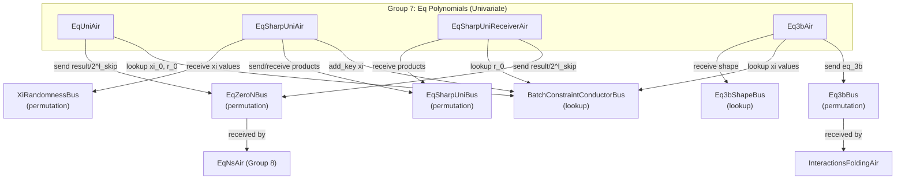

# Group 7: Batch Constraint - Eq Polynomials (Univariate)

## Group Summary

This group computes univariate equality polynomial evaluations required by the batch constraint sumcheck. The batch constraint protocol reduces the verification of all AIR constraints and interactions to a single polynomial identity, and the equality polynomials in this group handle the univariate component of that reduction -- specifically, the evaluations over the first `l_skip` variables corresponding to the coset structure of the low-degree domain D. The group contains four AIRs: EqUniAir computes the base eq polynomial at the sumcheck challenge, EqSharpUniAir expands the "sharp" eq polynomial across roots of unity using a butterfly-style doubling, EqSharpUniReceiverAir collects those products and performs Horner evaluation, and Eq3bAir computes the stacked-index equality values used by interaction folding.

## Architecture Diagram

---

## EqUniAir

### Executive Summary

EqUniAir computes the univariate equality polynomial `eq_uni(r_0, xi_0)` by iteratively squaring both the sumcheck challenge `r_0` and the randomness `xi_0` over `l_skip` rounds. The result, divided by `2^l_skip`, is sent to EqZeroNBus where it serves as the `n=0` base case for the multivariate eq computation in EqNsAir.

### Public Values

None.

### AIR Guarantees

1. **Challenge input (BatchConstraintConductorBus — lookup):** Looks up `xi_0` and `r_0`.
2. **Base eq output (EqZeroNBus — sends):** Sends `(is_sharp=0, eq_uni(r_0, xi_0) / 2^l_skip)`, where `eq_uni` is defined by the recurrence:
   - `res_0 = 1`
   - `res_{i+1} = (xi_0^{2^i} + r_0^{2^i}) * res_i + (xi_0^{2^i} - 1) * (r_0^{2^i} - 1)` for `i = 0..l_skip-1`
   - `eq_uni(r_0, xi_0) = res_{l_skip}`.

### Walkthrough

Consider `l_skip = 3`, `xi_0 = a`, `r_0 = b` (extension field elements).

| Row | idx | x        | y        | res                                    | is_first | is_valid |
|-----|-----|----------|----------|----------------------------------------|----------|----------|
| 0   | 0   | a        | b        | 1                                      | 1        | 1        |
| 1   | 1   | a^2      | b^2      | (a+b)*1 + (1-a)(1-b)                  | 0        | 1        |
| 2   | 2   | a^4      | b^4      | (a^2+b^2)*res_1 + (1-a^2)(1-b^2)      | 0        | 1        |
| 3   | 3   | a^8      | b^8      | (a^4+b^4)*res_2 + (1-a^4)(1-b^4)      | 0        | 1        |

On row 3 (last valid), the AIR sends `res_3 / 2^3` to `EqZeroNBus`. The value `res_3` equals `eq_uni(r_0, xi_0)` as defined by the recurrence above.

---

## EqSharpUniAir

### Executive Summary

EqSharpUniAir computes the coefficient vector of the "sharp" univariate equality polynomial via a butterfly-style expansion from the xi challenges. It uses a 3-level loop (proof x round x iteration) where each round corresponds to a variable index `xi_idx` from `l_skip-1` down to 0. Within each round, each partial product is split into two children using `(1 - xi ± xi * root_pow)`, doubling the number of terms. After `l_skip` rounds, the AIR emits `2^l_skip` coefficient terms, which EqSharpUniReceiverAir then Horner-evaluates at `r_0`.

### Public Values

None.

### AIR Guarantees

1. **Xi input (XiRandomnessBus — receives):** Receives xi challenges from the GKR module.
2. **Coefficient output (EqSharpUniBus — sends):** Sends `2^l_skip` coefficient terms to EqSharpUniReceiverAir via a butterfly-style expansion.
3. **Xi publication (BatchConstraintConductorBus — provides):** Publishes `xi_0` (key `msg_type = Xi, idx = 0`) for downstream EqUni lookups.

### Walkthrough

For `l_skip = 2`, the butterfly expansion proceeds:

| Row | xi_idx | iter_idx | root  | root_pow | root_half_order | product_before |
|-----|--------|----------|-------|----------|-----------------|----------------|
| 0   | 1      | 0        | -1    | 1        | 1               | 1              |
| 1   | 0      | 0        | w^-1  | 1        | 2               | (1-xi_1+xi_1)  |
| 2   | 0      | 1        | w^-1  | w^-1     | 2               | (1-xi_1-xi_1)  |

Row 0 produces two children (iter 0 and iter 1 of the next round). Rows 1-2 each produce two more, yielding 4 final coefficient terms that are received by EqSharpUniReceiverAir.

---

## EqSharpUniReceiverAir

### Executive Summary

EqSharpUniReceiverAir collects the `2^l_skip` coefficient terms from EqSharpUniAir and performs a Horner-scheme evaluation at the sumcheck challenge `r_0`. The resulting polynomial evaluation, divided by `2^l_skip`, is sent to EqZeroNBus as the "sharp" variant (`is_sharp=1`) of the base equality evaluation.

### Public Values

None.

### AIR Guarantees

1. **Coefficient input (EqSharpUniBus — receives):** Receives the `2^l_skip` coefficient terms from EqSharpUniAir.
2. **Challenge input (BatchConstraintConductorBus — lookup):** Looks up `r_0`.
3. **Sharp eq output (EqZeroNBus — sends):** Sends `(is_sharp=1, eq_sharp_uni(r_0, xi) / 2^l_skip)`, computed as a Horner evaluation of the products at `r_0`.

### Walkthrough

For `l_skip = 2`, with 4 product coefficients `[c0, c1, c2, c3]` and challenge `r_0`:

| Row | idx | coeff | r   | cur_sum                                |
|-----|-----|-------|-----|----------------------------------------|
| 0   | 0   | c0    | r_0 | c0 + r_0*(c1 + r_0*(c2 + r_0*c3))     |
| 1   | 1   | c1    | r_0 | c1 + r_0*(c2 + r_0*c3)                 |
| 2   | 2   | c2    | r_0 | c2 + r_0*c3                            |
| 3   | 3   | c3    | r_0 | c3                                     |

The AIR sends `cur_sum[row 0] / 4` to EqZeroNBus. This equals `eq_sharp_uni(r_0, xi) / 2^l_skip`.

---

## Eq3bAir

### Executive Summary

Eq3bAir computes `eq_3b(xi, stacked_idx >> l_skip)` for each interaction in each AIR. This equality polynomial evaluation maps each interaction's position in the stacked hypercube to a scalar weight used during interaction folding. The AIR iterates bit-by-bit through the shifted stacked index, multiplying the running eq product by either `xi_n` or `(1 - xi_n)` depending on the corresponding bit, starting from the interaction's lift height `n_lift`.

### Public Values

None.

### AIR Guarantees

1. **Shape input (Eq3bShapeBus — receives):** Receives `(sort_idx, n_lift, n_logup)` from ProofShapeAir on the first row of each AIR, providing the range of hypercube dimensions.
2. **Xi input (BatchConstraintConductorBus — lookup):** Looks up `xi_{n + l_skip}` for each bit position in the stacked index.
3. **Eq3b output (Eq3bBus — sends):** Sends `(sort_idx, interaction_idx, eq_3b)` for each interaction in each AIR, where `eq_3b = eq(xi, stacked_idx >> l_skip)` is the stacked-index equality weight.

Eq3bAir tracks `n_logup` as a column, received via Eq3bShapeBus. The `n_logup` value stays constant across all rows within an AIR and determines the upper bound of the hypercube iteration. On the last interaction row (when `has_interactions`), `n == n_logup` is enforced.

### Walkthrough

For an interaction at `sort_idx=2`, `interaction_idx=0`, `n_lift=1`, `n_logup=3`, `stacked_idx >> l_skip = 4` (binary `100`):

| Row | n   | nth_bit | n_at_least_n_lift | xi            | eq                     | idx |
|-----|-----|---------|-------------------|---------------|------------------------|-----|
| 0   | 0   | 0       | 0                 | (ignored)     | 1                      | 0   |
| 1   | 1   | 0       | 1                 | xi_{l_skip+1} | 1 * (1 - xi_{l+1})    | 0   |
| 2   | 2   | 1       | 1                 | xi_{l_skip+2} | prev * xi_{l+2}        | 4   |
| 3   | 3   | --      | 1                 | --            | (final eq_3b sent)     | 4   |

At n=0, n < n_lift so the AIR forces `nth_bit=0` (bits below the lift height are ignored and constrained to zero). At n=1, the actual eq computation begins. The final `eq` value on the last row is sent to `Eq3bBus`. The reconstructed `idx` equals 4, matching the stacked index, because bits below n_lift are constrained to be zero.

---

## Bus Summary

| Bus | Type | Role in This Group |
|-----|------|--------------------|
| [BatchConstraintConductorBus](bus-inventory.md#631-batchconstraintconductorbus) | Lookup (per-proof) | EqUniAir, EqSharpUniAir, EqSharpUniReceiverAir, Eq3bAir look up / provide challenges |
| [EqZeroNBus](bus-inventory.md#639-eqzeronbus) | Permutation (per-proof) | EqUniAir and EqSharpUniReceiverAir send base eq values to EqNsAir (Group 8) |
| [EqSharpUniBus](bus-inventory.md#638-eqsharpunibus) | Permutation (per-proof) | EqSharpUniAir sends products; EqSharpUniReceiverAir receives |
| [Eq3bBus](bus-inventory.md#637-eq3bbus) | Permutation (per-proof) | Eq3bAir sends eq_3b values to InteractionsFoldingAir |
| [Eq3bShapeBus](bus-inventory.md#511-eq3bshapebus) | Lookup (per-proof) | Eq3bAir receives shape (n_lift, n_logup) from ProofShapeAir |
| [XiRandomnessBus](bus-inventory.md#41-xirandomnessbus) | Permutation (per-proof) | EqSharpUniAir receives xi challenges from GKR module |
