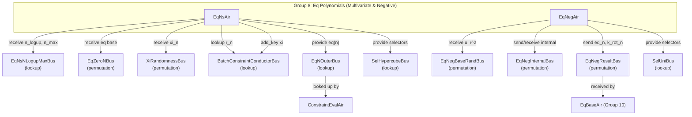

# Group 8: Batch Constraint - Eq Polynomials (Multivariate & Negative)

## Group Summary

This group extends the univariate equality polynomial base cases (produced by Group 7) into full multivariate evaluations. EqNsAir iterates through variables `n = 0..n_max`, multiplying by the factor `1 - (xi_n + r_n - 2*xi_n*r_n)` at each step to build up the complete `eq(xi, r)` and `eq_sharp(xi, r)` evaluations needed by the batch constraint protocol. EqNegAir handles AIRs whose log-height is smaller than `l_skip` (the "negative hypercube" case), computing equality kernel values via iterative squaring over decreasing sections and providing selector lookups for those short traces. Together, these two AIRs cover all hypercube dimensions: EqNsAir handles dimensions >= 0, and EqNegAir handles dimensions < 0.

## Architecture Diagram

---

## EqNsAir

### Executive Summary

EqNsAir computes the multivariate equality polynomials `eq(xi, r)` and `eq_sharp(xi, r)` by extending the base cases received from Group 7 (EqZeroNBus) through `n_max` rounds. On each row `n`, it multiplies both eq and eq_sharp by the shared factor `1 - (xi_n + r_n - 2*xi_n*r_n)`. The accumulated values, combined with a running product of `r` values, are provided as lookups to the constraint evaluation AIRs.

### Public Values

None.

### AIR Guarantees

1. **Base eq input (EqZeroNBus — receives):** Receives `(is_sharp=0, eq_base)` and `(is_sharp=1, eq_sharp_base)` from the univariate eq AIRs (Group 7).
2. **Shape input (EqNsNLogupMaxBus — receives):** Receives `(n_logup, n_max)` from ProofShapeAir, providing the global LogUp dimension and maximum hypercube dimension.
3. **Xi input (XiRandomnessBus — receives):** Receives xi challenges from the GKR module.
4. **Challenge lookups (BatchConstraintConductorBus — lookup/provides):** Looks up sumcheck challenges `r_n` and publishes xi values for downstream consumers.
5. **Eq output (EqNOuterBus — provides):** Provides `(is_sharp, n, eq*r_product)` for each variable index `n`, where `eq` extends the base case through `n_max` rounds by the multivariate factor `1 - (xi_n + r_n - 2*xi_n*r_n)`.
6. **Selector output (SelHypercubeBus — provides):** Provides hypercube selector evaluations `(n, is_first, value)` derived from prefix products of `r_n` values.

### Walkthrough

For a proof with `l_skip = 2`, `n_logup = 2`, `n_max = 3`, base eq from Group 7 = `E0`, base eq_sharp = `S0`:

| Row | n | xi_n         | r_n  | r_product       | eq                        | eq_sharp                  | n < n_max |
|-----|---|--------------|------|-----------------|---------------------------|---------------------------|-----------|
| 0   | 0 | xi_{l+0}     | r_1  | r_1*r_2*r_3     | E0                        | S0                        | 1         |
| 1   | 1 | xi_{l+1}     | r_2  | r_2*r_3         | E0 * m_0                  | S0 * m_0                  | 1         |
| 2   | 2 | xi_{l+2}     | r_3  | r_3             | E0 * m_0 * m_1            | S0 * m_0 * m_1            | 1         |
| 3   | 3 | (beyond)     | 1    | 1               | E0 * m_0 * m_1 * m_2      | S0 * m_0 * m_1 * m_2      | 0         |

Where `m_i = 1 - (xi_{l+i} + r_{i+1} - 2*xi_{l+i}*r_{i+1})`. Each row provides `eq[n] * r_product[n]` to `EqNOuterBus` for lookup by constraint evaluation AIRs.

---

## EqNegAir

### Executive Summary

EqNegAir handles equality polynomial evaluation for AIRs whose log-height is strictly less than `l_skip`, corresponding to "negative" hypercube dimensions. It runs `l_skip` sections indexed by `neg_hypercube = 0..l_skip-1`, where section `h` has `l_skip - h + 1` rows of iterative squaring. The AIR computes running products `prod(u^{2^i} + r'^{2^i})` and `prod(u^{2^i} + (r*omega)'^{2^i})` to derive `eq_n(u, r)` and `k_rot_n(u, r)` for negative `n`, and provides univariate selector values via `SelUniBus`.

### Public Values

None.

### AIR Guarantees

1. **Base randomness (EqNegBaseRandBus — receives):** Receives `(u, r^2)` from EqBaseAir.
2. **Eq/k_rot output (EqNegResultBus — sends):** Sends `(n=-neg_hypercube, 2^{l_skip+n} * eq_n(u, r), 2^{l_skip+n} * k_rot_n(u, r))` to EqBaseAir for negative-dimension AIRs (those with `log_height < l_skip`). Values include the scaling factor `2^{l_skip+n}`.
3. **Selector output (SelUniBus — provides):** Provides univariate selector evaluations for AIRs with negative hypercube dimensions.

### Walkthrough

For `l_skip = 2`, `u_0 = u`, `r_0 = r`, `omega = g_4`:

**Section 0 (neg_hypercube = 0):** 3 rows

| Row | neg_h | row_idx | u_pow | r_pow    | r_omega_pow   | prod_u_r              |
|-----|-------|---------|-------|----------|---------------|-----------------------|
| 0   | 0     | 0       | u     | r        | r*omega       | u*(u+r)               |
| 1   | 0     | 1       | u^2   | r^2      | (r*omega)^2   | u*(u+r)*(u^2+r^2)    |
| 2   | 0     | 2       | u^4   | r^4      | (r*omega)^4   | (full product)        |

On the penultimate row (row 1), the AIR computes `eq_0 = (prod_u_r - u^4 + 1) * 2^{l_skip+0}` and `k_rot_0` (the values include the scaling factor `2^{l_skip+n}`, representing `2^{l_skip+n} * eq_n(u, r)` rather than the unscaled evaluation). These are not sent to `EqNegResultBus` for section 0 (since `neg_hypercube = 0`), but `SelUniBus` lookups are provided.

**Section 1 (neg_hypercube = 1):** 2 rows

| Row | neg_h | row_idx | u_pow | r_pow    | prod_u_r         |
|-----|-------|---------|-------|----------|------------------|
| 3   | 1     | 0       | u     | r^2      | u*(u+r^2)        |
| 4   | 1     | 1       | u^2   | r^4      | u*(u+r^2)*(u^2+r^4) |

On the penultimate row (row 3), `eq_{-1}` and `k_rot_{-1}` (scaled by `2^{l_skip+(-1)}`) are computed and sent to `EqNegResultBus`. The internal bus passes `(u, r^2, (r*omega)^2)` from section 0 to section 1.

---

## Bus Summary

| Bus | Type | Role in This Group |
|-----|------|--------------------|
| [EqZeroNBus](bus-inventory.md#639-eqzeronbus) | Permutation (per-proof) | EqNsAir receives base eq values from Group 7 |
| [EqNsNLogupMaxBus](bus-inventory.md#512-eqnsnlogupmaxbus) | Lookup (per-proof) | EqNsAir receives (n_logup, n_max) from ProofShapeAir |
| [XiRandomnessBus](bus-inventory.md#41-xirandomnessbus) | Permutation (per-proof) | EqNsAir receives xi challenges |
| [BatchConstraintConductorBus](bus-inventory.md#631-batchconstraintconductorbus) | Lookup (per-proof) | EqNsAir looks up r_n and provides xi values |
| [EqNOuterBus](bus-inventory.md#6310-eqnouterbus) | Lookup (per-proof) | EqNsAir provides eq(n) values for constraint evaluation |
| [SelHypercubeBus](bus-inventory.md#55-selhypercubebus) | Lookup (per-proof) | EqNsAir provides hypercube selector evaluations |
| [EqNegBaseRandBus](bus-inventory.md#45-eqnegbaserandbus) | Permutation (per-proof) | EqNegAir receives (u, r^2) from EqBaseAir |
| [EqNegResultBus](bus-inventory.md#56-eqnegresultbus) | Permutation (per-proof) | EqNegAir sends eq_n, k_rot_n to EqBaseAir |
| [EqNegInternalBus](bus-inventory.md#6311-eqneginternalbus) | Permutation (per-proof) | EqNegAir internal recursive computation |
| [SelUniBus](bus-inventory.md#54-selunibus) | Lookup (per-proof) | EqNegAir provides univariate selector evaluations |
