# Group 9: Stacking - Claims & Opening

## Group Summary

This group implements the stacking protocol that reduces all column opening claims to a single WHIR polynomial commitment claim. The protocol proceeds in four stages: OpeningClaimsAir collects per-column opening claims from the batch constraint module, computes an RLC using lambda to form `s_0`, and computes per-stacked-column coefficients. UnivariateRoundAir verifies the univariate round by checking that the sum of `s_0(z)` over domain D equals `|D| * (a_0 + a_{|D|})` and evaluates `s_0(u_0)` via Horner's method. SumcheckRoundsAir executes `n_stack` rounds of multilinear sumcheck with quadratic interpolation, maintaining eq_cube and rot_cube kernels. StackingClaimsAir accumulates the final sumcheck result, verifies it against the multilinear evaluation, and computes the RLC with mu to form the WHIR claim.

## Architecture Diagram

```mermaid
graph TD
    subgraph "Group 9: Stacking - Claims & Opening"
        Opening["OpeningClaimsAir"]
        Univariate["UnivariateRoundAir"]
        Sumcheck["SumcheckRoundsAir"]
        Claims["StackingClaimsAir"]
    end

    ColumnClaimsBus["ColumnClaimsBus<br/>(permutation)"]
    SumcheckClaimsBus["SumcheckClaimsBus<br/>(permutation)"]
    ClaimCoefficientsBus["ClaimCoefficientsBus<br/>(permutation)"]
    StackingTidxBus["StackingModuleTidxBus<br/>(permutation)"]
    TranscriptBus["TranscriptBus<br/>(permutation)"]
    EqKernelBus["EqKernelLookupBus<br/>(lookup)"]
    EqBitsLookupBus["EqBitsLookupBus<br/>(lookup)"]
    EqRandBus["EqRandValuesLookupBus<br/>(lookup)"]
    EqBaseBus["EqBaseBus<br/>(permutation)"]
    WhirModuleBus["WhirModuleBus<br/>(permutation)"]
    WhirMuBus["WhirMuBus<br/>(permutation)"]
    WhirOpeningBus["WhirOpeningPointBus<br/>(permutation)"]
    ConstraintRandBus["ConstraintSumcheckRandomnessBus<br/>(permutation)"]
    LiftedHeightsBus["LiftedHeightsBus<br/>(lookup)"]
    StackingIndicesBus["StackingIndicesBus<br/>(lookup)"]

    Opening -->|"send column claims"| ColumnClaimsBus
    Opening -->|"send s_0 sum"| SumcheckClaimsBus
    Opening -->|"send coefficients"| ClaimCoefficientsBus
    Opening -->|"send tidx"| StackingTidxBus
    Opening -->|"lookup heights"| LiftedHeightsBus
    Opening -->|"lookup eq_in"| EqKernelBus
    Opening -->|"lookup eq_bits"| EqBitsLookupBus
    Opening -->|"receive/send transcript"| TranscriptBus

    Univariate -->|"receive tidx"| StackingTidxBus
    Univariate -->|"receive s_0 sum"| SumcheckClaimsBus
    Univariate -->|"send s_0(u_0)"| SumcheckClaimsBus
    Univariate -->|"provide u_0"| EqRandBus
    Univariate -->|"send tidx"| StackingTidxBus
    Univariate -->|"receive/send transcript"| TranscriptBus

    Sumcheck -->|"receive tidx"| StackingTidxBus
    Sumcheck -->|"receive s_0(u_0)"| SumcheckClaimsBus
    Sumcheck -->|"send s_eval_at_u"| SumcheckClaimsBus
    Sumcheck -->|"receive eq_base"| EqBaseBus
    Sumcheck -->|"provide eq_round"| EqKernelBus
    Sumcheck -->|"provide u_round"| EqRandBus
    Sumcheck -->|"send u to WHIR"| WhirOpeningBus
    Sumcheck -->|"receive r"| ConstraintRandBus
    Sumcheck -->|"send tidx"| StackingTidxBus

    Claims -->|"receive tidx"| StackingTidxBus
    Claims -->|"receive coefficients"| ClaimCoefficientsBus
    Claims -->|"receive s_eval_at_u"| SumcheckClaimsBus
    Claims -->|"send whir_claim"| WhirModuleBus
    Claims -->|"send mu"| WhirMuBus
    Claims -->|"provide stacking indices"| StackingIndicesBus
    Claims -->|"receive/send transcript"| TranscriptBus
```

---

## OpeningClaimsAir

### Executive Summary

OpeningClaimsAir processes all column opening claims from the batch constraint module, ordering them by (sort_idx, part_idx, col_idx). For each claim, it computes an RLC `s_0 = sum(lambda_pow^i * (col_claim_i + lambda * rot_claim_i))` and a stacking coefficient `lambda_pow * eq_bits * (eq_in + lambda * k_rot_in)`. The s_0 sum is sent to UnivariateRoundAir, and per-stacked-column coefficients are sent to StackingClaimsAir.

### Public Values

None.

### AIR Guarantees

1. **Column claims (ColumnClaimsBus — sends):** Sends each `(sort_idx, part_idx, col_idx, claim, is_rot)` to SymbolicExpressionAir.
2. **S_0 sum (SumcheckClaimsBus — sends):** Sends the RLC `s_0 = sum(lambda_pow^i * (col_claim_i + lambda * rot_claim_i))` to UnivariateRoundAir.
3. **Coefficients (ClaimCoefficientsBus — sends):** Sends `(commit_idx, stacked_col_idx, coefficient)` to StackingClaimsAir at each stacked column boundary.
4. **Height lookups (LiftedHeightsBus — lookup):** Looks up lifted heights from ProofShapeAir.
5. **Rotation check (AirShapeBus — lookup):** Looks up `NeedRot` property from ProofShapeAir to determine which columns require rotation claims.
6. **Eq kernel lookups (EqKernelLookupBus — lookup, EqBitsLookupBus — lookup):** Looks up equality kernel evaluations for stacking coefficient computation.
7. **Module input (StackingModuleBus — receives):** Receives starting tidx from the batch constraint module.
8. **Tidx coordination (StackingModuleTidxBus — sends):** Sends tidx to downstream stacking AIRs (SumcheckRoundsAir, StackingClaimsAir).
9. **Transcript (TranscriptBus — receives):** Receives column claims and samples lambda.

### Walkthrough

For 3 columns with `lambda`, `l_skip = 1`, `n_stack = 2`:

| Row | sort_idx | col_idx | lambda_pow | col_claim | s_0                                  | commit_idx | is_last_for_claim |
|-----|----------|---------|------------|-----------|--------------------------------------|------------|-------------------|
| 0   | 0        | 0       | 1          | c0        | c0 + lambda*rot0                     | 0          | 0                 |
| 1   | 0        | 1       | lambda^2   | c1        | s_0[0] + lambda^2*c1 + lambda^3*rot1 | 0          | 1                 |
| 2   | 1        | 0       | lambda^4   | c2        | s_0[1] + lambda^4*c2 + lambda^5*rot2 | 1          | 1                 |

The final `s_0` on the last row is sent to SumcheckClaimsBus. Coefficient boundaries at `is_last_for_claim=1` trigger sends to ClaimCoefficientsBus.

---

## UnivariateRoundAir

### Executive Summary

UnivariateRoundAir verifies the univariate round of the stacking protocol. It reads the polynomial `s_0` from the transcript (as `2*|D|-1` coefficients), checks that the sum `s_0(z)` over `z in D` equals the RLC from OpeningClaimsAir (using the identity `sum = |D| * (a_0 + a_{|D|})`), and computes `s_0(u_0)` via Horner's method. The result is forwarded to SumcheckRoundsAir.

### Public Values

None.

### AIR Guarantees

1. **S_0 verification (SumcheckClaimsBus — receives/sends):** Receives the `s_0` sum from OpeningClaimsAir. Verifies the sum of the univariate polynomial over domain D equals this value. Sends `s_0(u_0)` to SumcheckRoundsAir.
2. **u_0 publication (EqRandValuesLookupBus — provides):** Provides `(idx=0, u_0)` for downstream equality polynomial lookups.
3. **Tidx coordination (StackingModuleTidxBus — receives/sends):** Receives/sends tidx for phase coordination.
4. **Transcript (TranscriptBus — receives):** Observes coefficients and samples `u_0`.

### Walkthrough

For `l_skip = 2` (D has 4 elements), 7 coefficients `[a0..a6]`, challenge `u_0`:

| Row | coeff_idx | coeff | u_0_pow | coeff_is_d | s_0_sum_over_d           | poly_rand_eval          |
|-----|-----------|-------|---------|------------|--------------------------|-------------------------|
| 0   | 0         | a0    | 1       | 0          | 4*a0                     | a0                      |
| 1   | 1         | a1    | u_0     | 0          | 4*a0                     | a0 + a1*u_0             |
| 2   | 2         | a2    | u_0^2   | 0          | 4*a0                     | ... + a2*u_0^2          |
| 3   | 3         | a3    | u_0^3   | 0          | 4*a0                     | ... + a3*u_0^3          |
| 4   | 4         | a4    | u_0^4   | 1          | 4*(a0 + a4)              | ... + a4*u_0^4          |
| 5   | 5         | a5    | u_0^5   | 0          | 4*(a0 + a4)              | ... + a5*u_0^5          |
| 6   | 6         | a6    | u_0^6   | 0          | 4*(a0 + a4)              | s_0(u_0)                |

The AIR verifies `s_0_sum_over_d` matches the RLC from OpeningClaimsAir, and sends `poly_rand_eval` = `s_0(u_0)` to SumcheckRoundsAir.

---

## SumcheckRoundsAir

### Executive Summary

SumcheckRoundsAir executes `n_stack` rounds of multilinear sumcheck for the stacking protocol. Each row corresponds to one round, where the prover provides evaluations `s_eval_at_1` and `s_eval_at_2`. The AIR derives `s_eval_at_0` from the previous round's claim, performs quadratic interpolation at the verifier's challenge `u_round`, and maintains the eq_cube, r_not_u_prod, and rot_cube_minus_prod accumulators needed for the equality kernel lookups.

### Public Values

None.

### AIR Guarantees

1. **Claim flow (SumcheckClaimsBus — receives/sends):** Receives `s_0(u_0)` from UnivariateRoundAir. Executes `n_stack` rounds of quadratic sumcheck. Sends final `s_eval_at_u` to StackingClaimsAir.
2. **Eq base (EqBaseBus — receives):** Receives base equality kernel values from EqBaseAir.
3. **Eq kernel output (EqKernelLookupBus — provides):** Provides per-round `(n=round, eq_in, k_rot_in)` for OpeningClaimsAir.
4. **Randomness output (EqRandValuesLookupBus — provides):** Provides `(idx=round, u_round)` for downstream equality polynomial lookups.
5. **WHIR opening points (WhirOpeningPointBus — sends):** Sends `(idx=round+l_skip-1, u_round)` for WHIR evaluation.
6. **Constraint randomness (ConstraintSumcheckRandomnessBus — receives):** Receives `r_round` from the batch constraint module when available.
7. **Tidx coordination (StackingModuleTidxBus — receives/sends):** Receives/sends tidx for phase coordination.

### Walkthrough

For `n_stack = 2` with challenges `u_1, u_2` and verifier randomness `r_1`:

| Row | round | s_eval_at_0     | s_eval_at_1 | s_eval_at_u   | eq_cube           |
|-----|-------|-----------------|-------------|---------------|-------------------|
| 0   | 1     | claim - s1[0]   | s1[0]       | interp(u_1)   | 1-(u1r1+r1u1')    |
| 1   | 2     | s_at_u[0]-s1[1] | s1[1]       | interp(u_2)   | eq_cube[0]*next   |

The final `s_eval_at_u` is sent to StackingClaimsAir for verification against the stacking claim inner products.

---

## StackingClaimsAir

### Executive Summary

StackingClaimsAir collects all stacking claims (one per stacked column), receives their corresponding coefficients from OpeningClaimsAir, and verifies that `sum(stacking_claim_i * coefficient_i) = s_{n_stack}(u_{n_stack})` (the final sumcheck evaluation from SumcheckRoundsAir). It then computes an RLC of the stacking claims using a batching challenge `mu` and sends the resulting WHIR claim to the WHIR module.

### Public Values

None.

### AIR Guarantees

1. **Coefficients (ClaimCoefficientsBus — receives):** Receives per-column `(commit_idx, stacked_col_idx, coefficient)` from OpeningClaimsAir.
2. **Sumcheck verification (SumcheckClaimsBus — receives):** Receives the final sumcheck result. Verifies `sum(stacking_claim_i * coefficient_i)` equals this value.
3. **WHIR claim (WhirModuleBus — sends):** Sends `(tidx, whir_claim)` to WhirRoundAir, where `whir_claim = sum(mu^i * stacking_claim_i)`.
4. **Mu (WhirMuBus — sends):** Sends the batching challenge `mu` to InitialOpenedValuesAir.
5. **Stacking indices (StackingIndicesBus — provides):** Provides `(commit_idx, col_idx)` for InitialOpenedValuesAir.
6. **Mu proof-of-work (ExpBitsLenBus — lookup):** Verifies the mu PoW witness via exponentiation lookup.
7. **Tidx coordination (StackingModuleTidxBus — receives):** Receives starting tidx.
8. **Transcript (TranscriptBus — receives):** Reads stacking claims and samples `mu`.

### Walkthrough

For 3 stacked columns with claims `[v0, v1, v2]`, coefficients `[c0, c1, c2]`, and challenge `mu`:

| Row | commit_idx | stacked_col_idx | stacking_claim | claim_coefficient | final_s_eval    | whir_claim             |
|-----|------------|-----------------|----------------|-------------------|-----------------|------------------------|
| 0   | 0          | 0               | v0             | c0                | v0*c0           | v0                     |
| 1   | 0          | 1               | v1             | c1                | v0*c0+v1*c1     | v0 + mu*v1             |
| 2   | 1          | 0               | v2             | c2                | v0*c0+v1*c1+v2*c2 | v0 + mu*v1 + mu^2*v2 |

The AIR verifies `final_s_eval` equals the sumcheck result from SumcheckRoundsAir on the last valid row (before optional padding), then sends `whir_claim` to WhirModuleBus to initiate WHIR verification. Bus interactions are gated on `is_last_valid`, not the absolute last row.

---

## Bus Summary

| Bus | Type | Role in This Group |
|-----|------|--------------------|
| [ColumnClaimsBus](bus-inventory.md#37-columnclaimsbus) | Permutation (per-proof) | OpeningClaimsAir sends column claims to SymbolicExpressionAir |
| [SumcheckClaimsBus](bus-inventory.md#643-sumcheckclaimsbus-stacking) | Permutation (per-proof) | Claims flow: OpeningClaimsAir -> UnivariateRoundAir -> SumcheckRoundsAir -> StackingClaimsAir |
| [ClaimCoefficientsBus](bus-inventory.md#642-claimcoefficientsbus) | Permutation (per-proof) | OpeningClaimsAir sends coefficients; StackingClaimsAir receives |
| [StackingModuleTidxBus](bus-inventory.md#641-stackingmoduletidxbus) | Permutation (per-proof) | Tidx handoff between all stacking sub-modules |
| [StackingModuleBus](bus-inventory.md#14-stackingmodulebus) | Permutation (per-proof) | OpeningClaimsAir receives starting tidx from batch constraint |
| [TranscriptBus](bus-inventory.md#11-transcriptbus) | Permutation (per-proof) | All AIRs receive transcript observations/samples |
| [LiftedHeightsBus](bus-inventory.md#33-liftedheightsbus) | Lookup (per-proof) | OpeningClaimsAir looks up lifted heights from ProofShapeAir |
| [AirShapeBus](bus-inventory.md#31-airshapebus) | Lookup (per-proof) | OpeningClaimsAir looks up NeedRot from ProofShapeAir |
| [EqKernelLookupBus](bus-inventory.md#647-eqkernellookupbus) | Lookup (per-proof) | OpeningClaimsAir looks up; SumcheckRoundsAir provides |
| [EqBitsLookupBus](bus-inventory.md#648-eqbitslookupbus) | Lookup (per-proof) | OpeningClaimsAir looks up eq_bits values |
| [EqRandValuesLookupBus](bus-inventory.md#644-eqrandvalueslookupbus) | Lookup (per-proof) | UnivariateRoundAir and SumcheckRoundsAir provide u values |
| [EqBaseBus](bus-inventory.md#645-eqbasebus) | Permutation (per-proof) | SumcheckRoundsAir receives base eq values from EqBaseAir |
| [WhirOpeningPointBus](bus-inventory.md#43-whiropeningpointbus) | Permutation (per-proof) | SumcheckRoundsAir sends opening points to WHIR |
| [ConstraintSumcheckRandomnessBus](bus-inventory.md#42-constraintsumcheckrandomnessbus) | Permutation (per-proof) | SumcheckRoundsAir receives r_round challenges |
| [WhirModuleBus](bus-inventory.md#15-whirmodulebus) | Permutation (per-proof) | StackingClaimsAir sends WHIR claim to WhirRoundAir |
| [WhirMuBus](bus-inventory.md#16-whirmubus) | Permutation (per-proof) | StackingClaimsAir sends mu to InitialOpenedValuesAir |
| [StackingIndicesBus](bus-inventory.md#36-stackingindicesbus) | Lookup (per-proof) | StackingClaimsAir provides stacking indices |
| [ExpBitsLenBus](bus-inventory.md#51-expbitslenbus) | Lookup (global) | StackingClaimsAir verifies mu PoW |
