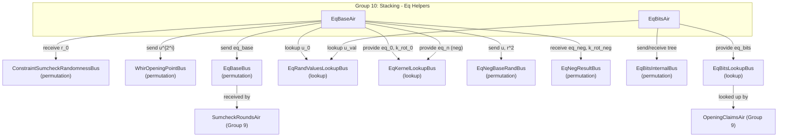

# Group 10: Stacking - Eq Helpers

## Group Summary

This group provides the equality polynomial evaluations needed by the stacking protocol (Group 9). EqBaseAir computes the base equality kernels `eq_0(u, r)`, `eq_0(u, r*omega)`, `eq_0(u, 1)`, and `eq_0(r*omega, 1)` via iterative squaring over `l_skip` rounds. These base values feed into SumcheckRoundsAir and also support negative-dimension lookups by receiving results from EqNegAir and providing combined eq/k_rot values through EqKernelLookupBus. EqBitsAir computes `eq_bits(u, b)` evaluations using a tree-based decomposition, where each node derives its value from its parent via the recurrence `eval * (1 + 2*b_lsb*u - b_lsb - u)`. These bit-decomposed equality values are needed by OpeningClaimsAir to compute stacking coefficients.

## Architecture Diagram

---

## EqBaseAir

### Executive Summary

EqBaseAir computes the fundamental equality polynomial evaluations `eq_0(u, r)` and `eq_0(u, r*omega)` over the first `l_skip` variables via iterative squaring. Starting from the challenges `u_0` and `r_0`, each row squares the running values and accumulates products of `(u^{2^i} + r^{2^i})`. The final products yield `eq_0(u, r) = (prod - u^{2^l_skip} + 1) / 2^l_skip`. Additionally, it computes `eq_0(u, 1)` and `eq_0(r*omega, 1)` for the rotation kernel, sends base values to SumcheckRoundsAir, and provides combined equality kernel lookups for both positive and negative hypercube dimensions.

### Public Values

None.

### AIR Guarantees

1. **Challenge input (ConstraintSumcheckRandomnessBus — receives, EqRandValuesLookupBus — lookup):** Receives `r_0` and looks up `u_0`.
2. **Eq base output (EqBaseBus — sends):** Sends `(eq_u_r, eq_u_r_omega, eq_u_r_prod)` to SumcheckRoundsAir.
3. **Eq kernel output (EqKernelLookupBus — provides):** Provides `(n=0, eq_0, k_rot_0)` for positive dimensions, and `(n=-i, eq_neg, k_rot_neg)` for negative dimensions (combined with values received from EqNegAir).
4. **WHIR opening points (WhirOpeningPointBus — sends):** Sends `(idx=row_idx, u^{2^row_idx})` for each iterative-squaring level.
5. **Negative-dimension coordination (EqNegBaseRandBus — sends, EqNegResultBus — receives):** Sends `(u, r^2)` to EqNegAir and receives back `(eq_neg, k_rot_neg)` for negative-dimension AIRs.

### Walkthrough

For `l_skip = 2`, `u_0 = u`, `r_0 = r`, `omega = g_4`:

| Row | row_idx | u_pow | r_pow | r_omega_pow | prod_u_r             | u_pow_rev | in_prod        |
|-----|---------|-------|-------|-------------|----------------------|-----------|----------------|
| 0   | 0       | u     | r     | r*omega     | u*(u+r)              | u^4       | 1              |
| 1   | 1       | u^2   | r^2   | (r*w)^2     | u*(u+r)*(u^2+r^2)   | u^2       | 1*(u^2+1)      |
| 2   | 2       | u^4   | r^4   | (r*w)^4     | (full product)       | u         | (u^2+1)*(u+1)  |

- Row 0: Sends `(idx=0, u)` to WhirOpeningPointBus. Sends `(u, r^2)` to EqNegBaseRandBus.
- Row 1: Sends `(idx=1, u^2)` to WhirOpeningPointBus. Receives `(n=-1, eq_{-1}, k_rot_{-1})` from EqNegResultBus. Provides `(-1, in_1*eq_{-1}, in_1*k_rot_{-1})` to EqKernelLookupBus.
- Row 1 (penultimate, gated by `next.is_last`): Computes `eq_0 = (prod_u_r - u^4 + 1) / 4` and `k_rot_0 = (prod_u_r_omega - u^4 + 1) / 4`. Provides `(0, eq_0, k_rot_0)` to EqKernelLookupBus. Sends base values to EqBaseBus.
- Row 2 (last): Forces `eq_neg = k_rot_neg = 1` for the `n = -l_skip` special case and publishes the negative-dimension lookup to EqKernelLookupBus.

---

## EqBitsAir

### Executive Summary

EqBitsAir computes `eq_bits(u, b)` for each unique (b_value, num_bits) pair encountered across all stacked slices. It uses a tree structure: the root node (first row) has `b_value=0, num_bits=0, eval=1`. Each child row derives its evaluation from its parent via the recurrence `eval = sub_eval * (1 + 2*b_lsb*u - b_lsb - u)`, where `b_lsb` is the least significant bit being added and `u = u_{n_stack - num_bits + 1}`. Internal nodes propagate their results through `EqBitsInternalBus`, while leaf nodes provide their evaluations to OpeningClaimsAir through `EqBitsLookupBus`.

### Public Values

None.

### AIR Guarantees

1. **u lookups (EqRandValuesLookupBus — lookup):** Looks up stacking challenge `u` values for each tree level.
2. **Eq_bits output (EqBitsLookupBus — provides):** Provides `(b_value * 2^l_skip, num_bits, eval)` where `eval = eq_bits(u, b_value)`, computed via an internal binary tree decomposition.

### Walkthrough

For `n_stack = 2`, `l_skip = 1`, with stacked slices needing `b_values` {0, 1, 2}:

| Row | sub_b_value | b_lsb | num_bits | u_val | sub_eval | eval               | internal_child_flag | external_mult |
|-----|-------------|-------|----------|-------|----------|--------------------|---------------------|---------------|
| 0   | 0           | 0     | 0        | 0     | 1        | 1                  | 3                   | 0             |
| 1   | 0           | 0     | 1        | u_2   | 1        | 1*(1-u_2)          | 1                   | 0             |
| 2   | 0           | 1     | 1        | u_2   | 1        | 1*(2*u_2-1+1-u_2)  | 0                   | 0             |
| 3   | 0           | 0     | 2        | u_1   | (1-u_2)  | (1-u_2)*(1-u_1)    | 0                   | 1             |
| 4   | 0           | 1     | 2        | u_1   | (1-u_2)  | (1-u_2)*(u_1)      | 0                   | 1             |
| 5   | 1           | 0     | 2        | u_1   | (u_2)    | (u_2)*(1-u_1)      | 0                   | 1             |

- Row 0 (root): `eval = 1`, sends two children (b_lsb=0 and b_lsb=1) via `EqBitsInternalBus`.
- Row 1: Receives from internal bus (parent b_value=0, child_lsb=0). Computes `eval = 1 * (1 - u_2)`. Has one child with lsb=0.
- Row 3: A leaf node with `external_mult=1`; provides `eq_bits(u, b=0) = (1-u_2)*(1-u_1)` to EqBitsLookupBus.

---

## Bus Summary

| Bus | Type | Role in This Group |
|-----|------|--------------------|
| [ConstraintSumcheckRandomnessBus](bus-inventory.md#42-constraintsumcheckrandomnessbus) | Permutation (per-proof) | EqBaseAir receives r_0 |
| [EqRandValuesLookupBus](bus-inventory.md#644-eqrandvalueslookupbus) | Lookup (per-proof) | EqBaseAir looks up u_0; EqBitsAir looks up u values |
| [EqBaseBus](bus-inventory.md#645-eqbasebus) | Permutation (per-proof) | EqBaseAir sends base eq values to SumcheckRoundsAir |
| [EqKernelLookupBus](bus-inventory.md#647-eqkernellookupbus) | Lookup (per-proof) | EqBaseAir provides eq_0/k_rot_0 for positive and negative dimensions |
| [WhirOpeningPointBus](bus-inventory.md#43-whiropeningpointbus) | Permutation (per-proof) | EqBaseAir sends u^{2^i} opening points |
| [EqNegBaseRandBus](bus-inventory.md#45-eqnegbaserandbus) | Permutation (per-proof) | EqBaseAir sends (u, r^2) to EqNegAir |
| [EqNegResultBus](bus-inventory.md#56-eqnegresultbus) | Permutation (per-proof) | EqBaseAir receives eq_neg/k_rot_neg from EqNegAir |
| [EqBitsLookupBus](bus-inventory.md#648-eqbitslookupbus) | Lookup (per-proof) | EqBitsAir provides eq_bits values to OpeningClaimsAir |
| [EqBitsInternalBus](bus-inventory.md#646-eqbitsinternalbus) | Permutation (per-proof) | EqBitsAir internal tree propagation |
