# Group 11: WHIR - Protocol Control

## Group Summary

This group manages the top-level WHIR polynomial commitment verification protocol. WhirRoundAir is the main controller: it has one row per WHIR round per proof, orchestrating the commitment verification, OOD sampling, sumcheck initiation, query generation, and claim propagation across rounds. SumcheckAir handles the inner sumcheck within each WHIR round, running `k_whir` sub-rounds per WHIR round, where each sub-round performs quadratic interpolation and accumulates the Mobius-adjusted equality kernel for the eval-to-coefficient RS encoding used by WHIR. Together, these AIRs bridge the stacking output (the WHIR claim) through the multi-round WHIR protocol to the final polynomial and query verification AIRs.

## Architecture Diagram

```mermaid
graph TD
    subgraph "Group 11: WHIR - Protocol Control"
        WhirRound["WhirRoundAir"]
        Sumcheck["SumcheckAir (WHIR)"]
    end

    WhirModuleBus["WhirModuleBus<br/>(permutation)"]
    CommitmentsBus["CommitmentsBus<br/>(lookup)"]
    TranscriptBus["TranscriptBus<br/>(permutation)"]
    WhirSumcheckBus["WhirSumcheckBus<br/>(permutation)"]
    WhirQueryBus["WhirQueryBus<br/>(permutation)"]
    VerifyQueriesBus["VerifyQueriesBus<br/>(permutation)"]
    WhirGammaBus["WhirGammaBus<br/>(permutation)"]
    FinalPolyMleEvalBus["FinalPolyMleEvalBus<br/>(permutation)"]
    FinalPolyQueryEvalBus["FinalPolyQueryEvalBus<br/>(permutation)"]
    WhirAlphaBus["WhirAlphaBus<br/>(lookup)"]
    WhirEqAlphaUBus["WhirEqAlphaUBus<br/>(permutation)"]
    WhirOpeningPointBus["WhirOpeningPointBus<br/>(permutation)"]
    ExpBitsLenBus["ExpBitsLenBus<br/>(lookup)"]

    WhirRound -->|"receive claim"| WhirModuleBus
    WhirRound -->|"provide commits"| CommitmentsBus
    WhirRound -->|"send sumcheck"| WhirSumcheckBus
    WhirRound -->|"send z0 query"| WhirQueryBus
    WhirRound -->|"send verify queries"| VerifyQueriesBus
    WhirRound -->|"send gamma"| WhirGammaBus
    WhirRound -->|"send final_poly_mle"| FinalPolyMleEvalBus
    WhirRound -->|"send final_poly_query"| FinalPolyQueryEvalBus
    WhirRound -->|"PoW check"| ExpBitsLenBus
    WhirRound -->|"transcript ops"| TranscriptBus

    Sumcheck -->|"receive sumcheck"| WhirSumcheckBus
    Sumcheck -->|"provide alpha"| WhirAlphaBus
    Sumcheck -->|"send eq_partial"| WhirEqAlphaUBus
    Sumcheck -->|"receive u"| WhirOpeningPointBus
    Sumcheck -->|"PoW check"| ExpBitsLenBus
    Sumcheck -->|"transcript ops"| TranscriptBus
```

---

## WhirRoundAir

### Executive Summary

WhirRoundAir serves as the top-level controller for the WHIR protocol, with one row per WHIR round per proof. Each row manages a complete round: it receives the round's starting claim, initiates sumcheck (via WhirSumcheckBus), commits to the next codeword, samples the OOD point `z0`, observes the OOD evaluation `y0`, generates queries, samples the batching challenge `gamma`, and computes the next round's claim. On the final round, it dispatches the final polynomial evaluation to FinalPolyMleEvalAir and FinalPolyQueryEvalAir.

The AIR explicitly tracks the domain generator `omega` as a column. On the first round of each proof, `omega` is initialized to the 2-adic generator for `initial_log_domain_size`. On subsequent rounds, `omega` is constrained to square: `next.omega == omega^2`. This omega value is passed to WhirQueryAir via the VerifyQueriesBus message.

### Public Values

None.

### AIR Guarantees

1. **WHIR claim (WhirModuleBus — receives):** Receives the initial `(tidx, claim)` from StackingClaimsAir.
2. **Commitments (CommitmentsBus — provides):** Provides round commitments `(major_idx=whir_round+1, minor_idx=0, commitment)` for each non-final round.
3. **Sumcheck dispatch (WhirSumcheckBus — sends):** Sends `(tidx, sumcheck_idx, pre_claim, post_claim)` to SumcheckAir for each round.
4. **Query dispatch (WhirQueryBus — sends):** Sends OOD query `(whir_round, query_idx=0, z0)` for each non-final round.
5. **Query verification (VerifyQueriesBus — sends):** Sends `(tidx, whir_round, num_queries, omega, gamma, pre_claim, post_claim)` to WhirQueryAir. The `omega` field carries the domain generator for this round.
6. **Gamma (WhirGammaBus — sends):** Sends `(idx=whir_round, gamma)` for FinalPolyQueryEvalAir.
7. **Final poly dispatch (FinalPolyMleEvalBus — sends, FinalPolyQueryEvalBus — sends):** On the last round, sends the final polynomial MLE evaluation claim and the query evaluation claim difference `(next_claim - final_poly_mle_eval)`.
8. **Proof-of-work (ExpBitsLenBus — lookup):** Verifies PoW when required.
9. **Transcript (TranscriptBus — receives):** Observes commitments and evaluations, samples challenges (`z0`, `gamma`).

### Walkthrough

For a proof with `num_rounds = 3`, `k_whir = 2`:

| Row | whir_round | is_first_in_proof | claim  | post_sumcheck | z0  | gamma | omega    | next_claim |
|-----|------------|-------------------|--------|---------------|-----|-------|----------|------------|
| 0   | 0          | 1                 | C0     | PSC_0         | z00 | g0    | omega_0  | C1         |
| 1   | 1          | 0                 | C1     | PSC_1         | z01 | g1    | omega_0² | C2         |
| 2   | 2          | 0                 | C2     | PSC_2         | --  | g2    | omega_0⁴ | C3         |

- Row 0: Receives `C0` from WhirModuleBus. Sends sumcheck with `sumcheck_idx=0`. Commits codeword, samples z0, observes y0. `omega` is initialized to the 2-adic generator for `initial_log_domain_size`.
- Row 1: Receives commitment for round 2. Links `C1 = post_query_claim[round 0]`.
- Row 2 (last): No commitment or z0 sampling. Sends to FinalPolyMleEvalBus and FinalPolyQueryEvalBus.

---

## SumcheckAir (WHIR)

### Executive Summary

SumcheckAir executes the inner sumcheck protocol within each WHIR round. Each WHIR round contains `k_whir` sub-rounds of sumcheck, for a total of `num_rounds * k_whir` rows per proof. Each row receives the polynomial evaluations `ev1` (at 1) and `ev2` (at 2), performs quadratic interpolation at the sampled challenge `alpha`, and produces the post-round claim. The AIR accumulates the Mobius-adjusted equality kernel `eq_partial = product(mobius_eq_1(u_i, alpha_i))` across all sub-rounds, which is sent to FinalPolyMleEvalAir on the last sub-round of each proof.

### Public Values

None.

### AIR Guarantees

1. **Sumcheck input (WhirSumcheckBus — receives):** Receives `(tidx, sumcheck_idx, pre_claim, post_claim)` from WhirRoundAir for each WHIR round.
2. **Alpha output (WhirAlphaBus — provides):** Provides `(idx=sumcheck_idx, alpha)` for WhirFoldingAir and FinalPolyQueryEvalAir.
3. **Eq partial (WhirEqAlphaUBus — sends):** Sends the accumulated Mobius-adjusted eq product `prod(mobius_eq_1(u_i, alpha_i))` to FinalPolyMleEvalAir. Note: `eq_partial` accumulates over the entire proof (all WHIR rounds), not just per round.
4. **Opening points (WhirOpeningPointBus — receives):** Receives `(idx=sumcheck_idx, u)` from the stacking/EqBase modules.
5. **Proof-of-work (ExpBitsLenBus — lookup):** Verifies folding PoW when required.
6. **Transcript (TranscriptBus — receives):** Observes evaluations, samples alpha challenges.

### Walkthrough

For `k_whir = 2`, `num_rounds = 2` (total 4 sumcheck sub-rounds per proof):

| Row | whir_round | subidx | sumcheck_idx | ev1    | ev2    | alpha  | pre_claim     | eq_partial              |
|-----|------------|--------|--------------|--------|--------|--------|---------------|-------------------------|
| 0   | 0          | 0      | 0            | s1[0]  | s2[0]  | a0     | C0            | meq(u0,a0)              |
| 1   | 0          | 1      | 1            | s1[1]  | s2[1]  | a1     | interp(a0)    | meq(u0,a0)*meq(u1,a1)  |
| 2   | 1          | 0      | 2            | s1[2]  | s2[2]  | a2     | C1            | prev*meq(u2,a2)         |
| 3   | 1          | 1      | 3            | s1[3]  | s2[3]  | a3     | interp(a2)    | prev*meq(u3,a3)         |

- Rows 0-1: First WHIR round's sumcheck. `post_group_claim` is the final claim after both sub-rounds.
- Row 3 (last): `eq_partial` = full product of all `mobius_eq_1` terms. Sent to WhirEqAlphaUBus for FinalPolyMleEvalAir.
- `alpha_lookup_count` on each row accounts for all lookups from WhirFoldingAir and FinalPolyQueryEvalAir at that sumcheck index.

---

## Bus Summary

| Bus | Type | Role in This Group |
|-----|------|--------------------|
| [WhirModuleBus](bus-inventory.md#15-whirmodulebus) | Permutation (per-proof) | WhirRoundAir receives initial claim from StackingClaimsAir |
| [CommitmentsBus](bus-inventory.md#34-commitmentsbus) | Lookup (per-proof) | WhirRoundAir provides round commitments |
| [WhirSumcheckBus](bus-inventory.md#651-whirsumcheckbus) | Permutation (per-proof) | WhirRoundAir sends; SumcheckAir receives |
| [WhirAlphaBus](bus-inventory.md#652-whiralphabus) | Lookup (per-proof) | SumcheckAir provides alpha challenges |
| [WhirEqAlphaUBus](bus-inventory.md#653-whireqalphaubus) | Permutation (per-proof) | SumcheckAir sends eq_partial to FinalPolyMleEvalAir |
| [WhirOpeningPointBus](bus-inventory.md#43-whiropeningpointbus) | Permutation (per-proof) | SumcheckAir receives opening points |
| [WhirQueryBus](bus-inventory.md#656-whirquerybus) | Permutation (per-proof) | WhirRoundAir sends OOD queries |
| [VerifyQueriesBus](bus-inventory.md#654-verifyqueriesbus) | Permutation (per-proof) | WhirRoundAir sends query verification data to WhirQueryAir |
| [WhirGammaBus](bus-inventory.md#657-whirgammabus) | Permutation (per-proof) | WhirRoundAir sends gamma challenges |
| [FinalPolyMleEvalBus](bus-inventory.md#659-finalpolymleevalbus) | Permutation (per-proof) | WhirRoundAir sends final poly MLE claim |
| [FinalPolyQueryEvalBus](bus-inventory.md#6511-finalpolyqueryevalbus) | Permutation (per-proof) | WhirRoundAir sends final poly query claim |
| [ExpBitsLenBus](bus-inventory.md#51-expbitslenbus) | Lookup (global) | WhirRoundAir and SumcheckAir verify PoW |
| [TranscriptBus](bus-inventory.md#11-transcriptbus) | Permutation (per-proof) | All AIRs receive transcript observations/samples |
