# Group 12: WHIR - Query Verification

## Group Summary

This group handles query generation and Merkle opening verification for the WHIR protocol. WhirQueryAir generates the in-domain queries for each WHIR round, computing query positions from transcript samples and accumulating the `gamma`-weighted sum of query evaluations `y_i` to link the pre-query and post-query claims. InitialOpenedValuesAir processes the initial (round 0) codeword openings with a 5-level nested loop over (proof, query, coset, commit, col_chunk), hashing opened values with Poseidon2 and batching them with `mu`. NonInitialOpenedValuesAir processes non-initial round codeword openings with a simpler 4-level loop over (proof, whir_round, query, coset), sending each leaf value to the folding and Merkle buses.

## Architecture Diagram

```mermaid
graph TD
    subgraph "Group 12: WHIR - Query Verification"
        Query["WhirQueryAir"]
        Initial["InitialOpenedValuesAir"]
        NonInitial["NonInitialOpenedValuesAir"]
    end

    TranscriptBus["TranscriptBus<br/>(permutation)"]
    VerifyQueriesBus["VerifyQueriesBus<br/>(permutation)"]
    WhirQueryBus["WhirQueryBus<br/>(permutation)"]
    VerifyQueryBus["VerifyQueryBus<br/>(permutation)"]
    ExpBitsLenBus["ExpBitsLenBus<br/>(lookup)"]
    WhirFoldingBus["WhirFoldingBus<br/>(permutation)"]
    MerkleVerifyBus["MerkleVerifyBus<br/>(permutation)"]
    Poseidon2PermBus["Poseidon2PermuteBus<br/>(lookup)"]
    Poseidon2CompBus["Poseidon2CompressBus<br/>(lookup)"]
    StackingIndicesBus["StackingIndicesBus<br/>(lookup)"]
    WhirMuBus["WhirMuBus<br/>(permutation)"]

    Query -->|"sample queries"| TranscriptBus
    Query -->|"receive verify_queries"| VerifyQueriesBus
    Query -->|"send z_i query"| WhirQueryBus
    Query -->|"send verify_query"| VerifyQueryBus
    Query -->|"exp bits (zi_root)"| ExpBitsLenBus

    Initial -->|"receive verify_query"| VerifyQueryBus
    Initial -->|"send leaf values"| WhirFoldingBus
    Initial -->|"send Merkle proof"| MerkleVerifyBus
    Initial -->|"hash values"| Poseidon2PermBus
    Initial -->|"lookup stacking indices"| StackingIndicesBus
    Initial -->|"receive mu"| WhirMuBus

    NonInitial -->|"receive verify_query"| VerifyQueryBus
    NonInitial -->|"send leaf values"| WhirFoldingBus
    NonInitial -->|"send Merkle proof"| MerkleVerifyBus
    NonInitial -->|"hash values"| Poseidon2CompBus
```

---

## WhirQueryAir

### Executive Summary

WhirQueryAir generates the in-domain queries for each WHIR round. For each round, it samples `num_queries` query positions from the transcript, computes `zi_root = omega^(sample & mask)` using the `ExpBitsLenBus`, derives `zi = zi_root^{2^k}`, and accumulates a running `gamma`-weighted sum of the query evaluations `y_i`. The accumulated sum links the pre-query claim to the post-query claim (next round's starting claim) sent by WhirRoundAir.

### Public Values

None.

### AIR Guarantees

1. **Query verification (VerifyQueriesBus — receives):** Receives `(tidx, whir_round, num_queries, omega, gamma, pre_claim, post_claim)` from WhirRoundAir. The `omega` field carries the domain generator for the round (constrained to stay constant within a round). Verifies that `pre_claim + sum(gamma_pow_i * y_i) = post_claim` across all queries in each round.
2. **Query output (WhirQueryBus — sends):** Sends `(whir_round, query_idx+1, zi)` to FinalPolyQueryEvalAir.
3. **Verify query (VerifyQueryBus — sends):** Sends `(whir_round, query_idx, sample, zi_root, zi, yi)` to InitialOpenedValuesAir and NonInitialOpenedValuesAir.
4. **Root computation (ExpBitsLenBus — lookup):** Computes `zi_root = omega^(sample & mask)` via exponentiation lookup.
5. **Transcript (TranscriptBus — receives):** Samples query positions.

### Walkthrough

For round 0 with `num_queries = 3`, `gamma = g`:

| Row | whir_round | query_idx | sample | zi_root        | zi         | gamma_pow | pre_claim          |
|-----|------------|-----------|--------|----------------|------------|-----------|---------------------|
| 0   | 0          | 0         | s0     | omega^(s0&m)   | zi_root^4  | g^2       | PSC + g*y0          |
| 1   | 0          | 1         | s1     | omega^(s1&m)   | zi_root^4  | g^3       | prev + g^2*y0       |
| 2   | 0          | 2         | s2     | omega^(s2&m)   | zi_root^4  | g^4       | prev + g^3*y1       |

Row 0 receives `(pre_claim=PSC+g*y0, post_claim=C1)` from VerifyQueriesBus, where PSC is the post-sumcheck claim and `g*y0` is the OOD contribution. On the last row, `pre_claim + g^4 * y2 = C1` is verified.

---

## InitialOpenedValuesAir

### Executive Summary

InitialOpenedValuesAir processes the initial round (round 0) codeword openings for WHIR query verification. It handles the most complex case because the initial codeword contains stacked columns from multiple AIRs. The AIR uses a 5-level nested loop over (proof, query, coset_idx, commit_idx, col_chunk) to iterate through all opened values. For each coset element, it hashes the row values using Poseidon2 permutation, accumulates batched values using `mu`, and sends leaf hashes to the Merkle verification bus.

### Public Values

None.

### AIR Guarantees

1. **Query input (VerifyQueryBus — receives):** Receives `(whir_round=0, query_idx, sample, zi_root, zi, yi)` from WhirQueryAir.
2. **Folding output (WhirFoldingBus — sends):** Sends `(whir_round=0, query_idx, height=0, coset_shift, coset_size, coset_idx, twiddle, mu_batched_value, z_final, y_final)` to WhirFoldingAir for each coset element.
3. **Merkle output (MerkleVerifyBus — sends):** Sends leaf hashes to MerkleVerifyAir for authentication path verification.
4. **Hashing (Poseidon2PermuteBus — lookup):** Hashes opened row values via Poseidon2 permutation.
5. **Stacking indices (StackingIndicesBus — lookup):** Looks up `(commit_idx, col_idx)` from StackingClaimsAir.
6. **Mu (WhirMuBus — receives):** Receives batching challenge `mu` from StackingClaimsAir.

### Walkthrough

For `k_whir = 2` (coset size 4), 1 query, 1 commit with 2 column chunks:

| Row | query | coset_idx | commit_idx | col_chunk | twiddle | value          |
|-----|-------|-----------|------------|-----------|---------|----------------|
| 0   | 0     | 0         | 0          | 0         | 1       | row[0][0:4]    |
| 1   | 0     | 0         | 0          | 1         | 1       | row[0][4:8]    |
| 2   | 0     | 1         | 0          | 0         | omega_k | row[1][0:4]    |
| 3   | 0     | 1         | 0          | 1         | omega_k | row[1][4:8]    |
| 4   | 0     | 2         | 0          | 0         | omega_k^2| row[2][0:4]   |
| ...

Each column chunk is hashed via Poseidon2. At the end of each coset element (all col_chunks processed), the accumulated `mu`-batched value is sent to WhirFoldingBus and the leaf hash is sent to MerkleVerifyBus.

---

## NonInitialOpenedValuesAir

### Executive Summary

NonInitialOpenedValuesAir processes codeword openings for non-initial WHIR rounds (rounds 1 through num_rounds-1). Unlike the initial round, each opened value is a single extension field element (no column stacking), making the structure simpler. The AIR iterates over (proof, whir_round, query, coset_idx) in a 4-level nested loop, hashing each value via Poseidon2 compress, sending it to the folding bus with the appropriate twiddle factor, and dispatching the leaf hash to the Merkle verification bus.

### Public Values

None.

### AIR Guarantees

1. **Query input (VerifyQueryBus — receives):** Receives `(whir_round, query_idx, sample, zi_root, zi, yi)` from WhirQueryAir.
2. **Folding output (WhirFoldingBus — sends):** Sends `(whir_round, query_idx, height=0, coset_shift, coset_size, coset_idx, twiddle, value, z_final, y_final)` to WhirFoldingAir for each coset element. Note: `twiddle = 1` is only AIR-constrained at the first row of each round (`is_first_in_round`); for subsequent queries within the same round, twiddle reset to 1 is a trace-generation assumption (an incorrect twiddle would propagate as a wrong folded value, caught at the folding root).
3. **Merkle output (MerkleVerifyBus — sends):** Sends leaf hashes to MerkleVerifyAir, with `total_depth = initial_log_domain_size + 1 - whir_round`.
4. **Hashing (Poseidon2CompressBus — lookup):** Hashes each opened value via Poseidon2 compression.

### Walkthrough

For `k_whir = 1` (coset size 2), `initial_log_domain_size = 10`, rounds 1-2 with 2 queries each:

| Row | whir_round | query_idx | coset_idx | twiddle | value  | total_depth |
|-----|------------|-----------|-----------|---------|--------|-------------|
| 0   | 1          | 0         | 0         | 1       | v[0]   | 10          |
| 1   | 1          | 0         | 1         | omega_k | v[1]   | 10          |
| 2   | 1          | 1         | 0         | 1       | v[2]   | 10          |
| 3   | 1          | 1         | 1         | omega_k | v[3]   | 10          |
| 4   | 2          | 0         | 0         | 1       | v[4]   | 9           |
| 5   | 2          | 0         | 1         | omega_k | v[5]   | 9           |
| 6   | 2          | 1         | 0         | 1       | v[6]   | 9           |
| 7   | 2          | 1         | 1         | omega_k | v[7]   | 9           |

Each value is hashed via Poseidon2CompressBus and the resulting `value_hash` is sent to MerkleVerifyBus. Each `(whir_round, query_idx, coset_idx, value)` tuple is also sent to WhirFoldingBus as a leaf node of the folding tree.

---

## Bus Summary

| Bus | Type | Role in This Group |
|-----|------|--------------------|
| [VerifyQueriesBus](bus-inventory.md#654-verifyqueriesbus) | Permutation (per-proof) | WhirQueryAir receives query verification params from WhirRoundAir |
| [WhirQueryBus](bus-inventory.md#656-whirquerybus) | Permutation (per-proof) | WhirQueryAir sends zi queries to FinalPolyQueryEvalAir |
| [VerifyQueryBus](bus-inventory.md#655-verifyquerybus) | Permutation (per-proof) | WhirQueryAir sends; InitialOpenedValuesAir and NonInitialOpenedValuesAir receive |
| [ExpBitsLenBus](bus-inventory.md#51-expbitslenbus) | Lookup (global) | WhirQueryAir computes zi_root via exponentiation |
| [TranscriptBus](bus-inventory.md#11-transcriptbus) | Permutation (per-proof) | WhirQueryAir samples query positions |
| [WhirFoldingBus](bus-inventory.md#658-whirfoldingbus) | Permutation (per-proof) | InitialOpenedValuesAir and NonInitialOpenedValuesAir send leaf values |
| [MerkleVerifyBus](bus-inventory.md#17-merkleverifybus) | Permutation (per-proof) | InitialOpenedValuesAir and NonInitialOpenedValuesAir send leaf hashes |
| [Poseidon2PermuteBus](bus-inventory.md#21-poseidon2permutebus) | Lookup (global) | InitialOpenedValuesAir hashes opened row values |
| [Poseidon2CompressBus](bus-inventory.md#22-poseidon2compressbus) | Lookup (global) | NonInitialOpenedValuesAir hashes opened values |
| [StackingIndicesBus](bus-inventory.md#36-stackingindicesbus) | Lookup (per-proof) | InitialOpenedValuesAir looks up stacking column indices |
| [WhirMuBus](bus-inventory.md#16-whirmubus) | Permutation (per-proof) | InitialOpenedValuesAir receives mu from StackingClaimsAir |
