# Group 13: WHIR - Polynomial Folding & Final Poly

## Group Summary

This group completes the WHIR protocol by performing polynomial folding and final polynomial evaluation. WhirFoldingAir implements binary k-folding: it receives leaf values from the opened-values AIRs (Group 12) and folds them pairwise up a binary tree of depth `k_whir`, combining left and right children using the formula `value = left + (alpha - x)(left - right)/(2x)` at each level. FinalPolyMleEvalAir evaluates the final polynomial as an MLE (multilinear extension) at the WHIR opening point using a binary tree reduction: `value = left + (right - left) * point`. FinalPolyQueryEvalAir evaluates the final polynomial at each query point and accumulates the `gamma`-weighted eq-product contributions across all WHIR rounds, verifying the final claim difference.

## Architecture Diagram

```mermaid
graph TD
    subgraph "Group 13: WHIR - Polynomial Folding & Final Poly"
        Folding["WhirFoldingAir"]
        MleEval["FinalPolyMleEvalAir"]
        QueryEval["FinalPolyQueryEvalAir"]
    end

    WhirFoldingBus["WhirFoldingBus<br/>(permutation)"]
    WhirAlphaBus["WhirAlphaBus<br/>(lookup)"]
    WhirEqAlphaUBus["WhirEqAlphaUBus<br/>(permutation)"]
    WhirOpeningPointBus["WhirOpeningPointBus<br/>(permutation)"]
    FinalPolyMleEvalBus["FinalPolyMleEvalBus<br/>(permutation)"]
    FinalPolyQueryEvalBus["FinalPolyQueryEvalBus<br/>(permutation)"]
    FinalPolyFoldingBus["FinalPolyFoldingBus<br/>(permutation)"]
    WhirFinalPolyBus["WhirFinalPolyBus<br/>(lookup)"]
    WhirQueryBus["WhirQueryBus<br/>(permutation)"]
    WhirGammaBus["WhirGammaBus<br/>(permutation)"]
    TranscriptBus["TranscriptBus<br/>(permutation)"]

    Folding -->|"receive left/right"| WhirFoldingBus
    Folding -->|"send parent"| WhirFoldingBus
    Folding -->|"lookup alpha"| WhirAlphaBus

    MleEval -->|"receive from WhirRound"| FinalPolyMleEvalBus
    MleEval -->|"receive eq_partial"| WhirEqAlphaUBus
    MleEval -->|"receive opening point"| WhirOpeningPointBus
    MleEval -->|"send/receive tree"| FinalPolyFoldingBus
    MleEval -->|"provide coeffs"| WhirFinalPolyBus
    MleEval -->|"observe coeffs"| TranscriptBus

    QueryEval -->|"receive from WhirRound"| FinalPolyQueryEvalBus
    QueryEval -->|"receive query pow"| WhirQueryBus
    QueryEval -->|"receive gamma"| WhirGammaBus
    QueryEval -->|"lookup alpha"| WhirAlphaBus
    QueryEval -->|"lookup final poly"| WhirFinalPolyBus
```



---

## WhirFoldingAir

### Executive Summary

WhirFoldingAir implements the binary k-folding tree used in WHIR to reduce a coset of `2^k` opened values to a single folded value. Each row represents one internal node of the folding tree: it receives its two children (left and right) from `WhirFoldingBus`, combines them using `value = left + (alpha - x)(left - right)/(2x)` where `x = twiddle * coset_shift`, and sends the result back to `WhirFoldingBus` (or absorbs it at the root). The root node's value equals `y_final`, the query evaluation that feeds into WhirQueryAir's claim accumulation.

### Public Values

None.

### AIR Guarantees

1. **Leaf input (WhirFoldingBus — receives):** Receives leaf values from InitialOpenedValuesAir and NonInitialOpenedValuesAir.
2. **Alpha lookup (WhirAlphaBus — lookup):** Looks up `(idx=whir_round*k+height-1, alpha)` from SumcheckAir.
3. **Root claim (WhirFoldingBus — self-absorbs):** At the root of each folding tree, the folded value equals `y_final`, linking the folded coset result to the query evaluation used in WhirQueryAir's claim accumulation. Non-root nodes send their folded value back to WhirFoldingBus for the parent to consume.

### Walkthrough

For `k_whir = 2`, one query with coset values `[v0, v1, v2, v3]`, twiddle `omega_4`, challenges `alpha_0, alpha_1`:

```
Level 0 (leaves, from opened-values AIRs):
  (coset_idx=0, twiddle=1,      value=v0)
  (coset_idx=1, twiddle=omega,  value=v1)
  (coset_idx=2, twiddle=-1,     value=v2)
  (coset_idx=3, twiddle=-omega, value=v3)

Level 1 (WhirFoldingAir rows, height=1):
  Row A: left=v0, right=v2, alpha=alpha_0
         x = 1*shift, value_A = v0 + (alpha_0 - x)(v0 - v2)/(2x)
  Row B: left=v1, right=v3, alpha=alpha_0
         x = omega*shift, value_B = v1 + (alpha_0 - x)(v1 - v3)/(2x)

Level 2 (WhirFoldingAir root, height=2):
  Row C: left=value_A, right=value_B, alpha=alpha_1
         x = 1*shift^2, value_C = y_final
```

| Row | height | coset_idx | twiddle | left_value | right_value | alpha   | value   | is_root |
|-----|--------|-----------|---------|------------|-------------|---------|---------|---------|
| A   | 1      | 0         | 1       | v0         | v2          | alpha_0 | fold_A  | 0       |
| B   | 1      | 1         | omega   | v1         | v3          | alpha_0 | fold_B  | 0       |
| C   | 2      | 0         | 1       | fold_A     | fold_B      | alpha_1 | y_final | 1       |

---

## FinalPolyMleEvalAir

### Executive Summary

FinalPolyMleEvalAir evaluates the final polynomial (represented as coefficients in evaluation form) at the WHIR opening point using multilinear extension (MLE) folding. The AIR uses a binary tree structure: leaf nodes (layer 0) hold the final polynomial coefficients, and each internal node computes `value = left + (right - left) * point` where `point` is the evaluation variable for that layer. The root node's value, multiplied by `eq_partial` from SumcheckAir, yields the final MLE evaluation. FinalPolyMleEvalAir receives and validates the claimed value from WhirRoundAir (which sends it via FinalPolyMleEvalBus).

### Public Values

None.

### AIR Guarantees

1. **Claimed value (FinalPolyMleEvalBus — receives):** Receives `(tidx, num_whir_rounds, claimed_value)` from WhirRoundAir. Validates that `claimed_value = MLE_eval * eq_alpha_u`.
2. **Eq partial (WhirEqAlphaUBus — receives):** Receives the accumulated Mobius-adjusted eq product from SumcheckAir.
3. **Opening points (WhirOpeningPointBus — receives):** Receives evaluation points for each MLE folding layer from SumcheckRoundsAir/EqBaseAir.
4. **Final polynomial (WhirFinalPolyBus — provides):** Provides `(idx=node_idx, coeff)` for each leaf coefficient, enabling FinalPolyQueryEvalAir to evaluate the polynomial at query points.
5. **Transcript (TranscriptBus — receives):** Observes each final polynomial coefficient.

### Walkthrough

For `num_vars = 2` (4 coefficients `[c0, c1, c2, c3]`), evaluation points `[p0, p1]`:

| Row | layer | node_idx | left_value | right_value | point | value                   | is_root |
|-----|-------|----------|------------|-------------|-------|-------------------------|---------|
| 0   | 0     | 0        | c0         | 0           | 0     | c0                      | 0       |
| 1   | 0     | 1        | c1         | 0           | 0     | c1                      | 0       |
| 2   | 0     | 2        | c2         | 0           | 0     | c2                      | 0       |
| 3   | 0     | 3        | c3         | 0           | 0     | c3                      | 0       |
| 4   | 1     | 0        | c0         | c2          | p1    | c0 + (c2-c0)*p1        | 0       |
| 5   | 1     | 1        | c1         | c3          | p1    | c1 + (c3-c1)*p1        | 0       |
| 6   | 2     | 0        | row4.val   | row5.val    | p0    | MLE(p0,p1)             | 1       |

At the root (row 6), the value equals the MLE evaluation of the final polynomial at `(p0, p1)`. This is multiplied by `eq_alpha_u` and validated against the claimed value received from WhirRoundAir via FinalPolyMleEvalBus.

---

## FinalPolyQueryEvalAir

### Executive Summary

FinalPolyQueryEvalAir evaluates the final polynomial at each query point across all WHIR rounds and accumulates the `gamma`-weighted contributions. For each (whir_round, query) pair, it runs two phases: the eq-product phase computes `gamma_eq_acc = gamma_pow * product(eq_1(alpha_i, query_pow^{2^i}))` over the remaining sumcheck indices, and the polynomial evaluation phase computes a Horner evaluation of the final polynomial at `query_pow`. The accumulated `final_value_acc` across all rounds is verified against the claim difference from WhirRoundAir.

### Public Values

None.

### AIR Guarantees

1. **Claim verification (FinalPolyQueryEvalBus — receives):** Receives `(last_whir_round, final_value)` from WhirRoundAir. Verifies that the accumulated gamma-weighted evaluations across all rounds and queries match this value.
2. **Query points (WhirQueryBus — receives):** Receives `(whir_round, query_idx, query_pow)` from WhirQueryAir.
3. **Gamma (WhirGammaBus — receives):** Receives per-round `gamma` from WhirRoundAir.
4. **Alpha (WhirAlphaBus — lookup):** Looks up sumcheck alphas from SumcheckAir for eq-product computation.
5. **Final polynomial (WhirFinalPolyBus — lookup):** Looks up coefficients from FinalPolyMleEvalAir for Horner polynomial evaluation at each query point.

### Walkthrough

For `num_whir_rounds = 2`, `k_whir = 1`, final poly of length 2 (`[c0, c1]`), round 0 with 2 queries (plus OOD):

**Round 0, Query 0 (OOD, query_pow = z0):**

| Row | phase | eval_idx | query_pow | alpha | gamma_eq_acc       | horner_acc     | final_poly_coeff |
|-----|-------|----------|-----------|-------|--------------------|----------------|------------------|
| 0   | 0     | 0        | z0        | a1    | g * eq_1(a1, z0)   | 0              | 0                |
| 1   | 1     | 0        | z0^2      | --    | (frozen)           | c1             | c1               |
| 2   | 1     | 1        | z0^2      | --    | (frozen)           | c1*z0^2 + c0   | c0               |

**Round 0, Query 1 (in-domain, query_pow = zi):**

| Row | phase | eval_idx | query_pow | alpha | gamma_eq_acc        | horner_acc     | final_poly_coeff |
|-----|-------|----------|-----------|-------|---------------------|----------------|------------------|
| 3   | 0     | 0        | zi        | a1    | g^2 * eq_1(a1, zi) | 0              | 0                |
| 4   | 1     | 0        | zi^2      | --    | (frozen)            | c1             | c1               |
| 5   | 1     | 1        | zi^2      | --    | (frozen)            | c1*zi^2 + c0   | c0               |

After all rounds complete, `final_value_acc = sum(gamma_eq_acc * horner_acc)` for all non-excluded queries. This is verified against the `next_claim - final_poly_mle_eval` value received from WhirRoundAir via FinalPolyQueryEvalBus.

---

## Bus Summary

| Bus | Type | Role in This Group |
|-----|------|--------------------|
| [WhirFoldingBus](bus-inventory.md#658-whirfoldingbus) | Permutation (per-proof) | WhirFoldingAir receives leaf values and sends folded parents |
| [WhirAlphaBus](bus-inventory.md#652-whiralphabus) | Lookup (per-proof) | WhirFoldingAir and FinalPolyQueryEvalAir look up alpha challenges |
| [FinalPolyMleEvalBus](bus-inventory.md#659-finalpolymleevalbus) | Permutation (per-proof) | FinalPolyMleEvalAir receives claimed value from WhirRoundAir |
| [WhirEqAlphaUBus](bus-inventory.md#653-whireqalphaubus) | Permutation (per-proof) | FinalPolyMleEvalAir receives eq_partial from SumcheckAir |
| [WhirOpeningPointBus](bus-inventory.md#43-whiropeningpointbus) | Permutation (per-proof) | FinalPolyMleEvalAir receives evaluation points |
| [FinalPolyFoldingBus](bus-inventory.md#6510-finalpolyfoldingbus) | Permutation (per-proof) | FinalPolyMleEvalAir internal MLE tree folding |
| [WhirFinalPolyBus](bus-inventory.md#6512-whirfinalpolybus) | Lookup (per-proof) | FinalPolyMleEvalAir provides coefficients; FinalPolyQueryEvalAir looks up |
| [TranscriptBus](bus-inventory.md#11-transcriptbus) | Permutation (per-proof) | FinalPolyMleEvalAir observes coefficients |
| [FinalPolyQueryEvalBus](bus-inventory.md#6511-finalpolyqueryevalbus) | Permutation (per-proof) | FinalPolyQueryEvalAir receives claim difference from WhirRoundAir |
| [WhirQueryBus](bus-inventory.md#656-whirquerybus) | Permutation (per-proof) | FinalPolyQueryEvalAir receives query points from WhirQueryAir |
| [WhirGammaBus](bus-inventory.md#657-whirgammabus) | Permutation (per-proof) | FinalPolyQueryEvalAir receives gamma challenges from WhirRoundAir |
