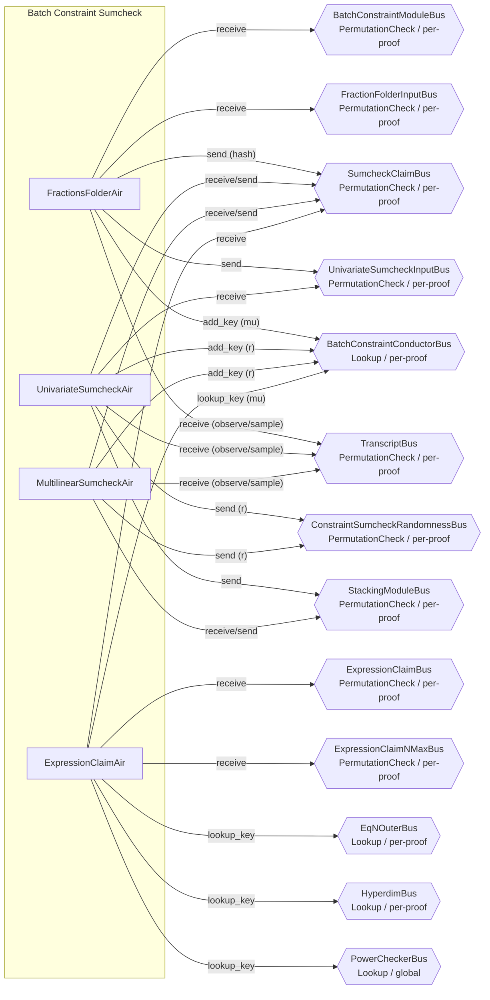
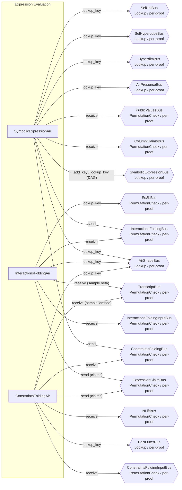
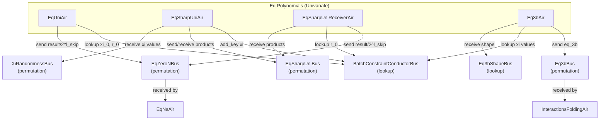

# BatchConstraint AIRs

This page covers the BatchConstraint AIRs in four implementation subgroups: the sumcheck pipeline, expression evaluation, univariate equality polynomials, and multivariate/negative equality polynomials.

**Module-level correspondence:** [README.md](./README.md) (interface, extraction, contract, module-level argument).



---

## Sumcheck Pipeline

### FractionsFolderAir

**Source:** `crates/recursion/src/batch_constraint/fractions_folder/air.rs`

### Executive Summary

FractionsFolderAir folds the per-AIR GKR numerator and denominator claims into a single polynomial hash using Horner's method with batching randomness mu. It iterates over AIRs in reverse order (highest air_idx first, decrementing to 0). For each AIR, it reads the sum claims `(sum_claim_p, sum_claim_q)` from the transcript. The polynomial hash accumulates as `h' = p + mu * (q + mu * h)`. At the end, it sends the hash as the initial sumcheck claim and forwards the GKR input layer claims for cross-checking.

### Public Values

None.

### AIR Guarantees

1. **GKR claims (BatchConstraintModuleBus — receives):** Receives `(tidx, [cur_p_sum, cur_q_sum])` from GkrInputAir on the last row. Both `cur_p_sum` and `cur_q_sum` are constrained as running sums across rows.
2. **AIR count (FractionFolderInputBus — receives):** Receives `(num_present_airs)` from ProofShapeAir.
3. **Sumcheck claim (SumcheckClaimBus — sends):** Sends the Horner-folded polynomial hash as the initial sumcheck claim (round=-1).
4. **Mu publication (BatchConstraintConductorBus — provides):** Provides the batching randomness `mu`.
5. **Handoff (UnivariateSumcheckInputBus — sends):** Sends final tidx to UnivariateSumcheckAir.
6. **Transcript (TranscriptBus — receives):** Reads per-AIR sum claims and samples `mu`.

### Walkthrough

For a proof with 3 present AIRs:

```
Row | proof_idx | is_first | air_idx | tidx | sum_claim_p | sum_claim_q | cur_hash    | mu
----|-----------|----------|---------|------|-------------|-------------|-------------|------
 0  |     0     |    1     |    2    |  350 | [p2,...]    | [q2,...]    | p2+mu*q2    | [m,..]
 1  |     0     |    0     |    1    |  342 | [p1,...]    | [q1,...]    | p1+mu*(q1+mu*h0) | [m,..]
 2  |     0     |    0     |    0    |  334 | [p0,...]    | [q0,...]    | p0+mu*(q0+mu*h1) | [m,..]
```

- **Row 0:** First AIR (highest index). Initializes hash = `p2 + mu*q2`. Samples mu from transcript after observing claims.
- **Row 1:** Adds AIR 1. Hash updated via Horner: `p1 + mu*(q1 + mu*prev_hash)`.
- **Row 2 (last):** Final AIR. `air_idx=0`. Sends the final hash as the sumcheck claim. Verifies running sums match GKR output.

---

### UnivariateSumcheckAir

**Source:** `crates/recursion/src/batch_constraint/sumcheck/univariate/air.rs`

### Executive Summary

UnivariateSumcheckAir performs the front-loaded univariate sumcheck round. It processes a univariate polynomial of degree `univariate_deg` by iterating coefficients from highest to lowest degree. It computes (a) the sum of the polynomial at roots of unity of order `2^l_skip` (using periodic selector columns) and (b) the evaluation at a sampled point `r` via Horner's method. The sum at roots must match the initial sumcheck claim, and the evaluation at `r` becomes the new claim.

### Public Values

None.

### AIR Guarantees

1. **Claim verification (SumcheckClaimBus — receives/sends):** Receives the initial sumcheck claim (round=-1) from FractionsFolderAir. Verifies the sum of the univariate polynomial at roots of unity equals this claim. Sends the polynomial evaluation at the sampled challenge as the new claim (round=0).
2. **Randomness (ConstraintSumcheckRandomnessBus, BatchConstraintConductorBus — provides):** Publishes the sampled challenge `r` on both buses.
3. **Handoff (UnivariateSumcheckInputBus — receives, StackingModuleBus — sends):** Receives tidx from FractionsFolderAir; sends tidx to the multilinear/stacking phase.
4. **Transcript (TranscriptBus — receives):** Observes coefficients and samples `r`.

### Walkthrough

For `univariate_deg=5` and `l_skip=2` (domain size=4):

```
Row | coeff_idx | omega_power | eq_to_1 | coeff    | sum_at_roots | value_at_r
----|-----------|-------------|---------|----------|--------------|----------
 0  |     5     |    w^5      |    0    | [c5,..]  | [0,...]      | [c5,...]
 1  |     4     |    w^4      |    1    | [c4,..]  | [4*c4,...]   | c5*r+c4
 2  |     3     |    w^3      |    0    | [c3,..]  | [4*c4,...]   | (c5*r+c4)*r+c3
 3  |     2     |    w^2      |    0    | [c2,..]  | [4*c4,...]   | ...
 4  |     1     |    w^1      |    0    | [c1,..]  | [4*c4,...]   | ...
 5  |     0     |    w^0=1    |    1    | [c0,..]  | [4*c4+4*c0]  | c5*r^5+...+c0
```

- Only `coeff_idx=4` and `coeff_idx=0` have `omega_power=1`, so `sum_at_roots = 4*(c4 + c0)`.
- `value_at_r` builds via Horner from highest to lowest coefficient.
- Final row verifies sum equals claim and sends evaluation as new claim.

---

### MultilinearSumcheckAir

**Source:** `crates/recursion/src/batch_constraint/sumcheck/multilinear/air.rs`

### Executive Summary

MultilinearSumcheckAir performs n_max rounds of multilinear sumcheck reduction. Each round receives the current claim, reads `s_deg+1` evaluations of the round polynomial (where `s_deg = max_constraint_degree + 1`), computes Lagrange interpolation at a sampled point `r`, and propagates the result as the next round's claim. The Lagrange interpolation uses incrementally computed prefix/suffix products and factorial-based denominators.

### Public Values

None.

### AIR Guarantees

1. **Claim flow (SumcheckClaimBus — receives/sends):** For each round, receives the current claim (verifying sum property: `eval[0] + eval[1] = claim`), performs Lagrange interpolation of the round polynomial at the sampled challenge, and sends the interpolated value as the next round's claim.
2. **Randomness (ConstraintSumcheckRandomnessBus, BatchConstraintConductorBus — provides):** Publishes each round's sampled challenge `r` on both buses.
3. **Handoff (StackingModuleBus — receives/sends):** Receives/sends tidx for stacking phase coordination.
4. **Transcript (TranscriptBus — receives):** Observes round evaluations and samples challenges.

### Walkthrough

One round with `max_constraint_degree=2` (`s_deg=3`, so 4 evaluations at points 0, 1, 2, 3):

```
Row | round_idx | eval_idx | eval     | denom_inv | prefix | suffix | lagrange | cur_sum    | r
----|-----------|----------|----------|-----------|--------|--------|----------|------------|-----
 0  |     0     |    0     | [e0,..]  |   1/2     |  1     | r(r-1) | ...      | e0*L0      | [r..]
 1  |     0     |    1     | [e1,..]  |   -1      |  r     | (2-r)  | ...      | e0*L0+e1*L1| [r..]
 2  |     0     |    2     | [e2,..]  |   1/2     | r(r-1) |  1     | ...      | final_sum  | [r..]
```

- The Lagrange coefficients are `L_i(r) = prefix * suffix * denom_inv` for interpolating through points 0, 1, 2.
- `claim_in` is verified as `e0 + e1` (sum property).
- `cur_sum` at the last row is the interpolated value at `r`, sent as the next claim.

---

### ExpressionClaimAir

**Source:** `crates/recursion/src/batch_constraint/expression_claim/air.rs`

### Executive Summary

ExpressionClaimAir is the final verification stage of the batch constraint pipeline. For each proof, it receives `2t` interaction claims (numerator and denominator for each of `t` AIRs) and `t` constraint claims from the expression evaluation AIRs. These claims are folded in reverse order with the batching randomness `mu` into a single value via `cur_sum = value * multiplier + next.cur_sum * mu`. The resulting value must match the final sumcheck claim.

### Public Values

None.

### AIR Guarantees

1. **Expression claims (ExpressionClaimBus — receives):** Receives interaction claims (numerator/denominator per AIR) and constraint claims from InteractionsFoldingAir and ConstraintsFoldingAir.
2. **Sumcheck match (SumcheckClaimBus — receives):** Receives the final sumcheck claim and verifies it equals the mu-folded sum of all expression claims (with appropriate normalization multipliers).
3. **N_max (ExpressionClaimNMaxBus — receives):** Receives the number of multilinear sumcheck rounds from ProofShapeAir.
4. **Mu lookup (BatchConstraintConductorBus — lookup):** Looks up the batching randomness `mu`.
5. **Normalization lookups (EqNOuterBus — lookup, HyperdimBus — lookup, PowerCheckerBus — lookup):** Looks up equality polynomial evaluations, hyperdimensional parameters, and power values to compute per-claim multipliers.

### Walkthrough

For a proof with 2 AIRs (4 interaction claims + 2 constraint claims):

```
Row | is_first | is_interaction | idx | idx_parity | value    | multiplier | cur_sum
----|----------|----------------|-----|------------|----------|------------|--------
 0  |    1     |       1        |  0  |     0      | [num0..] | [eq_ns0..] | final
 1  |    0     |       1        |  1  |     1      | [den0..] | [eq_ns0..] | ...
 2  |    0     |       1        |  2  |     0      | [num1..] | [eq_ns1..] | ...
 3  |    0     |       1        |  3  |     1      | [den1..] | [eq_ns1..] | ...
 4  |    0     |       0        |  0  |     -      | [con0..] | [1,0,0,0]  | ...
 5  |    0     |       0        |  1  |     -      | [con1..] | [1,0,0,0]  | con1
```

- Rows are processed in reverse order for folding (row 5 first conceptually).
- Row 0 (`is_first`): Verifies `cur_sum` matches the sumcheck claim at the final round. Looks up `mu` from BatchConstraintConductorBus.

---

### Bus Summary

| Bus | Type | Scope | Key Role in This Group |
|-----|------|-------|----------------------|
| [BatchConstraintModuleBus](../../bus-inventory.md#13-batchconstraintmodulebus) | PermutationCheck | per-proof | FFA receives from GkrInputAir |
| [FractionFolderInputBus](../../bus-inventory.md#58-fractionfolderinputbus) | PermutationCheck | per-proof | FFA receives from ProofShapeAir |
| [SumcheckClaimBus](../../bus-inventory.md#632-sumcheckclaimbus) | PermutationCheck | per-proof | Claims flow: FFA -> USA -> MSA -> ECA |
| [UnivariateSumcheckInputBus](../../bus-inventory.md#6312-univariatesumcheckinputbus) | PermutationCheck | per-proof | FFA sends tidx to USA |
| [StackingModuleBus](../../bus-inventory.md#14-stackingmodulebus) | PermutationCheck | per-proof | USA sends to MSA, MSA sends to stacking |
| [ConstraintSumcheckRandomnessBus](../../bus-inventory.md#42-constraintsumcheckrandomnessbus) | PermutationCheck | per-proof | USA/MSA send challenges |
| [BatchConstraintConductorBus](../../bus-inventory.md#631-batchconstraintconductorbus) | Lookup | per-proof | FFA provides mu, USA/MSA provide r |
| [ExpressionClaimBus](../../bus-inventory.md#634-expressionclaimbus) | PermutationCheck | per-proof | ECA receives from InteractionsFolding/ConstraintsFolding |
| [ExpressionClaimNMaxBus](../../bus-inventory.md#57-expressionclaimnmaxbus) | PermutationCheck | per-proof | ECA receives from ProofShapeAir |
| [TranscriptBus](../../bus-inventory.md#11-transcriptbus) | PermutationCheck | per-proof | All AIRs receive (observe/sample) |

---

## Expression Evaluation

This subgroup computes and folds all constraint and interaction evaluations at the sumcheck challenge point. SymbolicExpressionAir evaluates the constraint DAG for each child AIR, producing intermediate node values and dispatching interaction and constraint nodes to their respective folding AIRs. InteractionsFoldingAir folds interaction evaluations with beta to produce per-AIR numerator and denominator claims. ConstraintsFoldingAir folds constraint evaluations with lambda to produce per-AIR constraint claims.



### SymbolicExpressionAir

**Source:** `crates/recursion/src/batch_constraint/expr_eval/symbolic_expression/air.rs`

#### Executive Summary

SymbolicExpressionAir evaluates the constraint DAG of each child AIR at the sumcheck challenge point. Each row represents one node in the flattened DAG. Node types include arithmetic operations (Add, Sub, Mul, Neg), variable references (VarMain, VarPreprocessed, VarPublicValue), selector evaluations (SelIsFirst, SelIsLast, SelIsTransition), constants, and interaction components (InteractionMult, InteractionMsgComp, InteractionBusIndex). The AIR is self-referential through SymbolicExpressionBus: parent nodes look up their children's values, and each node publishes its computed value with a fanout count.

The AIR supports multiple child proofs simultaneously via horizontally replicated per-proof columns. A cached trace partition holds the DAG structure (node kind, attrs, fanout), while per-proof common-main columns hold the dynamic arguments (evaluated values, sort_idx).

#### Public Values

None.

#### AIR Guarantees

1. **Column claims (ColumnClaimsBus — receives):** Receives column evaluations `(sort_idx, part_idx, col_idx, claim, is_rot)` for variable reference nodes.
2. **Public values (PublicValuesBus — receives):** Receives public values from PublicValuesAir for public value nodes.
3. **Shape verification (AirShapeBus — lookup, AirPresenceBus — lookup, HyperdimBus — lookup):** Looks up AIR shape, presence flags, and hyperdimensional parameters for each evaluated node. AirPresenceBus is used to determine which AIRs are present before processing.
4. **Selector lookups (SelHypercubeBus — lookup, SelUniBus — lookup):** Looks up selector evaluations for is_first/is_last/is_transition nodes.
5. **Interaction dispatch (InteractionsFoldingBus — sends):** Sends interaction components `(air_idx, interaction_idx, is_mult, idx_in_message, value)` to InteractionsFoldingAir.
6. **Constraint dispatch (ConstraintsFoldingBus — sends):** Sends constraint node evaluations `(air_idx, constraint_idx, value)` to ConstraintsFoldingAir.

#### Node Kind Encoding

The 14 node kinds are encoded into 4 flag columns using a degree-2 encoder:

```
Kind                | Code | Description
--------------------|------|------------------------------------------
VarPreprocessed     |   0  | Preprocessed trace column evaluation
VarMain             |   1  | Main trace column evaluation
VarPublicValue      |   2  | Public value (base field)
SelIsFirst          |   3  | is_first_row selector
SelIsLast           |   4  | is_last_row selector
SelIsTransition     |   5  | is_transition selector (= 1 - is_last)
Constant            |   6  | Field constant
Add                 |   7  | Addition of two nodes
Sub                 |   8  | Subtraction of two nodes
Neg                 |   9  | Negation of one node
Mul                 |  10  | Multiplication of two nodes
InteractionMult     |  11  | Interaction multiplicity
InteractionMsgComp  |  12  | Interaction message component
InteractionBusIndex |  13  | Interaction bus index
```

#### Walkthrough

Consider a simple constraint `(main[0] + main[1]) * 3`:

```
Row | kind     | air_idx | node_idx | attrs      | fanout | args[0..3]   | args[4..7]   | value
----|----------|---------|----------|------------|--------|--------------|--------------|------
 0  | VarMain  |    0    |    0     | [0, 0, 0]  |   1    | [v0,0,0,0]   | [0,0,0,0]    | [v0,..]
 1  | VarMain  |    0    |    1     | [1, 0, 0]  |   1    | [v1,0,0,0]   | [0,0,0,0]    | [v1,..]
 2  | Add      |    0    |    2     | [0, 1, 0]  |   1    | [v0,0,0,0]   | [v1,0,0,0]   | [v0+v1,...]
 3  | Constant |    0    |    3     | [3, 0, 0]  |   1    | [0,0,0,0]    | [0,0,0,0]    | [3,0,0,0]
 4  | Mul      |    0    |    4     | [2, 3, 0]  |   0    | [v0+v1,..]   | [3,0,0,0]    | [3(v0+v1),...]
```

- **Row 0-1:** Variable references. Look up column claims from ColumnClaimsBus. Publish values with fanout=1.
- **Row 2:** Add node. Looks up nodes 0 and 1 from SymbolicExpressionBus. Publishes sum with fanout=1.
- **Row 3:** Constant node. Value is `3` extended to the extension field. Fanout=1.
- **Row 4:** Mul node (constraint root). Looks up nodes 2 and 3. `is_constraint=true`, so sends value on ConstraintsFoldingBus. Fanout=0 (no parent references this node).

### InteractionsFoldingAir

**Source:** `crates/recursion/src/batch_constraint/expr_eval/interactions_folding/air.rs`

#### Executive Summary

InteractionsFoldingAir folds the interaction evaluations for each child AIR using the challenge beta. For each interaction, it receives the multiplicity, message components, and bus index from SymbolicExpressionAir. It performs beta-folding via Horner's method: `cur_sum = value + beta * cur_sum` for message components. After folding all interactions for an AIR, it accumulates the final numerator and denominator and sends them on ExpressionClaimBus.

#### Public Values

None.

#### AIR Guarantees

1. **Interaction input (InteractionsFoldingBus — receives):** Receives interaction multiplicities, message components, and bus indices from SymbolicExpressionAir.
2. **Beta tidx input (InteractionsFoldingInputBus — receives):** Receives the transcript index for the beta challenge from GkrInputAir.
3. **Expression claims (ExpressionClaimBus — sends):** Sends per-AIR numerator and denominator claims: numerator at `idx = sort_idx * 2`, denominator at `idx = sort_idx * 2 + 1`, both with `is_interaction=true`. AIRs without interactions send zero claims.
4. **Eq3b normalization (Eq3bBus — receives):** Receives `eq_3b` normalization factors for stacked-index weighting.
5. **Shape (AirShapeBus — lookup):** Looks up `num_interactions` per AIR. Validates `air_idx` consistency on the first row of each AIR.
6. **Transcript (TranscriptBus — receives):** Samples beta challenge.

#### Walkthrough

For AIR 0 with 1 interaction having 2 message components, and AIR 1 with no interactions:

```
Row | sort_idx | interaction_idx | is_first_msg | is_second_msg | is_bus_idx | idx_in_msg | value     | cur_sum
----|----------|-----------------|--------------|---------------|------------|------------|-----------|--------
 0  |    0     |        0        |      1       |       0       |     0      |     -      | [mult,..] | [mult,..]
 1  |    0     |        0        |      0       |       1       |     0      |     0      | [m0,..]   | m0+beta*(m1+beta*(bus+1))
 2  |    0     |        0        |      0       |       0       |     0      |     1      | [m1,..]   | m1+beta*(bus+1)
 3  |    0     |        0        |      0       |       0       |     1      |     -1     | [bus+1,..]| [bus+1,..]
 4  |    1     |        0        |      1       |       0       |     0      |     -      | [0,..]    | [0,..]
```

- **Row 0:** Multiplicity row. `is_first_in_message=1`, so `cur_sum = value` (the interaction multiplicity).
- **Row 1:** First message component. `is_second_in_message=1` (immediately after first_in_message). `cur_sum = value + beta * next.cur_sum` (reverse accumulation: `local = value + beta * next`).
- **Row 2:** Second message component. `cur_sum = m1 + beta * cur_sum[3]`.
- **Row 3:** Bus index row. `is_bus_index=1`. `cur_sum = value` since next row is `is_first_in_message`. Accumulation into `final_acc_num` happens on the `is_first_in_message` row; accumulation into `final_acc_denom` happens on the `is_second_in_message` row.
- **Row 4:** AIR 1 has no interactions. Single dummy row. Still sends zero claims.

After processing AIR 0, sends `final_acc_num` (claim idx=0, is_interaction=1) and `final_acc_denom` (claim idx=1, is_interaction=1) on ExpressionClaimBus.

### ConstraintsFoldingAir

**Source:** `crates/recursion/src/batch_constraint/expr_eval/constraints_folding/air.rs`

#### Executive Summary

ConstraintsFoldingAir folds the constraint evaluations for each child AIR using the challenge lambda. For each AIR, it receives constraint values from SymbolicExpressionAir, folds them via Horner: `cur_sum = value + lambda * next.cur_sum`. The final folded value is multiplied by `eq_n` (an equality evaluation factor for normalization) and sent on ExpressionClaimBus as a constraint claim.

#### Public Values

None.

#### AIR Guarantees

1. **Constraint input (ConstraintsFoldingBus — receives):** Receives per-AIR constraint values from SymbolicExpressionAir.
2. **Lambda tidx input (ConstraintsFoldingInputBus — receives):** Receives the transcript index for the lambda challenge from GkrInputAir.
3. **Expression claims (ExpressionClaimBus — sends):** Sends `(is_interaction=0, idx=sort_idx, value=folded_sum*eq_n)` for each AIR, where the folded sum is the lambda-Horner folding of all constraint values, normalized by `eq_n`.
4. **Eq_n normalization (EqNOuterBus — lookup):** Looks up `eq_n` for normalization.
5. **Shape (AirShapeBus — lookup):** Looks up AIR id for consistency validation on the first row of each AIR.
6. **N_lift (NLiftBus — receives):** Receives `(air_idx, n_lift)` from ProofShapeAir.
7. **Transcript (TranscriptBus — receives):** Samples lambda challenge.

#### Walkthrough

For a proof with 2 AIRs, AIR 0 having 3 constraints and AIR 1 having 2 constraints:

```
Row | proof_idx | sort_idx | constraint_idx | value    | lambda   | cur_sum           | eq_n
----|-----------|----------|----------------|----------|----------|-------------------|------
 0  |     0     |    0     |       0        | [v0,..]  | [l,..]   | v0+l*(v1+l*v2)    | [e0..]
 1  |     0     |    0     |       1        | [v1,..]  | [l,..]   | v1+l*v2           | [e0..]
 2  |     0     |    0     |       2        | [v2,..]  | [l,..]   | v2                | [e0..]
 3  |     0     |    1     |       0        | [w0,..]  | [l,..]   | w0+l*w1           | [e1..]
 4  |     0     |    1     |       1        | [w1,..]  | [l,..]   | w1                | [e1..]
```

- **Rows 0-2:** AIR 0's constraints. Horner folding produces `v0 + l*v1 + l^2*v2` at row 0. Sends `cur_sum * eq_n[0]` on ExpressionClaimBus.
- **Rows 3-4:** AIR 1's constraints. Folded to `w0 + l*w1`. Sends `cur_sum * eq_n[1]`.
- Lambda is sampled once per proof from the transcript.

### Bus Summary

| Bus | Type | Scope | Role in This Group |
|-----|------|-------|--------------------|
| [SymbolicExpressionBus](../../bus-inventory.md#633-symbolicexpressionbus) | Lookup (per-proof) | SEA self-referential: provides and consumes DAG node values |
| [InteractionsFoldingBus](../../bus-inventory.md#635-interactionsfoldingbus) | PermutationCheck (per-proof) | SEA sends interaction nodes; IFA receives |
| [ConstraintsFoldingBus](../../bus-inventory.md#636-constraintsfoldingbus) | PermutationCheck (per-proof) | SEA sends constraint nodes; CFA receives |
| [ExpressionClaimBus](../../bus-inventory.md#634-expressionclaimbus) | PermutationCheck (per-proof) | IFA and CFA send folded claims; ExpressionClaimAir receives |
| [ColumnClaimsBus](../../bus-inventory.md#37-columnclaimsbus) | PermutationCheck (per-proof) | SEA receives column evaluations from stacking/WHIR |
| [PublicValuesBus](../../bus-inventory.md#35-publicvaluesbus) | PermutationCheck (per-proof) | SEA receives PV values from PublicValuesAir |
| [AirShapeBus](../../bus-inventory.md#31-airshapebus) | Lookup (per-proof) | SEA, IFA, and CFA look up AIR properties |
| [AirPresenceBus](../../bus-inventory.md#510-airpresencebus) | Lookup (per-proof) | SEA looks up AIR presence flags |
| [HyperdimBus](../../bus-inventory.md#32-hyperdimbus) | Lookup (per-proof) | SEA looks up hyperdimensional parameters |
| [InteractionsFoldingInputBus](../../bus-inventory.md#514-interactionsfoldinginputbus) | PermutationCheck (per-proof) | IFA receives beta tidx from GkrInputAir |
| [ConstraintsFoldingInputBus](../../bus-inventory.md#513-constraintsfoldinginputbus) | PermutationCheck (per-proof) | CFA receives lambda tidx from GkrInputAir |
| [SelHypercubeBus](../../bus-inventory.md#55-selhypercubebus) | Lookup (per-proof) | SEA looks up hypercube selector evaluations |
| [SelUniBus](../../bus-inventory.md#54-selunibus) | Lookup (per-proof) | SEA looks up univariate selector evaluations |
| [Eq3bBus](../../bus-inventory.md#637-eq3bbus) | PermutationCheck (per-proof) | IFA looks up eq_3b normalization factors |
| [EqNOuterBus](../../bus-inventory.md#6310-eqnouterbus) | Lookup (per-proof) | CFA looks up eq_n normalization factors |
| [NLiftBus](../../bus-inventory.md#59-nliftbus) | PermutationCheck (per-proof) | CFA receives n_lift from ProofShapeAir |
| [TranscriptBus](../../bus-inventory.md#11-transcriptbus) | PermutationCheck (per-proof) | IFA samples beta; CFA samples lambda |

---

## Eq Polynomials (Univariate)

This subgroup computes the univariate equality polynomial evaluations required by the batch constraint sumcheck. The batch constraint protocol reduces the verification of all AIR constraints and interactions to a single polynomial identity, and the equality polynomials in this subgroup handle the univariate component of that reduction, specifically the evaluations over the first `l_skip` variables corresponding to the coset structure of the low-degree domain `D`. The subgroup contains four AIRs: EqUniAir computes the base eq polynomial at the sumcheck challenge, EqSharpUniAir expands the sharp eq polynomial across roots of unity using a butterfly-style doubling, EqSharpUniReceiverAir collects those products and performs Horner evaluation, and Eq3bAir computes the stacked-index equality values used by interaction folding.



### EqUniAir

#### Executive Summary

EqUniAir computes the univariate equality polynomial `eq_uni(r_0, xi_0)` by iteratively squaring both the sumcheck challenge `r_0` and the randomness `xi_0` over `l_skip` rounds. The result, divided by `2^l_skip`, is sent to EqZeroNBus where it serves as the `n=0` base case for the multivariate eq computation in EqNsAir.

#### Public Values

None.

#### AIR Guarantees

1. **Challenge input (BatchConstraintConductorBus — lookup):** Looks up `xi_0` and `r_0`.
2. **Base eq output (EqZeroNBus — sends):** Sends `(is_sharp=0, eq_uni(r_0, xi_0) / 2^l_skip)`, where `eq_uni` is defined by the recurrence:
   - `res_0 = 1`
   - `res_{i+1} = (xi_0^{2^i} + r_0^{2^i}) * res_i + (xi_0^{2^i} - 1) * (r_0^{2^i} - 1)` for `i = 0..l_skip-1`
   - `eq_uni(r_0, xi_0) = res_{l_skip}`.

#### Walkthrough

Consider `l_skip = 3`, `xi_0 = a`, `r_0 = b` (extension field elements).

| Row | idx | x        | y        | res                                    | is_first | is_valid |
|-----|-----|----------|----------|----------------------------------------|----------|----------|
| 0   | 0   | a        | b        | 1                                      | 1        | 1        |
| 1   | 1   | a^2      | b^2      | (a+b)*1 + (1-a)(1-b)                  | 0        | 1        |
| 2   | 2   | a^4      | b^4      | (a^2+b^2)*res_1 + (1-a^2)(1-b^2)      | 0        | 1        |
| 3   | 3   | a^8      | b^8      | (a^4+b^4)*res_2 + (1-a^4)(1-b^4)      | 0        | 1        |

On row 3 (last valid), the AIR sends `res_3 / 2^3` to `EqZeroNBus`. The value `res_3` equals `eq_uni(r_0, xi_0)` as defined by the recurrence above.

### EqSharpUniAir

#### Executive Summary

EqSharpUniAir computes the coefficient vector of the sharp univariate equality polynomial via a butterfly-style expansion from the xi challenges. It uses a 3-level loop (proof x round x iteration) where each round corresponds to a variable index `xi_idx` from `l_skip-1` down to 0. Within each round, each partial product is split into two children using `(1 - xi ± xi * root_pow)`, doubling the number of terms. After `l_skip` rounds, the AIR emits `2^l_skip` coefficient terms, which EqSharpUniReceiverAir then Horner-evaluates at `r_0`.

#### Public Values

None.

#### AIR Guarantees

1. **Xi input (XiRandomnessBus — receives):** Receives xi challenges from the GKR module.
2. **Coefficient output (EqSharpUniBus — sends):** Sends `2^l_skip` coefficient terms to EqSharpUniReceiverAir via a butterfly-style expansion.
3. **Xi publication (BatchConstraintConductorBus — provides):** Publishes `xi_0` (key `msg_type = Xi, idx = 0`) for downstream EqUni lookups.

#### Walkthrough

For `l_skip = 2`, the butterfly expansion proceeds:

| Row | xi_idx | iter_idx | root  | root_pow | root_half_order | product_before |
|-----|--------|----------|-------|----------|-----------------|----------------|
| 0   | 1      | 0        | -1    | 1        | 1               | 1              |
| 1   | 0      | 0        | w^-1  | 1        | 2               | (1-xi_1+xi_1)  |
| 2   | 0      | 1        | w^-1  | w^-1     | 2               | (1-xi_1-xi_1)  |

Row 0 produces two children (iter 0 and iter 1 of the next round). Rows 1-2 each produce two more, yielding 4 final coefficient terms that are received by EqSharpUniReceiverAir.

### EqSharpUniReceiverAir

#### Executive Summary

EqSharpUniReceiverAir collects the `2^l_skip` coefficient terms from EqSharpUniAir and performs a Horner-scheme evaluation at the sumcheck challenge `r_0`. The resulting polynomial evaluation, divided by `2^l_skip`, is sent to EqZeroNBus as the sharp variant (`is_sharp=1`) of the base equality evaluation.

#### Public Values

None.

#### AIR Guarantees

1. **Coefficient input (EqSharpUniBus — receives):** Receives the `2^l_skip` coefficient terms from EqSharpUniAir.
2. **Challenge input (BatchConstraintConductorBus — lookup):** Looks up `r_0`.
3. **Sharp eq output (EqZeroNBus — sends):** Sends `(is_sharp=1, eq_sharp_uni(r_0, xi) / 2^l_skip)`, computed as a Horner evaluation of the products at `r_0`.

#### Walkthrough

For `l_skip = 2`, with 4 product coefficients `[c0, c1, c2, c3]` and challenge `r_0`:

| Row | idx | coeff | r   | cur_sum                                |
|-----|-----|-------|-----|----------------------------------------|
| 0   | 0   | c0    | r_0 | c0 + r_0*(c1 + r_0*(c2 + r_0*c3))     |
| 1   | 1   | c1    | r_0 | c1 + r_0*(c2 + r_0*c3)                 |
| 2   | 2   | c2    | r_0 | c2 + r_0*c3                            |
| 3   | 3   | c3    | r_0 | c3                                     |

The AIR sends `cur_sum[row 0] / 4` to EqZeroNBus. This equals `eq_sharp_uni(r_0, xi) / 2^l_skip`.

### Eq3bAir

#### Executive Summary

Eq3bAir computes `eq_3b(xi, stacked_idx >> l_skip)` for each interaction in each AIR. This equality polynomial evaluation maps each interaction's position in the stacked hypercube to a scalar weight used during interaction folding. The AIR iterates bit-by-bit through the shifted stacked index, multiplying the running eq product by either `xi_n` or `(1 - xi_n)` depending on the corresponding bit, starting from the interaction's lift height `n_lift`.

#### Public Values

None.

#### AIR Guarantees

1. **Shape input (Eq3bShapeBus — receives):** Receives `(sort_idx, n_lift, n_logup, num_interactions)` from ProofShapeAir on the first row of each AIR, providing the range of hypercube dimensions.
2. **Xi input (BatchConstraintConductorBus — lookup):** Looks up `xi_{n + l_skip}` for each bit position in the stacked index.
3. **Eq3b output (Eq3bBus — sends):** Sends `(sort_idx, interaction_idx, eq_3b)` for each interaction in each AIR, where `eq_3b = eq(xi, stacked_idx >> l_skip)` is the stacked-index equality weight.

Eq3bAir tracks `n_logup` as a column, received via Eq3bShapeBus. The `n_logup` value stays constant across all rows within an AIR and determines the upper bound of the hypercube iteration. On the last interaction row (when `has_interactions`), `n == n_logup` is enforced.

#### Walkthrough

For an interaction at `sort_idx=2`, `interaction_idx=0`, `n_lift=1`, `n_logup=3`, `stacked_idx >> l_skip = 4` (binary `100`):

| Row | n   | nth_bit | n_at_least_n_lift | xi            | eq                     | idx |
|-----|-----|---------|-------------------|---------------|------------------------|-----|
| 0   | 0   | 0       | 0                 | (ignored)     | 1                      | 0   |
| 1   | 1   | 0       | 1                 | xi_{l_skip+1} | 1 * (1 - xi_{l+1})    | 0   |
| 2   | 2   | 1       | 1                 | xi_{l_skip+2} | prev * xi_{l+2}        | 4   |
| 3   | 3   | --      | 1                 | --            | (final eq_3b sent)     | 4   |

At n=0, n < n_lift so the AIR forces `nth_bit=0` (bits below the lift height are ignored and constrained to zero). At n=1, the actual eq computation begins. The final `eq` value on the last row is sent to `Eq3bBus`. The reconstructed `idx` equals 4, matching the stacked index, because bits below n_lift are constrained to be zero.

### Bus Summary

| Bus | Type | Role in This Group |
|-----|------|--------------------|
| [BatchConstraintConductorBus](../../bus-inventory.md#631-batchconstraintconductorbus) | Lookup (per-proof) | EqUniAir, EqSharpUniAir, EqSharpUniReceiverAir, Eq3bAir look up / provide challenges |
| [EqZeroNBus](../../bus-inventory.md#639-eqzeronbus) | Permutation (per-proof) | EqUniAir and EqSharpUniReceiverAir send base eq values to EqNsAir |
| [EqSharpUniBus](../../bus-inventory.md#638-eqsharpunibus) | Permutation (per-proof) | EqSharpUniAir sends products; EqSharpUniReceiverAir receives |
| [Eq3bBus](../../bus-inventory.md#637-eq3bbus) | Permutation (per-proof) | Eq3bAir sends eq_3b values to InteractionsFoldingAir |
| [Eq3bShapeBus](../../bus-inventory.md#511-eq3bshapebus) | Lookup (per-proof) | Eq3bAir receives shape (`n_lift`, `n_logup`, `num_interactions`) from ProofShapeAir |
| [XiRandomnessBus](../../bus-inventory.md#41-xirandomnessbus) | Permutation (per-proof) | EqSharpUniAir receives xi challenges from GKR module |

---

## Eq Polynomials (Multivariate & Negative)

This subgroup extends the univariate equality polynomial base cases into full multivariate evaluations. EqNsAir iterates through variables `n = 0..n_max`, multiplying by the factor `1 - (xi_n + r_n - 2*xi_n*r_n)` at each step to build up the complete `eq(xi, r)` and `eq_sharp(xi, r)` evaluations needed by the batch constraint protocol. EqNegAir handles AIRs whose log-height is smaller than `l_skip` (the negative hypercube case), computing equality kernel values via iterative squaring over decreasing sections and providing selector lookups for those short traces. Together, these two AIRs cover all hypercube dimensions: EqNsAir handles dimensions `>= 0`, and EqNegAir handles dimensions `< 0`.

```mermaid
graph TD
    subgraph "Eq Polynomials (Multivariate & Negative)"
        EqNs["EqNsAir"]
        EqNeg["EqNegAir"]
    end

    EqZeroNBus["EqZeroNBus<br/>(permutation)"]
    XiRandomnessBus["XiRandomnessBus<br/>(permutation)"]
    ConductorBus["BatchConstraintConductorBus<br/>(lookup)"]
    EqNOuterBus["EqNOuterBus<br/>(lookup)"]
    SelHypercubeBus["SelHypercubeBus<br/>(lookup)"]
    EqNegInternalBus["EqNegInternalBus<br/>(permutation)"]
    EqNegResultBus["EqNegResultBus<br/>(permutation)"]
    EqNegBaseRandBus["EqNegBaseRandBus<br/>(permutation)"]
    SelUniBus["SelUniBus<br/>(lookup)"]

    EqNsNLogupMaxBus["EqNsNLogupMaxBus<br/>(lookup)"]

    EqNs -->|"lookup n_logup, n_max"| EqNsNLogupMaxBus
    EqNs -->|"receive eq base"| EqZeroNBus
    EqNs -->|"receive xi_n"| XiRandomnessBus
    EqNs -->|"lookup r_n"| ConductorBus
    EqNs -->|"add_key xi"| ConductorBus
    EqNs -->|"provide eq(n)"| EqNOuterBus
    EqNs -->|"provide selectors"| SelHypercubeBus

    EqNeg -->|"receive u, r^2"| EqNegBaseRandBus
    EqNeg -->|"send/receive internal"| EqNegInternalBus
    EqNeg -->|"send eq_n, k_rot_n"| EqNegResultBus
    EqNeg -->|"provide selectors"| SelUniBus
```



### EqNsAir

#### Executive Summary

EqNsAir computes the multivariate equality polynomials `eq(xi, r)` and `eq_sharp(xi, r)` by extending the base cases received from the univariate subgroup through `n_max` rounds. On each row `n`, it multiplies both `eq` and `eq_sharp` by the shared factor `1 - (xi_n + r_n - 2*xi_n*r_n)`. The accumulated values, combined with a running product of `r` values, are provided as lookups to the constraint evaluation AIRs.

#### Public Values

None.

#### AIR Guarantees

1. **Base eq input (EqZeroNBus — receives):** Receives `(is_sharp=0, eq_base)` and `(is_sharp=1, eq_sharp_base)` from the univariate eq AIRs.
2. **Shape input (EqNsNLogupMaxBus — lookup):** Looks up `(n_logup, n_max)` from ProofShapeAir, providing the global LogUp dimension and maximum hypercube dimension.
3. **Xi input (XiRandomnessBus — receives):** Receives xi challenges from the GKR module.
4. **Challenge lookups (BatchConstraintConductorBus — lookup/provides):** Looks up sumcheck challenges `r_n` and publishes xi values for downstream consumers.
5. **Eq output (EqNOuterBus — provides):** Provides `(is_sharp, n, eq*r_product)` for each variable index `n`, where `eq` extends the base case through `n_max` rounds by the multivariate factor `1 - (xi_n + r_n - 2*xi_n*r_n)`.
6. **Selector output (SelHypercubeBus — provides):** Provides hypercube selector evaluations `(n, is_first, value)` derived from prefix products of `r_n` values.

#### Walkthrough

For a proof with `l_skip = 2`, `n_logup = 2`, `n_max = 3`, base eq from the univariate subgroup = `E0`, base eq_sharp = `S0`:

| Row | n | xi_n         | r_n  | r_product       | eq                        | eq_sharp                  | n < n_max |
|-----|---|--------------|------|-----------------|---------------------------|---------------------------|-----------|
| 0   | 0 | xi_{l+0}     | r_1  | r_1*r_2*r_3     | E0                        | S0                        | 1         |
| 1   | 1 | xi_{l+1}     | r_2  | r_2*r_3         | E0 * m_0                  | S0 * m_0                  | 1         |
| 2   | 2 | xi_{l+2}     | r_3  | r_3             | E0 * m_0 * m_1            | S0 * m_0 * m_1            | 1         |
| 3   | 3 | (beyond)     | 1    | 1               | E0 * m_0 * m_1 * m_2      | S0 * m_0 * m_1 * m_2      | 0         |

Where `m_i = 1 - (xi_{l+i} + r_{i+1} - 2*xi_{l+i}*r_{i+1})`. Each row provides `eq[n] * r_product[n]` to `EqNOuterBus` for lookup by constraint evaluation AIRs.

### EqNegAir

#### Executive Summary

EqNegAir handles equality polynomial evaluation for AIRs whose log-height is strictly less than `l_skip`, corresponding to negative hypercube dimensions. It runs `l_skip` sections indexed by `neg_hypercube = 0..l_skip-1`, where section `h` has `l_skip - h + 1` rows of iterative squaring. The AIR computes running products `prod(u^{2^i} + r'^{2^i})` and `prod(u^{2^i} + (r*omega)'^{2^i})` to derive `eq_n(u, r)` and `k_rot_n(u, r)` for negative `n`, and provides univariate selector values via `SelUniBus`.

#### Public Values

None.

#### AIR Guarantees

1. **Base randomness (EqNegBaseRandBus — receives):** Receives `(u, r^2)` from EqBaseAir.
2. **Eq/k_rot output (EqNegResultBus — sends):** Sends `(n=-neg_hypercube, eq_n(u, r), k_rot_n(u, r))` to EqBaseAir for negative-dimension AIRs (those with `log_height < l_skip`). The values are `prod_u_r - next.u_pow + 1` and `prod_u_r_omega - next.u_pow + 1` respectively.
3. **Selector output (SelUniBus — provides):** Provides univariate selector evaluations for AIRs with negative hypercube dimensions.

#### Walkthrough

For `l_skip = 2`, `u_0 = u`, `r_0 = r`, `omega = g_4`:

**Section 0 (neg_hypercube = 0):** 3 rows

| Row | neg_h | row_idx | u_pow | r_pow    | r_omega_pow   | prod_u_r              |
|-----|-------|---------|-------|----------|---------------|-----------------------|
| 0   | 0     | 0       | u     | r        | r*omega       | u*(u+r)               |
| 1   | 0     | 1       | u^2   | r^2      | (r*omega)^2   | u*(u+r)*(u^2+r^2)    |
| 2   | 0     | 2       | u^4   | r^4      | (r*omega)^4   | (full product)        |

On the penultimate row (row 1), the AIR computes `eq_0 = prod_u_r - u^4 + 1` and `k_rot_0 = prod_u_r_omega - u^4 + 1`. These are not sent to `EqNegResultBus` for section 0 (since `neg_hypercube = 0`), but `SelUniBus` lookups are provided.

**Section 1 (neg_hypercube = 1):** 2 rows

| Row | neg_h | row_idx | u_pow | r_pow    | prod_u_r         |
|-----|-------|---------|-------|----------|------------------|
| 3   | 1     | 0       | u     | r^2      | u*(u+r^2)        |
| 4   | 1     | 1       | u^2   | r^4      | u*(u+r^2)*(u^2+r^4) |

On the penultimate row (row 3), `eq_{-1} = prod_u_r - u^2 + 1` and `k_rot_{-1}` are computed and sent to `EqNegResultBus`. The internal bus passes `(u, r^2, (r*omega)^2)` from section 0 to section 1.

### Bus Summary

| Bus | Type | Role in This Group |
|-----|------|--------------------|
| [EqZeroNBus](../../bus-inventory.md#639-eqzeronbus) | Permutation (per-proof) | EqNsAir receives base eq values from the univariate subgroup |
| [EqNsNLogupMaxBus](../../bus-inventory.md#512-eqnsnlogupmaxbus) | Lookup (per-proof) | EqNsAir receives `(n_logup, n_max)` from ProofShapeAir |
| [XiRandomnessBus](../../bus-inventory.md#41-xirandomnessbus) | Permutation (per-proof) | EqNsAir receives xi challenges |
| [BatchConstraintConductorBus](../../bus-inventory.md#631-batchconstraintconductorbus) | Lookup (per-proof) | EqNsAir looks up `r_n` and provides xi values |
| [EqNOuterBus](../../bus-inventory.md#6310-eqnouterbus) | Lookup (per-proof) | EqNsAir provides `eq(n)` values for constraint evaluation |
| [SelHypercubeBus](../../bus-inventory.md#55-selhypercubebus) | Lookup (per-proof) | EqNsAir provides hypercube selector evaluations |
| [EqNegBaseRandBus](../../bus-inventory.md#45-eqnegbaserandbus) | Permutation (per-proof) | EqNegAir receives `(u, r^2)` from EqBaseAir |
| [EqNegResultBus](../../bus-inventory.md#56-eqnegresultbus) | Permutation (per-proof) | EqNegAir sends `eq_n`, `k_rot_n` to EqBaseAir |
| [EqNegInternalBus](../../bus-inventory.md#6311-eqneginternalbus) | Permutation (per-proof) | EqNegAir internal recursive computation |
| [SelUniBus](../../bus-inventory.md#54-selunibus) | Lookup (per-proof) | EqNegAir provides univariate selector evaluations |
