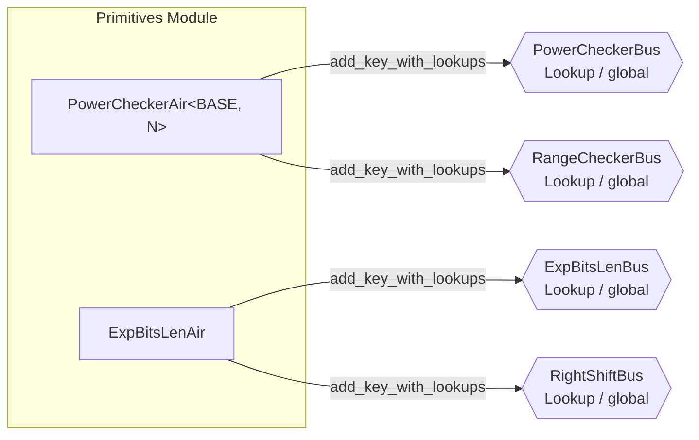

# Primitive AIRs

The primitives group provides two lookup tables used as building blocks by higher-level AIRs. PowerCheckerAir precomputes a table of powers (`BASE^i` for i in `0..N`) enabling other AIRs to look up that a value is a specific power of 2 (or another base). ExpBitsLenAir computes low-bit exponentiation and selected right shifts over BabyBear field elements, primarily used for proof-of-work checks and query-index derivations.

**Module-level correspondence:** [README.md](./README.md) (per-table contracts).



---

## PowerCheckerAir

**Source:** `crates/recursion/src/primitives/pow/air.rs`

### Executive Summary

PowerCheckerAir is a fixed N-row lookup table parameterized by BASE and N (both compile-time constants). Row `i` contains `(log=i, pow=BASE^i)`. It serves two buses simultaneously: PowerCheckerBus for `(log, exp)` lookups and RangeCheckerBus for range checks on the log value. In the standard configuration, `BASE=2` and `N=32`, giving a table of powers of two from `2^0` to `2^31`.

### Public Values

None.

### AIR Guarantees

1. **Power lookup (PowerCheckerBus — provides):** Provides `(log, exp=BASE^log)` for all `log` in `[0, N)`, enabling consumers to verify that a value is a specific power of BASE.
2. **Range lookup (RangeCheckerBus — provides):** Provides `(log, max_bits=log2(N))` as a secondary range check for values in `[0, N)`.

### Walkthrough

With `BASE=2, N=32`:

```
Row | log | pow         | mult_pow | mult_range
----|-----|-------------|----------|-----------
  0 |  0  |           1 |     3    |     0
  1 |  1  |           2 |     2    |     1
  2 |  2  |           4 |     0    |     0
  3 |  3  |           8 |     5    |     2
... | ... |         ... |    ...   |    ...
 10 | 10  |        1024 |     8    |     4
... | ... |         ... |    ...   |    ...
 31 | 31  |   134217727 |     0    |     0
```

- **Row 0:** `pow = 2^0 = 1`. Three AIRs looked up `(0, 1)` to verify something is `2^0`.
- **Row 10:** `pow = 2^10 = 1024`. Eight lookups confirm various heights or sizes equal `2^10`.
- **Row 31:** `pow = 2^31 mod p = 134217727` in BabyBear, where `p = 15 * 2^27 + 1`.
- The constraint `next.pow = local.pow * 2` ensures the table is exactly `{2^0, 2^1, ..., 2^31}` in field arithmetic.

### Trace Columns

```
PowerCheckerCols<T> {
    log: T,         // Row index i = 0..N-1
    pow: T,         // BASE^i
    mult_pow: T,    // Number of PowerCheckerBus lookups for this (log, pow) pair
    mult_range: T,  // Number of RangeCheckerBus lookups for this log value
}
```

### Constraint Details

The constraints are minimal but form a tight chain:

- **First row:** `log = 0`, `pow = 1`.
- **Transition:** `next.log = local.log + 1`, `next.pow = local.pow * BASE`.
- **Last row:** `log = N - 1`.

These three constraints together with the fixed height N mean the table is exactly the sequence `{(0, 1), (1, BASE), (2, BASE^2), ..., (N-1, BASE^(N-1))}`. No row can be duplicated, reordered, or omitted.

Note: `N` must be a power of two, as asserted during trace generation (`N.is_power_of_two()`). This is required because AIR trace heights must be powers of two.

### Lookup Usage

ExpressionClaimAir uses PowerCheckerBus to verify `n_abs_pow = 2^n_abs` when computing norm factors for interaction claims with negative hyperdimensional indices. ProofShapeAir also uses PowerCheckerBus to verify `height = 2^log_height` and to range-check auxiliary exponent values. ProofShapeAir additionally uses the secondary RangeCheckerBus to range-check limb decompositions of interaction counts and heights.

### Thread Safety

The CPU trace generator uses `AtomicU32` counters for both `count_pow` and `count_range`, allowing multiple threads to concurrently register lookups via `add_pow` and `add_range` with relaxed memory ordering. The `take_counts` method atomically swaps all counters to zero and returns the accumulated values.

---

## ExpBitsLenAir

**Source:** `crates/recursion/src/primitives/exp_bits_len/air.rs`

### Executive Summary

ExpBitsLenAir is a BabyBear-specific fixed-block lookup table for low-bit exponentiation. Each request occupies 32 rows, one for each step of the canonical 31-bit decomposition plus a terminal row. Row `bit_idx` stores `base^(2^bit_idx)`, the shifted exponent suffix `bit_src >> bit_idx`, the remaining active low-bit count `max(num_bits - bit_idx, 0)`, and a running product `result`. Only the first row of each 32-row block publishes `(base, bit_src, num_bits, result)` on ExpBitsLenBus. Optionally, one designated row in the block also publishes a `RightShiftBus` entry for the same `bit_src`.

### Public Values

None.

### AIR Guarantees

1. **Exponentiation lookup (ExpBitsLenBus — provides):** Provides `(base, bit_src, num_bits, result)` with `result = base^(bit_src mod 2^num_bits)`, using the canonical BabyBear bit decomposition of `bit_src`. Only the first row of each 32-row request block contributes multiplicity on ExpBitsLenBus.
2. **Right shift lookup (RightShiftBus — provides):** When requested, one row in the same 32-row block provides `(input=bit_src, shift_bits, result=input >> shift_bits)`. MerkleVerifyAir uses this to derive `current_idx_bit_src`.

### Walkthrough

Computing `3^5` where `5 = 101_binary` (`num_bits=3`, `bit_src=5`):

```
Row | bit_idx | base | bit_src | num_bits | bit_src_mod_2 | result_multiplier | result
----|---------|------|---------|----------|---------------|-------------------|-------
 0  |    0    |   3  |    5    |    3     |       1       |         3         |  243
 1  |    1    |   9  |    2    |    2     |       0       |         1         |   81
 2  |    2    |  81  |    1    |    1     |       1       |        81         |   81
 3  |    3    |6561  |    0    |    0     |       0       |         1         |    1
... |   ...   | ...  |   ...   |   ...    |      ...      |        ...        |  ...
 31 |   31    | 3^(2^31) | 0   |    0     |       0       |         1         |    1
```

- **Row 0:** The first row publishes `(3, 5, 3, 243)` on ExpBitsLenBus.
- **Transitions:** `base` is squared each step, `bit_src` is shifted right by one bit, and `num_bits` counts down to zero. The running product satisfies `local.result = next.result * local.result_multiplier`.
- **Rows 3..31:** After the requested low bits are exhausted, the block keeps shifting a zero suffix. These rows are still constrained, but the published bus key remains the first-row tuple.
- **Optional right shift:** If the request also asks for `shift_bits=2`, then row 2 publishes `(input=5, shift_bits=2, result=1)` on RightShiftBus.

### Trace Columns

```
ExpBitsLenCols<T> {
    is_valid: T,           // Whether this row belongs to a request block
    is_first: T,           // First row of a 32-row request block
    bit_idx: T,            // Current bit position (0..31)
    base: T,               // base^(2^bit_idx)
    bit_src: T,            // bit_src_original >> bit_idx
    num_bits: T,           // Remaining active low bits affecting the result
    apply_bit: T,          // Boolean: num_bits != 0
    low_bits_left: T,      // Countdown for the low 27 bits in the BabyBear canonicality check
    in_low_region: T,      // Boolean: still inside the low-bit region
    result: T,             // Running product for the remaining suffix
    result_multiplier: T,  // Either 1 or base, depending on the current bit
    bit_src_mod_2: T,      // Least-significant bit of the shifted suffix
    low_bits_are_zero: T,  // Running flag used in the canonicality constraints
    high_bits_all_one: T,  // Running flag used in the canonicality constraints
    bit_src_original: T,   // Unshifted original exponent source
    shift_mult: T,         // Multiplicity for the optional RightShiftBus publish
}
```

### Fixed Block Structure

Each request always occupies 32 rows, regardless of `num_bits`. The block is linked by local transition constraints rather than self-lookups:

- **First row:** `is_first = 1`, `bit_idx = 0`, `bit_src = bit_src_original`.
- **Transition:** `next.bit_idx = local.bit_idx + 1`, `next.base = local.base^2`, `local.bit_src = 2 * next.bit_src + local.bit_src_mod_2`, and `next.num_bits = local.num_bits - local.apply_bit`.
- **Running product:** `local.result = next.result * local.result_multiplier`, where `result_multiplier` is `base` exactly when the current low bit is active and equal to 1.
- **Last row:** `bit_idx = 31`, `bit_src = 0`, `num_bits = 0`, and `result = 1`.

The AIR is hard-coded for BabyBear (`p = 15 * 2^27 + 1`). The `low_bits_are_zero` and `high_bits_all_one` flags enforce canonicality of the 31-bit decomposition used by the lookup key, so consumers are checking exponentiation against the canonical field element, not an arbitrary integer representative.

### Multiple Independent Computations

The trace can contain many independent request blocks simultaneously. For example, verifying proof-of-work for multiple child proofs and evaluating WHIR query roots all append separate 32-row blocks to the same trace. `is_first` marks the start of each block, while `is_valid` distinguishes real requests from trailing padding after the final power-of-two padding step.

### Proof-of-Work Verification

In GkrInputAir, proof-of-work is checked by looking up:

```
(base=generator, bit_src=pow_sample, num_bits=pow_bits, result=1)
```

Because ExpBitsLenAir only uses the low `pow_bits` bits of `pow_sample`, this asserts that the low-bit exponent slice maps to 1 for the chosen generator. For the generators used in these PoW checks, that means the sampled challenge has the required low-bit structure.

---

## Relationship Between Primitives

PowerCheckerAir and ExpBitsLenAir serve complementary roles:

- **PowerCheckerAir** is a static table. Its height is fixed at compile time (N rows). It is efficient for looking up a known discrete set of values. Every possible `(log, pow)` pair is enumerated. Unused rows still exist but with `mult=0`.

- **ExpBitsLenAir** is dynamic in the number of requests, but each request contributes a fixed 32-row block. It handles arbitrary base/exponent combinations over the canonical BabyBear bit decomposition and can optionally publish a matching right-shift witness alongside the exponentiation result.

Neither AIR depends on the other. They are both global (not per-proof), meaning a single instance serves all child proofs being verified in the recursion circuit.

### Bus Protocol Distinction

Both AIRs use `LookupBus` (not `PermutationCheckBus`). This means they publish key-multiplicity pairs via `add_key_with_lookups`, and consumers use `lookup_key` to look up entries. The lookup bus protocol guarantees that the total number of lookups across all consumers equals the sum of multiplicities in the provider table -- ensuring no phantom lookups.

---

## Bus Summary

| Bus | Type | Direction in This Group | Key Consumers |
|-----|------|------------------------|---------------|
| [PowerCheckerBus](../../bus-inventory.md#53-powercheckerbus) | Lookup (global) | PCA provides keys | ExpressionClaimAir, ProofShapeAir |
| [RangeCheckerBus](../../bus-inventory.md#52-rangecheckerbus) | Lookup (global) | PCA provides keys (secondary) | ProofShapeAir, others |
| [ExpBitsLenBus](../../bus-inventory.md#51-expbitslenbus) | Lookup (global) | EBA provides keys | GkrInputAir, StackingClaimsAir, WhirRoundAir, SumcheckAir, WhirQueryAir |
| [RightShiftBus](../../bus-inventory.md#511-rightshiftbus) | Lookup (global) | EBA provides keys | MerkleVerifyAir |
