# WHIR AIRs

This page covers the WHIR AIRs in three implementation subgroups: protocol control, query verification, and polynomial folding/final polynomial evaluation.

**Module-level correspondence:** [README.md](./README.md) (interface, extraction, contract, module-level argument).

This group manages the top-level WHIR polynomial commitment verification protocol. WhirRoundAir is the main controller: it has one row per WHIR round per proof, orchestrating the commitment verification, OOD sampling, sumcheck initiation, query generation, and claim propagation across rounds. SumcheckAir handles the inner sumcheck within each WHIR round, running `k_whir` sub-rounds per WHIR round, where each sub-round performs quadratic interpolation and accumulates the Mobius-adjusted equality kernel for the eval-to-coefficient RS encoding used by WHIR. Together, these AIRs bridge the stacking output (the WHIR claim) through the multi-round WHIR protocol to the final polynomial and query verification AIRs.

## Architecture Diagram

```mermaid
graph TD
    subgraph "Group 11: WHIR - Protocol Control"
        WhirRound["WhirRoundAir"]
        Sumcheck["SumcheckAir (WHIR)"]
    end

    WhirModuleBus["WhirModuleBus<br/>(permutation)"]
    CommitmentsBus["CommitmentsBus<br/>(lookup)"]
    TranscriptBus["TranscriptBus<br/>(permutation)"]
    WhirSumcheckBus["WhirSumcheckBus<br/>(permutation)"]
    WhirQueryBus["WhirQueryBus<br/>(permutation)"]
    VerifyQueriesBus["VerifyQueriesBus<br/>(permutation)"]
    WhirGammaBus["WhirGammaBus<br/>(permutation)"]
    FinalPolyMleEvalBus["FinalPolyMleEvalBus<br/>(permutation)"]
    FinalPolyQueryEvalBus["FinalPolyQueryEvalBus<br/>(permutation)"]
    WhirAlphaBus["WhirAlphaBus<br/>(lookup)"]
    WhirEqAlphaUBus["WhirEqAlphaUBus<br/>(permutation)"]
    WhirOpeningPointBus["WhirOpeningPointBus<br/>(permutation)"]
    ExpBitsLenBus["ExpBitsLenBus<br/>(lookup)"]

    WhirRound -->|"receive claim"| WhirModuleBus
    WhirRound -->|"provide commits"| CommitmentsBus
    WhirRound -->|"send sumcheck"| WhirSumcheckBus
    WhirRound -->|"send z0 query"| WhirQueryBus
    WhirRound -->|"send verify queries"| VerifyQueriesBus
    WhirRound -->|"send gamma"| WhirGammaBus
    WhirRound -->|"send final_poly_mle"| FinalPolyMleEvalBus
    WhirRound -->|"send final_poly_query"| FinalPolyQueryEvalBus
    WhirRound -->|"PoW check"| ExpBitsLenBus
    WhirRound -->|"transcript ops"| TranscriptBus

    Sumcheck -->|"receive sumcheck"| WhirSumcheckBus
    Sumcheck -->|"provide alpha"| WhirAlphaBus
    Sumcheck -->|"send eq_partial"| WhirEqAlphaUBus
    Sumcheck -->|"receive u"| WhirOpeningPointBus
    Sumcheck -->|"PoW check"| ExpBitsLenBus
    Sumcheck -->|"transcript ops"| TranscriptBus
```



---

## Protocol Control

### WhirRoundAir

### Executive Summary

WhirRoundAir serves as the top-level controller for the WHIR protocol, with one row per WHIR round per proof. Each row manages a complete round: it receives the round's starting claim, initiates sumcheck (via WhirSumcheckBus), commits to the next codeword, samples the OOD point `z0`, observes the OOD evaluation `y0`, generates queries, samples the batching challenge `gamma`, and computes the next round's claim. On the final round, it dispatches the final polynomial evaluation to FinalPolyMleEvalAir and FinalPolyQueryEvalAir.

The AIR explicitly tracks the domain generator `omega` as a column. On the first round of each proof, `omega` is initialized to the 2-adic generator for `initial_log_domain_size`. On subsequent rounds, `omega` is constrained to square: `next.omega == omega^2`. This omega value is passed to WhirQueryAir via the VerifyQueriesBus message.

### Public Values

None.

### AIR Guarantees

1. **WHIR claim (WhirModuleBus — receives):** Receives the initial `(tidx, claim)` from StackingClaimsAir.
2. **Commitments (CommitmentsBus — provides):** Provides round commitments `(major_idx=whir_round+1, minor_idx=0, commitment)` for each non-final round.
3. **Sumcheck dispatch (WhirSumcheckBus — sends):** Sends `(tidx, sumcheck_idx, pre_claim, post_claim)` to SumcheckAir for each round.
4. **Query dispatch (WhirQueryBus — sends):** Sends OOD query `(whir_round, query_idx=0, z0)` for each round. On the final round, `z0` is zeroed out (gated by `is_same_proof`).
5. **Query verification (VerifyQueriesBus — sends):** Sends `(tidx, whir_round, num_queries, omega, gamma, pre_claim, post_claim)` to WhirQueryAir. The `omega` field carries the domain generator for this round.
6. **Gamma (WhirGammaBus — sends):** Sends `(idx=whir_round, gamma)` for FinalPolyQueryEvalAir.
7. **Final poly dispatch (FinalPolyMleEvalBus — sends, FinalPolyQueryEvalBus — sends):** On the last round, sends the final polynomial MLE evaluation claim and the query evaluation claim difference `(next_claim - final_poly_mle_eval)`.
8. **Proof-of-work (ExpBitsLenBus — lookup):** Verifies PoW when required.
9. **Transcript (TranscriptBus — receives):** Observes commitments and evaluations, samples challenges (`z0`, `gamma`).

### Walkthrough

For a proof with `num_rounds = 3`, `k_whir = 2`:

| Row | whir_round | is_first_in_proof | claim  | post_sumcheck | z0  | gamma | omega    | next_claim |
|-----|------------|-------------------|--------|---------------|-----|-------|----------|------------|
| 0   | 0          | 1                 | C0     | PSC_0         | z00 | g0    | omega_0  | C1         |
| 1   | 1          | 0                 | C1     | PSC_1         | z01 | g1    | omega_0² | C2         |
| 2   | 2          | 0                 | C2     | PSC_2         | --  | g2    | omega_0⁴ | C3         |

- Row 0: Receives `C0` from WhirModuleBus. Sends sumcheck with `sumcheck_idx=0`. Commits codeword, samples z0, observes y0. `omega` is initialized to the 2-adic generator for `initial_log_domain_size`.
- Row 1: Receives commitment for round 2. Links `C1 = post_query_claim[round 0]`.
- Row 2 (last): No commitment or z0 sampling. Sends to FinalPolyMleEvalBus and FinalPolyQueryEvalBus.

---

### SumcheckAir (WHIR)

### Executive Summary

SumcheckAir executes the inner sumcheck protocol within each WHIR round. Each WHIR round contains `k_whir` sub-rounds of sumcheck, for a total of `num_rounds * k_whir` rows per proof. Each row receives the polynomial evaluations `ev1` (at 1) and `ev2` (at 2), performs quadratic interpolation at the sampled challenge `alpha`, and produces the post-round claim. The AIR accumulates the Mobius-adjusted equality kernel `eq_partial = product(mobius_eq_1(u_i, alpha_i))` across all sub-rounds, which is sent to FinalPolyMleEvalAir on the last sub-round of each proof.

### Public Values

None.

### AIR Guarantees

1. **Sumcheck input (WhirSumcheckBus — receives):** Receives `(tidx, sumcheck_idx, pre_claim, post_claim)` from WhirRoundAir for each WHIR round.
2. **Alpha output (WhirAlphaBus — provides):** Provides `(idx=sumcheck_idx, alpha)` for WhirFoldingAir and FinalPolyQueryEvalAir.
3. **Eq partial (WhirEqAlphaUBus — sends):** Sends the accumulated Mobius-adjusted eq product `prod(mobius_eq_1(u_i, alpha_i))` to FinalPolyMleEvalAir. Note: `eq_partial` accumulates over the entire proof (all WHIR rounds), not just per round.
4. **Opening points (WhirOpeningPointBus — receives):** Receives `(idx=sumcheck_idx, u)` from the stacking/EqBase modules.
5. **Proof-of-work (ExpBitsLenBus — lookup):** Verifies folding PoW when required.
6. **Transcript (TranscriptBus — receives):** Observes evaluations, samples alpha challenges.

### Walkthrough

For `k_whir = 2`, `num_rounds = 2` (total 4 sumcheck sub-rounds per proof):

| Row | whir_round | subidx | sumcheck_idx | ev1    | ev2    | alpha  | pre_claim     | eq_partial              |
|-----|------------|--------|--------------|--------|--------|--------|---------------|-------------------------|
| 0   | 0          | 0      | 0            | s1[0]  | s2[0]  | a0     | C0            | meq(u0,a0)              |
| 1   | 0          | 1      | 1            | s1[1]  | s2[1]  | a1     | interp(a0)    | meq(u0,a0)*meq(u1,a1)  |
| 2   | 1          | 0      | 2            | s1[2]  | s2[2]  | a2     | C1            | prev*meq(u2,a2)         |
| 3   | 1          | 1      | 3            | s1[3]  | s2[3]  | a3     | interp(a2)    | prev*meq(u3,a3)         |

- Rows 0-1: First WHIR round's sumcheck. `post_group_claim` is the final claim after both sub-rounds.
- Row 3 (last): `eq_partial` = full product of all `mobius_eq_1` terms. Sent to WhirEqAlphaUBus for FinalPolyMleEvalAir.
- `alpha_lookup_count` on each row accounts for all lookups from WhirFoldingAir and FinalPolyQueryEvalAir at that sumcheck index.

---

### Bus Summary

| Bus | Type | Role in This Group |
|-----|------|--------------------|
| [WhirModuleBus](../../bus-inventory.md#15-whirmodulebus) | Permutation (per-proof) | WhirRoundAir receives initial claim from StackingClaimsAir |
| [CommitmentsBus](../../bus-inventory.md#34-commitmentsbus) | Lookup (per-proof) | WhirRoundAir provides round commitments |
| [WhirSumcheckBus](../../bus-inventory.md#651-whirsumcheckbus) | Permutation (per-proof) | WhirRoundAir sends; SumcheckAir receives |
| [WhirAlphaBus](../../bus-inventory.md#652-whiralphabus) | Lookup (per-proof) | SumcheckAir provides alpha challenges |
| [WhirEqAlphaUBus](../../bus-inventory.md#653-whireqalphaubus) | Permutation (per-proof) | SumcheckAir sends eq_partial to FinalPolyMleEvalAir |
| [WhirOpeningPointBus](../../bus-inventory.md#43-whiropeningpointbus) | Permutation (per-proof) | SumcheckAir receives opening points |
| [WhirQueryBus](../../bus-inventory.md#656-whirquerybus) | Permutation (per-proof) | WhirRoundAir sends OOD queries |
| [VerifyQueriesBus](../../bus-inventory.md#654-verifyqueriesbus) | Permutation (per-proof) | WhirRoundAir sends query verification data to WhirQueryAir |
| [WhirGammaBus](../../bus-inventory.md#657-whirgammabus) | Permutation (per-proof) | WhirRoundAir sends gamma challenges |
| [FinalPolyMleEvalBus](../../bus-inventory.md#659-finalpolymleevalbus) | Permutation (per-proof) | WhirRoundAir sends final poly MLE claim |
| [FinalPolyQueryEvalBus](../../bus-inventory.md#6511-finalpolyqueryevalbus) | Permutation (per-proof) | WhirRoundAir sends final poly query claim |
| [ExpBitsLenBus](../../bus-inventory.md#51-expbitslenbus) | Lookup (global) | WhirRoundAir and SumcheckAir verify PoW |
| [TranscriptBus](../../bus-inventory.md#11-transcriptbus) | Permutation (per-proof) | All AIRs receive transcript observations/samples |

---

## Query Verification

This subgroup handles query generation and Merkle opening verification for the WHIR protocol. WhirQueryAir generates the in-domain queries for each WHIR round, computing query positions from transcript samples and accumulating the `gamma`-weighted sum of query evaluations `y_i` to link the pre-query and post-query claims. InitialOpenedValuesAir processes the initial (round 0) codeword openings with a 5-level nested loop over `(proof, query, coset, commit, col_chunk)`, hashing opened values with Poseidon2 and batching them with `mu`. NonInitialOpenedValuesAir processes non-initial round codeword openings with a simpler 4-level nested loop over `(proof, whir_round, query, coset)`, sending each leaf value to the folding and Merkle buses.

```mermaid
graph TD
    subgraph "WHIR - Query Verification"
        Query["WhirQueryAir"]
        Initial["InitialOpenedValuesAir"]
        NonInitial["NonInitialOpenedValuesAir"]
    end

    TranscriptBus["TranscriptBus<br/>(permutation)"]
    VerifyQueriesBus["VerifyQueriesBus<br/>(permutation)"]
    WhirQueryBus["WhirQueryBus<br/>(permutation)"]
    VerifyQueryBus["VerifyQueryBus<br/>(permutation)"]
    ExpBitsLenBus["ExpBitsLenBus<br/>(lookup)"]
    WhirFoldingBus["WhirFoldingBus<br/>(permutation)"]
    MerkleVerifyBus["MerkleVerifyBus<br/>(permutation)"]
    Poseidon2PermBus["Poseidon2PermuteBus<br/>(lookup)"]
    Poseidon2CompBus["Poseidon2CompressBus<br/>(lookup)"]
    StackingIndicesBus["StackingIndicesBus<br/>(lookup)"]
    WhirMuBus["WhirMuBus<br/>(permutation)"]

    Query -->|"sample queries"| TranscriptBus
    Query -->|"receive verify_queries"| VerifyQueriesBus
    Query -->|"send z_i query"| WhirQueryBus
    Query -->|"send verify_query"| VerifyQueryBus
    Query -->|"exp bits (zi_root)"| ExpBitsLenBus

    Initial -->|"receive verify_query"| VerifyQueryBus
    Initial -->|"send leaf values"| WhirFoldingBus
    Initial -->|"send Merkle proof"| MerkleVerifyBus
    Initial -->|"hash values"| Poseidon2PermBus
    Initial -->|"lookup stacking indices"| StackingIndicesBus
    Initial -->|"receive mu"| WhirMuBus

    NonInitial -->|"receive verify_query"| VerifyQueryBus
    NonInitial -->|"send leaf values"| WhirFoldingBus
    NonInitial -->|"send Merkle proof"| MerkleVerifyBus
    NonInitial -->|"hash values"| Poseidon2CompBus
```



### WhirQueryAir

#### Executive Summary

WhirQueryAir generates the in-domain queries for each WHIR round. For each round, it samples `num_queries` query positions from the transcript, computes `zi_root = omega^(sample & mask)` using the `ExpBitsLenBus`, derives `zi = zi_root^{2^k}`, and accumulates a running `gamma`-weighted sum of the query evaluations `y_i`. The accumulated sum links the pre-query claim to the post-query claim (next round's starting claim) sent by WhirRoundAir.

#### Public Values

None.

#### AIR Guarantees

1. **Query verification (VerifyQueriesBus — receives):** Receives `(tidx, whir_round, num_queries, omega, gamma, pre_claim, post_claim)` from WhirRoundAir. The `omega` field carries the domain generator for the round (constrained to stay constant within a round). Verifies that `pre_claim + sum(gamma_pow_i * y_i) = post_claim` across all queries in each round.
2. **Query output (WhirQueryBus — sends):** Sends `(whir_round, query_idx+1, zi)` to FinalPolyQueryEvalAir.
3. **Verify query (VerifyQueryBus — sends):** Sends `(whir_round, query_idx, sample, zi_root, zi, yi)` to InitialOpenedValuesAir and NonInitialOpenedValuesAir.
4. **Root computation (ExpBitsLenBus — lookup):** Computes `zi_root = omega^(sample & mask)` via exponentiation lookup.
5. **Transcript (TranscriptBus — receives):** Samples query positions.

#### Walkthrough

For round 0 with `num_queries = 3`, `gamma = g`:

| Row | whir_round | query_idx | sample | zi_root        | zi         | gamma_pow | pre_claim          |
|-----|------------|-----------|--------|----------------|------------|-----------|---------------------|
| 0   | 0          | 0         | s0     | omega^(s0&m)   | zi_root^4  | g^2       | PSC + g*y0          |
| 1   | 0          | 1         | s1     | omega^(s1&m)   | zi_root^4  | g^3       | prev + g^2*y0       |
| 2   | 0          | 2         | s2     | omega^(s2&m)   | zi_root^4  | g^4       | prev + g^3*y1       |

Row 0 receives `(pre_claim=PSC+g*y0, post_claim=C1)` from VerifyQueriesBus, where PSC is the post-sumcheck claim and `g*y0` is the OOD contribution. On the last row, `pre_claim + g^4 * y2 = C1` is verified.

### InitialOpenedValuesAir

#### Executive Summary

InitialOpenedValuesAir processes the initial round (round 0) codeword openings for WHIR query verification. It handles the most complex case because the initial codeword contains stacked columns from multiple AIRs. The AIR uses a 5-level nested loop over `(proof, query, coset_idx, commit_idx, col_chunk)` to iterate through all opened values. For each coset element, it hashes the row values using Poseidon2 permutation, accumulates batched values using `mu`, and sends leaf hashes to the Merkle verification bus.

#### Public Values

None.

#### AIR Guarantees

1. **Query input (VerifyQueryBus — receives):** Receives `(whir_round=0, query_idx, sample, zi_root, zi, yi)` from WhirQueryAir.
2. **Folding output (WhirFoldingBus — sends):** Sends `(whir_round=0, query_idx, height=0, coset_shift, coset_size, coset_idx, twiddle, mu_batched_value, z_final, y_final)` to WhirFoldingAir for each coset element.
3. **Merkle output (MerkleVerifyBus — sends):** Sends leaf hashes to MerkleVerifyAir for authentication path verification.
4. **Hashing (Poseidon2PermuteBus — lookup):** Hashes opened row values via Poseidon2 permutation.
5. **Stacking indices (StackingIndicesBus — lookup):** Looks up `(commit_idx, col_idx)` from StackingClaimsAir.
6. **Mu (WhirMuBus — receives):** Receives batching challenge `mu` from StackingClaimsAir.

#### Walkthrough

For `k_whir = 2` (coset size 4), 1 query, 1 commit with 2 column chunks:

| Row | query | coset_idx | commit_idx | col_chunk | twiddle | value          |
|-----|-------|-----------|------------|-----------|---------|----------------|
| 0   | 0     | 0         | 0          | 0         | 1       | row[0][0:4]    |
| 1   | 0     | 0         | 0          | 1         | 1       | row[0][4:8]    |
| 2   | 0     | 1         | 0          | 0         | omega_k | row[1][0:4]    |
| 3   | 0     | 1         | 0          | 1         | omega_k | row[1][4:8]    |
| 4   | 0     | 2         | 0          | 0         | omega_k^2| row[2][0:4]   |
| ... | ...   | ...       | ...        | ...       | ...     | ...            |

Each column chunk is hashed via Poseidon2. At the end of each coset element (all col_chunks processed), the accumulated `mu`-batched value is sent to WhirFoldingBus and the leaf hash is sent to MerkleVerifyBus.

### NonInitialOpenedValuesAir

#### Executive Summary

NonInitialOpenedValuesAir processes codeword openings for non-initial WHIR rounds (rounds 1 through `num_rounds-1`). Unlike the initial round, each opened value is a single extension field element (no column stacking), making the structure simpler. The AIR iterates over `(proof, whir_round, query, coset_idx)` in a 4-level nested loop, hashing each value via Poseidon2 compress, sending it to the folding bus with the appropriate twiddle factor, and dispatching the leaf hash to the Merkle verification bus.

#### Public Values

None.

#### AIR Guarantees

1. **Query input (VerifyQueryBus — receives):** Receives `(whir_round, query_idx, sample, zi_root, zi, yi)` from WhirQueryAir.
2. **Folding output (WhirFoldingBus — sends):** Sends `(whir_round, query_idx, height=0, coset_shift, coset_size, coset_idx, twiddle, value, z_final, y_final)` to WhirFoldingAir for each coset element. The `twiddle = 1` constraint is AIR-enforced at the first row of each query (`is_first_in_query`), ensuring it resets for every query within a round.
3. **Merkle output (MerkleVerifyBus — sends):** Sends leaf hashes to MerkleVerifyAir, with `total_depth = initial_log_domain_size + 1 - whir_round`.
4. **Hashing (Poseidon2CompressBus — lookup):** Hashes each opened value via Poseidon2 compression.

#### Walkthrough

For `k_whir = 1` (coset size 2), `initial_log_domain_size = 10`, rounds 1-2 with 2 queries each:

| Row | whir_round | query_idx | coset_idx | twiddle | value  | total_depth |
|-----|------------|-----------|-----------|---------|--------|-------------|
| 0   | 1          | 0         | 0         | 1       | v[0]   | 10          |
| 1   | 1          | 0         | 1         | omega_k | v[1]   | 10          |
| 2   | 1          | 1         | 0         | 1       | v[2]   | 10          |
| 3   | 1          | 1         | 1         | omega_k | v[3]   | 10          |
| 4   | 2          | 0         | 0         | 1       | v[4]   | 9           |
| 5   | 2          | 0         | 1         | omega_k | v[5]   | 9           |
| 6   | 2          | 1         | 0         | 1       | v[6]   | 9           |
| 7   | 2          | 1         | 1         | omega_k | v[7]   | 9           |

Each value is hashed via Poseidon2CompressBus and the resulting `value_hash` is sent to MerkleVerifyBus. Each `(whir_round, query_idx, coset_idx, value)` tuple is also sent to WhirFoldingBus as a leaf node of the folding tree.

### Bus Summary

| Bus | Type | Role in This Group |
|-----|------|--------------------|
| [VerifyQueriesBus](../../bus-inventory.md#654-verifyqueriesbus) | Permutation (per-proof) | WhirQueryAir receives query verification params from WhirRoundAir |
| [WhirQueryBus](../../bus-inventory.md#656-whirquerybus) | Permutation (per-proof) | WhirQueryAir sends zi queries to FinalPolyQueryEvalAir |
| [VerifyQueryBus](../../bus-inventory.md#655-verifyquerybus) | Permutation (per-proof) | WhirQueryAir sends; InitialOpenedValuesAir and NonInitialOpenedValuesAir receive |
| [ExpBitsLenBus](../../bus-inventory.md#51-expbitslenbus) | Lookup (global) | WhirQueryAir computes zi_root via exponentiation |
| [TranscriptBus](../../bus-inventory.md#11-transcriptbus) | Permutation (per-proof) | WhirQueryAir samples query positions |
| [WhirFoldingBus](../../bus-inventory.md#658-whirfoldingbus) | Permutation (per-proof) | InitialOpenedValuesAir and NonInitialOpenedValuesAir send leaf values |
| [MerkleVerifyBus](../../bus-inventory.md#17-merkleverifybus) | Permutation (per-proof) | InitialOpenedValuesAir and NonInitialOpenedValuesAir send leaf hashes |
| [Poseidon2PermuteBus](../../bus-inventory.md#21-poseidon2permutebus) | Lookup (global) | InitialOpenedValuesAir hashes opened row values |
| [Poseidon2CompressBus](../../bus-inventory.md#22-poseidon2compressbus) | Lookup (global) | NonInitialOpenedValuesAir hashes opened values |
| [StackingIndicesBus](../../bus-inventory.md#36-stackingindicesbus) | Lookup (per-proof) | InitialOpenedValuesAir looks up stacking column indices |
| [WhirMuBus](../../bus-inventory.md#16-whirmubus) | Permutation (per-proof) | InitialOpenedValuesAir receives `mu` from StackingClaimsAir |

---

## Polynomial Folding & Final Poly

This subgroup completes the WHIR protocol by performing polynomial folding and final polynomial evaluation. WhirFoldingAir implements binary `k`-folding: it receives leaf values from the opened-values AIRs and folds them pairwise up a binary tree of depth `k_whir`, combining left and right children using the formula `value = left + (alpha - x)(left - right)/(2x)` at each level. FinalPolyMleEvalAir evaluates the final polynomial as an MLE (multilinear extension) at the WHIR opening point using a binary tree reduction: `value = left + (right - left) * point`. FinalPolyQueryEvalAir evaluates the final polynomial at each query point and accumulates the `gamma`-weighted eq-product contributions across all WHIR rounds, verifying the final claim difference.

```mermaid
graph TD
    subgraph "WHIR - Polynomial Folding & Final Poly"
        Folding["WhirFoldingAir"]
        MleEval["FinalPolyMleEvalAir"]
        QueryEval["FinalPolyQueryEvalAir"]
    end

    WhirFoldingBus["WhirFoldingBus<br/>(permutation)"]
    WhirAlphaBus["WhirAlphaBus<br/>(lookup)"]
    WhirEqAlphaUBus["WhirEqAlphaUBus<br/>(permutation)"]
    WhirOpeningPointBus["WhirOpeningPointBus<br/>(permutation)"]
    FinalPolyMleEvalBus["FinalPolyMleEvalBus<br/>(permutation)"]
    FinalPolyQueryEvalBus["FinalPolyQueryEvalBus<br/>(permutation)"]
    FinalPolyFoldingBus["FinalPolyFoldingBus<br/>(permutation)"]
    WhirFinalPolyBus["WhirFinalPolyBus<br/>(lookup)"]
    WhirQueryBus["WhirQueryBus<br/>(permutation)"]
    WhirGammaBus["WhirGammaBus<br/>(permutation)"]
    TranscriptBus["TranscriptBus<br/>(permutation)"]

    Folding -->|"receive left/right"| WhirFoldingBus
    Folding -->|"send parent"| WhirFoldingBus
    Folding -->|"lookup alpha"| WhirAlphaBus

    MleEval -->|"receive from WhirRound"| FinalPolyMleEvalBus
    MleEval -->|"receive eq_partial"| WhirEqAlphaUBus
    MleEval -->|"receive opening point"| WhirOpeningPointBus
    MleEval -->|"send/receive tree"| FinalPolyFoldingBus
    MleEval -->|"provide coeffs"| WhirFinalPolyBus
    MleEval -->|"observe coeffs"| TranscriptBus

    QueryEval -->|"receive from WhirRound"| FinalPolyQueryEvalBus
    QueryEval -->|"receive query pow"| WhirQueryBus
    QueryEval -->|"receive gamma"| WhirGammaBus
    QueryEval -->|"lookup alpha"| WhirAlphaBus
    QueryEval -->|"lookup final poly"| WhirFinalPolyBus
```



### WhirFoldingAir

#### Executive Summary

WhirFoldingAir implements the binary `k`-folding tree used in WHIR to reduce a coset of `2^k` opened values to a single folded value. Each row represents one internal node of the folding tree: it receives its two children (left and right) from `WhirFoldingBus`, combines them using `value = left + (alpha - x)(left - right)/(2x)` where `x = twiddle * coset_shift`, and sends the result back to `WhirFoldingBus` (or absorbs it at the root). The root node's value equals `y_final`, the query evaluation that feeds into WhirQueryAir's claim accumulation.

#### Public Values

None.

#### AIR Guarantees

1. **Leaf input (WhirFoldingBus — receives):** Receives leaf values from InitialOpenedValuesAir and NonInitialOpenedValuesAir.
2. **Alpha lookup (WhirAlphaBus — lookup):** Looks up `(idx=whir_round*k+height-1, alpha)` from SumcheckAir.
3. **Root claim (WhirFoldingBus — self-absorbs):** At the root of each folding tree, the folded value equals `y_final`, linking the folded coset result to the query evaluation used in WhirQueryAir's claim accumulation. Non-root nodes send their folded value back to WhirFoldingBus for the parent to consume.

#### Walkthrough

For `k_whir = 2`, one query with coset values `[v0, v1, v2, v3]`, twiddle `omega_4`, challenges `alpha_0, alpha_1`:

```
Level 0 (leaves, from opened-values AIRs):
  (coset_idx=0, twiddle=1,      value=v0)
  (coset_idx=1, twiddle=omega,  value=v1)
  (coset_idx=2, twiddle=-1,     value=v2)
  (coset_idx=3, twiddle=-omega, value=v3)

Level 1 (WhirFoldingAir rows, height=1):
  Row A: left=v0, right=v2, alpha=alpha_0
         x = 1*shift, value_A = v0 + (alpha_0 - x)(v0 - v2)/(2x)
  Row B: left=v1, right=v3, alpha=alpha_0
         x = omega*shift, value_B = v1 + (alpha_0 - x)(v1 - v3)/(2x)

Level 2 (WhirFoldingAir root, height=2):
  Row C: left=value_A, right=value_B, alpha=alpha_1
         x = 1*shift^2, value_C = y_final
```

| Row | height | coset_idx | twiddle | left_value | right_value | alpha   | value   | is_root |
|-----|--------|-----------|---------|------------|-------------|---------|---------|---------|
| A   | 1      | 0         | 1       | v0         | v2          | alpha_0 | fold_A  | 0       |
| B   | 1      | 1         | omega   | v1         | v3          | alpha_0 | fold_B  | 0       |
| C   | 2      | 0         | 1       | fold_A     | fold_B      | alpha_1 | y_final | 1       |

### FinalPolyMleEvalAir

#### Executive Summary

FinalPolyMleEvalAir evaluates the final polynomial (represented as coefficients in evaluation form) at the WHIR opening point using multilinear extension folding. The AIR uses a binary tree structure: leaf nodes (layer 0) hold the final polynomial coefficients, and each internal node computes `value = left + (right - left) * point` where `point` is the evaluation variable for that layer. The root node's value, multiplied by `eq_partial` from SumcheckAir, yields the final MLE evaluation. FinalPolyMleEvalAir receives and validates the claimed value from WhirRoundAir (which sends it via FinalPolyMleEvalBus).

#### Public Values

None.

#### AIR Guarantees

1. **Claimed value (FinalPolyMleEvalBus — receives):** Receives `(tidx, num_whir_rounds, claimed_value)` from WhirRoundAir. Validates that `claimed_value = MLE_eval * eq_alpha_u`.
2. **Eq partial (WhirEqAlphaUBus — receives):** Receives the accumulated Mobius-adjusted eq product from SumcheckAir.
3. **Opening points (WhirOpeningPointBus — receives):** Receives evaluation points for the first node of each MLE folding layer from SumcheckRoundsAir/EqBaseAir. Points are distributed within each layer via WhirOpeningPointLookupBus (the first node in each layer registers the point; remaining nodes look it up).
4. **Internal tree folding (FinalPolyFoldingBus — sends/receives):** Internal binary tree propagation: receives left/right children and sends parent values for each non-leaf, non-root node.
5. **Final polynomial (WhirFinalPolyBus — provides):** Provides `(idx=node_idx, coeff)` for each leaf coefficient, enabling FinalPolyQueryEvalAir to evaluate the polynomial at query points.
6. **Transcript (TranscriptBus — receives):** Observes each final polynomial coefficient.

#### Walkthrough

For `num_vars = 2` (4 coefficients `[c0, c1, c2, c3]`), evaluation points `[p0, p1]`:

| Row | layer | node_idx | left_value | right_value | point | value                   | is_root |
|-----|-------|----------|------------|-------------|-------|-------------------------|---------|
| 0   | 0     | 0        | c0         | 0           | 0     | c0                      | 0       |
| 1   | 0     | 1        | c1         | 0           | 0     | c1                      | 0       |
| 2   | 0     | 2        | c2         | 0           | 0     | c2                      | 0       |
| 3   | 0     | 3        | c3         | 0           | 0     | c3                      | 0       |
| 4   | 1     | 0        | c0         | c2          | p1    | c0 + (c2-c0)*p1        | 0       |
| 5   | 1     | 1        | c1         | c3          | p1    | c1 + (c3-c1)*p1        | 0       |
| 6   | 2     | 0        | row4.val   | row5.val    | p0    | MLE(p0,p1)             | 1       |

At the root (row 6), the value equals the MLE evaluation of the final polynomial at `(p0, p1)`. This is multiplied by `eq_alpha_u` and validated against the claimed value received from WhirRoundAir via FinalPolyMleEvalBus.

### FinalPolyQueryEvalAir

#### Executive Summary

FinalPolyQueryEvalAir evaluates the final polynomial at each query point across all WHIR rounds and accumulates the `gamma`-weighted contributions. For each `(whir_round, query)` pair, it runs two phases: the eq-product phase computes `gamma_eq_acc = gamma_pow * product(eq_1(alpha_i, query_pow^{2^i}))` over the remaining sumcheck indices, and the polynomial evaluation phase computes a Horner evaluation of the final polynomial at `query_pow`. The accumulated `final_value_acc` across all rounds is verified against the claim difference from WhirRoundAir.

#### Public Values

None.

#### AIR Guarantees

1. **Claim verification (FinalPolyQueryEvalBus — receives):** Receives `(last_whir_round, final_value)` from WhirRoundAir. Verifies that the accumulated gamma-weighted evaluations across all rounds and queries match this value.
2. **Query points (WhirQueryBus — receives):** Receives `(whir_round, query_idx, query_pow)` from WhirQueryAir.
3. **Gamma (WhirGammaBus — receives):** Receives per-round `gamma` from WhirRoundAir.
4. **Alpha (WhirAlphaBus — lookup):** Looks up sumcheck alphas from SumcheckAir for eq-product computation.
5. **Final polynomial (WhirFinalPolyBus — lookup):** Looks up coefficients from FinalPolyMleEvalAir for Horner polynomial evaluation at each query point.

#### Walkthrough

For `num_whir_rounds = 2`, `k_whir = 1`, final poly of length 2 (`[c0, c1]`), round 0 with 2 queries (plus OOD):

**Round 0, Query 0 (OOD, query_pow = z0):**

| Row | phase | eval_idx | query_pow | alpha | gamma_eq_acc       | horner_acc     | final_poly_coeff |
|-----|-------|----------|-----------|-------|--------------------|----------------|------------------|
| 0   | 0     | 0        | z0        | a1    | g * eq_1(a1, z0)   | 0              | 0                |
| 1   | 1     | 0        | z0^2      | --    | (frozen)           | c1             | c1               |
| 2   | 1     | 1        | z0^2      | --    | (frozen)           | c1*z0^2 + c0   | c0               |

**Round 0, Query 1 (in-domain, query_pow = zi):**

| Row | phase | eval_idx | query_pow | alpha | gamma_eq_acc        | horner_acc     | final_poly_coeff |
|-----|-------|----------|-----------|-------|---------------------|----------------|------------------|
| 3   | 0     | 0        | zi        | a1    | g^2 * eq_1(a1, zi) | 0              | 0                |
| 4   | 1     | 0        | zi^2      | --    | (frozen)            | c1             | c1               |
| 5   | 1     | 1        | zi^2      | --    | (frozen)            | c1*zi^2 + c0   | c0               |

After all rounds complete, `final_value_acc = sum(gamma_eq_acc * horner_acc)` for all non-excluded queries. This is verified against the `next_claim - final_poly_mle_eval` value received from WhirRoundAir via FinalPolyQueryEvalBus.

### Bus Summary

| Bus | Type | Role in This Group |
|-----|------|--------------------|
| [WhirFoldingBus](../../bus-inventory.md#658-whirfoldingbus) | Permutation (per-proof) | WhirFoldingAir receives leaf values and sends folded parents |
| [WhirAlphaBus](../../bus-inventory.md#652-whiralphabus) | Lookup (per-proof) | WhirFoldingAir and FinalPolyQueryEvalAir look up alpha challenges |
| [FinalPolyMleEvalBus](../../bus-inventory.md#659-finalpolymleevalbus) | Permutation (per-proof) | FinalPolyMleEvalAir receives claimed value from WhirRoundAir |
| [WhirEqAlphaUBus](../../bus-inventory.md#653-whireqalphaubus) | Permutation (per-proof) | FinalPolyMleEvalAir receives `eq_partial` from SumcheckAir |
| [WhirOpeningPointBus](../../bus-inventory.md#43-whiropeningpointbus) | Permutation (per-proof) | FinalPolyMleEvalAir receives evaluation points (first node per layer) |
| WhirOpeningPointLookupBus | Lookup (per-proof) | FinalPolyMleEvalAir distributes opening points within each MLE tree layer |
| [FinalPolyFoldingBus](../../bus-inventory.md#6510-finalpolyfoldingbus) | Permutation (per-proof) | FinalPolyMleEvalAir internal MLE tree folding |
| [WhirFinalPolyBus](../../bus-inventory.md#6512-whirfinalpolybus) | Lookup (per-proof) | FinalPolyMleEvalAir provides coefficients; FinalPolyQueryEvalAir looks up |
| [TranscriptBus](../../bus-inventory.md#11-transcriptbus) | Permutation (per-proof) | FinalPolyMleEvalAir observes coefficients |
| [FinalPolyQueryEvalBus](../../bus-inventory.md#6511-finalpolyqueryevalbus) | Permutation (per-proof) | FinalPolyQueryEvalAir receives claim difference from WhirRoundAir |
| [WhirQueryBus](../../bus-inventory.md#656-whirquerybus) | Permutation (per-proof) | FinalPolyQueryEvalAir receives query points from WhirQueryAir |
| [WhirGammaBus](../../bus-inventory.md#657-whirgammabus) | Permutation (per-proof) | FinalPolyQueryEvalAir receives gamma challenges from WhirRoundAir |
