# Verifier-to-Circuit Mapping: Correctness Justification

This document maps every step of the stark-backend's `verify()` function to the recursion circuit AIRs that constrain it. It argues that the 39-AIR recursion circuit faithfully implements the SWIRL/STARK verification protocol and addresses critical correctness concerns.

## Verifier Protocol Overview

The stark-backend verifier (`stark-backend/crates/stark-backend/src/verifier/mod.rs`) performs verification in four sequential phases:

1. **Preamble** -- Observe VK prehash, common main commitment, per-AIR metadata (presence, log heights, cached commitments, public values) into the Fiat-Shamir transcript. Validate proof shape and trace height constraints.
2. **GKR + Batch Constraint Evaluation** (`verify_zerocheck_and_logup`) -- PoW check, sample alpha/beta, run GKR layer-by-layer reduction with sumcheck, verify numerator/denominator terms match, fold with mu, univariate sumcheck, multilinear sumcheck rounds, evaluate constraints and interactions at the final point.
3. **Stacking** (`verify_stacked_reduction`) -- Organize column claims into stacked layouts, sample lambda, univariate round, n_stack rounds of quadratic sumcheck, verify final stacking claim.
4. **WHIR** (`verify_whir`) -- PoW check, sample mu, for each round: folding sumcheck (k sub-rounds with alpha challenges), commitment observation, query generation and Merkle verification, final polynomial evaluation.

---

## Step-by-Step Mapping

### Phase 1: Preamble

| Verifier Step | Recursion Circuit AIR(s) | Key Buses | Notes |
|---|---|---|---|
| Observe MVK prehash | ProofShapeAir | TranscriptBus | ProofShapeAir observes the VK prehash commitment into the transcript on its first row |
| Observe common_main_commit | ProofShapeAir | TranscriptBus, CommitmentsBus | The common main commitment is both observed into the transcript and registered on CommitmentsBus for later Merkle verification |
| Per-AIR: observe is_present flag | ProofShapeAir | TranscriptBus | For optional AIRs, ProofShapeAir conditionally observes the presence boolean |
| Per-AIR: observe preprocessed commit or log_height | ProofShapeAir | TranscriptBus, CommitmentsBus | ProofShapeAir observes either the preprocessed data commitment or the log_height scalar, depending on whether preprocessed data exists |
| Per-AIR: observe cached commitments | ProofShapeAir | TranscriptBus, CachedCommitBus, CommitmentsBus | Each cached commitment is observed into the transcript and registered for stacking/WHIR |
| Per-AIR: observe public values | PublicValuesAir | TranscriptBus, PublicValuesBus | PublicValuesAir receives per-AIR PV counts from ProofShapeAir via NumPublicValuesBus, then observes each public value into the transcript |
| Validate proof shape (VData lengths, bounds, etc.) | ProofShapeAir | RangeCheckerBus, AirShapeBus, HyperdimBus, LiftedHeightsBus | ProofShapeAir uses range checks (via RangeCheckerAir) and the idx_encoder to validate log_height bounds, cached commitment counts, and other structural properties |
| Trace height constraint check | ProofShapeAir | AirShapeBus, LiftedHeightsBus | ProofShapeAir's summary row enforces `sum_i(num_interactions[i] * lifted_height[i]) < max_interaction_count` via limb decomposition (see Section 3.2 below) |
| Compute trace_id_to_air_id sorting | ProofShapeAir | AirShapeBus | ProofShapeAir processes AIRs in sorted order (by descending log_height, then air_id) matching the verifier's `trace_id_to_air_id` |
| Populate per-AIR metadata buses | ProofShapeAir | AirShapeBus, HyperdimBus, NLiftBus, FractionFolderInputBus, ExpressionClaimNMaxBus, GkrModuleBus | ProofShapeAir sends metadata (air_id, num_interactions, need_rot, n_lift, n_max, n_logup, tidx) that downstream modules consume as lookup/permutation bus messages |

#### Host-only Prechecks (No AIR Counterpart)

The `verify()` function includes several host-only checks that have no corresponding AIR constraints in the recursion circuit:

- **SystemParamsMismatch**: Validates that the proof's system parameters match the verifier's expected parameters. This is enforced by **circuit construction binding**: the recursion circuit is built for a specific set of system parameters (`l_skip`, `n_stack`, `k_whir`, etc.), so a proof generated under different parameters simply cannot be verified by this circuit instance. No AIR constraint is needed because the parameter mismatch would prevent the proof from even forming valid bus messages.
- **trace_height_constraints loop**: Iterates over the child VK's `trace_height_constraints` to verify that linear inequalities on lifted heights are satisfied.

These checks are enforced at **circuit construction time** rather than by AIR constraints at proving time. Specifically, `VerifierSubCircuit::new_with_options` (in `system/mod.rs`) verifies that the child VK's constraints are implied by the circuit's structure. The ProofShapeAir enforces `sum_i(num_interactions[i] * lifted_height[i]) < max_interaction_count`, which implies the child VK's `trace_height_constraints` -- since the constructor verifies that the VK's constraint coefficients are dominated by the interaction counts used in ProofShapeAir's summary row. Any proof that passes the AIR constraint therefore also satisfies the host-only prechecks.

### Phase 2: GKR + Batch Constraint Evaluation

#### 2a. GKR Phase (verify_zerocheck_and_logup -> verify_gkr)

| Verifier Step | Recursion Circuit AIR(s) | Key Buses | Notes |
|---|---|---|---|
| PoW check for logup | GkrInputAir | TranscriptBus, ExpBitsLenBus | GkrInputAir observes the PoW witness into the transcript and verifies it via ExpBitsLenAir |
| Sample alpha_logup | GkrInputAir | TranscriptBus | Sampled from transcript; alpha_logup passed to batch constraint module via BatchConstraintModuleBus. beta_logup is sampled at this transcript position but consumed by InteractionsFoldingAir (see Phase 2b) |
| Observe q0_claim | GkrLayerAir | TranscriptBus | The root denominator claim q0 is observed into the transcript at layer 0 |
| GKR layer 0: observe p_xi_0, q_xi_0, p_xi_1, q_xi_1 | GkrLayerAir | TranscriptBus, XiRandomnessBus | Layer claims are observed; the zero-check (p_cross_term == 0) and root consistency (q_cross_term == q0_claim) are verified in-AIR |
| GKR layer 0: sample mu, reduce to single evaluation | GkrLayerAir | TranscriptBus, XiRandomnessBus | mu becomes the first xi coordinate; linear interpolation is constrained within GkrLayerAir |
| GKR layers 1..n: sample lambda, run sumcheck | GkrLayerAir, GkrLayerSumcheckAir | TranscriptBus, GkrSumcheckInputBus, GkrSumcheckOutputBus, GkrSumcheckChallengeBus | GkrLayerAir dispatches sumcheck to GkrLayerSumcheckAir (which observes polynomial evaluations, samples ri, performs cubic interpolation, computes eq incrementally). Results return via GkrSumcheckOutputBus |
| GKR layers 1..n: observe layer claims, verify consistency | GkrLayerAir | TranscriptBus, XiRandomnessBus | Each layer verifies expected_claim == (p_cross + lambda * q_cross) * eq_at_r_prime |
| GKR layers 1..n: sample mu, update xi | GkrLayerAir, GkrLayerSumcheckAir | XiRandomnessBus | The xi vector is built incrementally: xi[0] = final mu, xi[1..] = sumcheck r values from the last layer. Written to XiRandomnessBus for batch constraint use |
| Sample additional xi if n_logup < n_global | GkrXiSamplerAir | TranscriptBus, XiRandomnessBus | When the GKR protocol produces fewer xi coordinates than needed (n_logup < n_max), GkrXiSamplerAir samples the remaining ones |
| Output p_hat(xi), q_hat(xi) claims | GkrInputAir | BatchConstraintModuleBus | GkrInputAir sends the input layer claims (p_hat, q_hat) to the batch constraint module |
| Output xi randomness | GkrLayerAir, GkrLayerSumcheckAir, GkrXiSamplerAir | XiRandomnessBus | The xi evaluation point is built incrementally by GkrLayerAir (mu coordinates) and GkrLayerSumcheckAir (sumcheck r values), with any remaining coordinates sampled by GkrXiSamplerAir. All xi values are sent to the batch constraint eq polynomial AIRs via XiRandomnessBus |

**Zero-interaction sentinel**: When an AIR has no interactions (n_logup = 0), GkrInputAir handles this degenerate case by sampling xi challenges without running GKR layers. The q0_claim is set to 1 by construction in this case; there is no explicit AIR constraint enforcing the zero-interaction sentinel value, since no GKR reduction is needed when there are no interactions to verify.

#### 2b. Batch Constraint Phase (rest of verify_zerocheck_and_logup)

| Verifier Step | Recursion Circuit AIR(s) | Key Buses | Notes |
|---|---|---|---|
| Sample beta (interaction batching) | InteractionsFoldingAir | TranscriptBus, BatchConstraintConductorBus | Beta is sampled and distributed via the conductor bus for batching interaction evaluations |
| Sample lambda (constraint batching) | ConstraintsFoldingAir | TranscriptBus, BatchConstraintConductorBus | Lambda is sampled and distributed via the conductor bus for batching constraint evaluations |
| Observe numerator/denominator terms, verify sum matches GKR claim | FractionsFolderAir | TranscriptBus, BatchConstraintModuleBus | FractionsFolderAir receives the GKR claim via BatchConstraintModuleBus, observes per-AIR fraction sums, and checks p_xi_claim == 0 and q_xi_claim == alpha |
| Sample mu (fraction batching) | FractionsFolderAir | TranscriptBus, BatchConstraintConductorBus | mu is sampled and placed on the conductor bus |
| Univariate sumcheck round | UnivariateSumcheckAir | TranscriptBus, SumcheckClaimBus, ConstraintSumcheckRandomnessBus | Observes univariate polynomial coefficients, verifies sum over roots-of-unity domain matches the claim, samples r_0, evaluates s_0(r_0) |
| Multilinear sumcheck rounds (n_max rounds) | MultilinearSumcheckAir | TranscriptBus, SumcheckClaimBus, ConstraintSumcheckRandomnessBus, BatchConstraintConductorBus | Each round: observe degree-(d+1) evaluations, verify s(0)+s(1)==claim, sample r_i, compute next claim via Lagrange interpolation |
| Observe column openings (common main, then preprocessed/cached) | OpeningClaimsAir, SymbolicExpressionAir, InteractionsFoldingAir, ConstraintsFoldingAir | TranscriptBus, ColumnClaimsBus | Column openings are observed into the transcript. OpeningClaimsAir sends column opening claims to ColumnClaimsBus; SymbolicExpressionAir receives them from ColumnClaimsBus to evaluate constraint expressions |
| Compute eq_3b_per_trace (GKR indexing) | Eq3bAir | Eq3bBus, BatchConstraintConductorBus | Computes eq(xi[l_skip+n_lift..l_skip+n_logup], b) for each interaction's stacking index |
| Compute eq_ns and eq_sharp_ns | EqNsAir, EqUniAir, EqSharpUniAir, EqSharpUniReceiverAir | EqZeroNBus, EqNOuterBus, XiRandomnessBus, SelHypercubeBus | EqUniAir computes eval_eq_uni(l_skip, xi[0], r_0). EqSharpUniAir computes eval_eq_sharp_uni with roots of unity. EqNsAir accumulates multilinear eq products. All results are front-loaded (multiplied by trailing r products) |
| Compute negative-dimension eq polynomials | EqNegAir | EqNegResultBus, EqNegBaseRandBus, EqNegInternalBus, SelUniBus | For AIRs with log_height < l_skip, computes eq evaluations in the negative hypercube dimensions |
| Evaluate constraint DAG | SymbolicExpressionAir | SymbolicExpressionBus, AirShapeBus, ColumnClaimsBus, PublicValuesBus, HyperdimBus, SelHypercubeBus, SelUniBus | Evaluates the symbolic expression DAG node-by-node (constants, variables from column openings, public values, selectors, arithmetic ops). The verifier's `is_first_row`, `is_last_row`, and `is_transition` selectors are computed within SymbolicExpressionAir using lookups on SelHypercubeBus (for dimensions n >= 0) and SelUniBus (for dimensions n < 0), provided by EqNsAir and EqNegAir respectively |
| Fold constraint evaluations | ConstraintsFoldingAir | ConstraintsFoldingBus, ExpressionClaimBus, EqNOuterBus, NLiftBus, TranscriptBus | Folds per-constraint evaluations with lambda powers and eq_ns, producing claims on ExpressionClaimBus |
| Fold interaction evaluations (numerator/denominator) | InteractionsFoldingAir | InteractionsFoldingBus, ExpressionClaimBus, AirShapeBus, Eq3bBus, TranscriptBus | Folds interaction evaluations with eq_3b and eq_sharp_ns, producing claims on ExpressionClaimBus |
| Verify final claim: cur_sum == evaluated_claim | ExpressionClaimAir | ExpressionClaimBus, SumcheckClaimBus, BatchConstraintConductorBus, EqNOuterBus, PowerCheckerBus, HyperdimBus, ExpressionClaimNMaxBus | ExpressionClaimAir batches all expression claims with mu powers and verifies the total matches the sumcheck final claim |
| Output: sumcheck randomness r = [r_0, r_1, ..., r_{n_max}] | UnivariateSumcheckAir, MultilinearSumcheckAir | ConstraintSumcheckRandomnessBus, StackingModuleBus | The sumcheck randomness vector is passed to the stacking module |

### Phase 3: Stacking (verify_stacked_reduction)

| Verifier Step | Recursion Circuit AIR(s) | Key Buses | Notes |
|---|---|---|---|
| Sample lambda (stacking batching) | OpeningClaimsAir | TranscriptBus | Lambda is sampled by OpeningClaimsAir (opening/air.rs:500) for batching column opening claims with rotation |
| Compute s_0 from column opening claims t_i | OpeningClaimsAir | ColumnClaimsBus, LiftedHeightsBus, AirShapeBus, ClaimCoefficientsBus | OpeningClaimsAir receives column openings from the batch constraint phase and computes the batched stacking claim coefficients |
| Univariate sumcheck round | UnivariateRoundAir | TranscriptBus, SumcheckClaimsBus, EqRandValuesLookupBus, EqKernelLookupBus | Observes univariate coefficients, verifies sum over multiplicative domain matches s_0, samples u_0 |
| Quadratic sumcheck rounds (n_stack rounds) | SumcheckRoundsAir | TranscriptBus, SumcheckClaimsBus, EqBaseBus, EqRandValuesLookupBus, ConstraintSumcheckRandomnessBus, WhirOpeningPointBus | Each round: observe s(1), s(2), sample u_i, interpolate. Also receives the batch constraint r values via ConstraintSumcheckRandomnessBus and sends u values via WhirOpeningPointBus |
| Compute eq_prism, rot_kernel_prism per column | EqBaseAir | EqBaseBus, EqRandValuesLookupBus, EqKernelLookupBus, EqNegBaseRandBus, EqNegResultBus | Evaluates eq_prism(l, u[..=n_lift], r[..=n_lift]) and optionally rot_kernel_prism, using stacking and batch constraint randomness |
| Compute eq_mle(u[n_lift+1..], b) per stacking slice | EqBitsAir | EqBitsLookupBus, EqRandValuesLookupBus, EqBitsInternalBus | Bit-decomposes stacking row indices and evaluates multilinear eq products |
| Verify final claim: sum(q_coeffs * q_openings) == claim | StackingClaimsAir | SumcheckClaimsBus, ClaimCoefficientsBus, StackingIndicesBus | Assembles q_coeffs from eq evaluations and verifies the inner product with stacking openings matches the sumcheck claim |
| Observe stacking openings | StackingClaimsAir | TranscriptBus | Stacking openings are observed into the transcript before WHIR begins |
| PoW check for mu (WHIR batching) | StackingClaimsAir | TranscriptBus, ExpBitsLenBus | The mu PoW witness is verified via ExpBitsLenAir |
| Sample mu (WHIR batching) | StackingClaimsAir | TranscriptBus, WhirMuBus | mu is sampled and sent to the WHIR module |
| Output: u vector, stacking openings, commitments | StackingClaimsAir | WhirModuleBus, WhirMuBus, StackingIndicesBus | The WHIR module receives the opening point u, the batching challenge mu, and the stacking indices |

### Phase 4: WHIR (verify_whir)

| Verifier Step | Recursion Circuit AIR(s) | Key Buses | Notes |
|---|---|---|---|
| Per-round: k sumcheck sub-rounds (folding) | SumcheckAir (WHIR) | WhirSumcheckBus, TranscriptBus, ExpBitsLenBus, WhirAlphaBus, WhirEqAlphaUBus | Each sub-round: observe s(1), s(2), PoW check, sample alpha. Alphas are sent to WhirFoldingAir and FinalPolyQueryEvalAir |
| Non-final rounds: observe codeword commitment | WhirRoundAir | TranscriptBus, CommitmentsBus | Codeword commitments are observed into the transcript and registered on CommitmentsBus for Merkle verification |
| Non-final rounds: sample z0, observe OOD value y0 | WhirRoundAir | TranscriptBus | The out-of-domain point z0 and its evaluation y0 are part of the Fiat-Shamir interaction |
| Final round: observe final polynomial coefficients | WhirRoundAir, FinalPolyMleEvalAir | TranscriptBus, WhirFinalPolyBus | The final polynomial is observed into the transcript and provided to both MLE and query evaluation AIRs |
| Final polynomial length check | ProofShapeAir | AirShapeBus | The verifier checks `final_poly.len() == 1 << log_final_poly_len`. This is a proof shape property validated by ProofShapeAir during preamble proof shape validation |
| Per-round: PoW check (query phase) | WhirRoundAir | TranscriptBus, ExpBitsLenBus | Query-phase PoW witness is verified |
| Per-round: sample query indices z_i | WhirQueryAir | TranscriptBus, ExpBitsLenBus, WhirQueryBus | WhirQueryAir samples query indices from the transcript and dispatches them |
| Initial round: compute codeword from stacking commitments | InitialOpenedValuesAir | StackingIndicesBus, WhirMuBus, VerifyQueryBus, WhirFoldingBus, Poseidon2PermuteBus, MerkleVerifyBus | Opens rows from stacking matrices, hashes leaves via Poseidon2 permute, verifies Merkle paths against stacking commitments, combines with mu powers |
| Non-initial rounds: open from committed codeword | NonInitialOpenedValuesAir | VerifyQueryBus, WhirFoldingBus, Poseidon2CompressBus, MerkleVerifyBus | Opens rows from WHIR codeword commitments, hashes via Poseidon2 compress, verifies Merkle paths |
| Binary k-fold of opened values | WhirFoldingAir | WhirFoldingBus, WhirAlphaBus | Performs the binary folding tree: fold(h; alpha)(X^2) = h(X) + (alpha - X) * (h(X) - h(-X)) / (2X) |
| Sample gamma, accumulate claims | WhirRoundAir | TranscriptBus, WhirGammaBus | gamma is sampled per round; y0 and query evaluations are accumulated into the running claim |
| Final check: acc == claim (MLE + query evaluations) | FinalPolyMleEvalAir, FinalPolyQueryEvalAir | WhirFinalPolyBus, FinalPolyMleEvalBus, FinalPolyQueryEvalBus, WhirEqAlphaUBus, WhirAlphaBus, WhirGammaBus, FinalPolyFoldingBus | FinalPolyMleEvalAir computes prefix * suffix_sum (the MLE term). FinalPolyQueryEvalAir computes the query terms. Together they verify acc == claim |

---

## Correctness Concerns

### 1. Transcript Ordering

**Concern**: The Fiat-Shamir transcript must be deterministic and match the verifier's observe/sample sequence exactly. Any reordering, omission, or extra observation would break soundness.

**How the circuit enforces this**: The `TranscriptBus` is a per-proof permutation bus carrying `(tidx, value, is_sample)` tuples. Every AIR that interacts with the transcript sends or receives messages on this bus with explicit transcript indices (`tidx`). The `TranscriptAir` is the sole sender on this bus; it processes operations sequentially and constrains:

- **Sequential indexing**: Each row advances `tidx` by the number of values processed in that row (up to CHUNK = 8 per row). The `tidx` field on each row exactly matches the position in the Poseidon2 sponge state.
- **Observe/sample mode transitions**: When switching between observe and sample modes, TranscriptAir enforces that a Poseidon2 permutation occurs (via `Poseidon2PermuteBus`). This matches the verifier's sponge: absorb elements, then squeeze.
- **State continuity**: The `prev_state` and `post_state` columns maintain the Poseidon2 sponge state across rows. When a Poseidon2 permutation is required (at mode transitions or full-CHUNK absorptions), a Poseidon2 permutation lookup constrains `post_state = Perm(prev_state)`. When no permutation is needed, `prev_state == post_state` is enforced.
- **Per-proof isolation**: Messages include `proof_idx`, and `is_proof_start` marks the first row of each proof's transcript, resetting the sponge state.

All other AIRs reference the transcript via `tidx` values computed during the preflight pass, which replays the exact same transcript sequence as the verifier. The preflight stores the `tidx` at each phase boundary (e.g., `post_tidx` for ProofShape, GKR, BatchConstraint, Stacking, WHIR), and each module's AIRs use these indices to place their observations and samples at the correct positions.

**Key invariant**: Because TranscriptBus is a permutation bus, the set of `(proof_idx, tidx, value, is_sample)` tuples sent by TranscriptAir must exactly match the multiset of tuples received by all other AIRs combined. Any missing or extra transcript operation would cause a bus imbalance, which the STARK prover/verifier would detect.

**Clarification on AIR-constrained vs. preflight/tracegen-constrained properties**: TranscriptAir constrains the following properties via AIR constraints: (a) Poseidon2 permutation correctness, verified via lookup against Poseidon2Air on `Poseidon2PermuteBus`; (b) `tidx` ordering, verified via the TranscriptBus permutation check -- every `(tidx, value, is_sample)` tuple must be accounted for; (c) observe/sample mode consistency -- a Poseidon2 permutation is enforced at every mode transition. The mode-transition *sequencing* (i.e., that observations happen before samples within each phase) is set by tracegen during the preflight pass and verified indirectly: the TranscriptBus's `tidx` ordering combined with bus sends from other AIRs (which embed their expected `tidx` values) ensures that observations and samples occur at the correct positions in the transcript. Moreover, even if a malicious prover attempted to reorder observations and samples while maintaining `tidx` balance, the Poseidon2 sponge state chain would produce different intermediate states and therefore different sampled values. These altered values would fail the bus check against other AIRs that embed the correct (protocol-determined) sampled challenge values at their expected `tidx` positions.

### 2. Linear Constraints (LogUp Soundness)

**Concern**: The verifier checks `trace_height_constraints` to ensure that the total weighted interaction count does not exceed `max_interaction_count`. This is critical for LogUp soundness: if the interaction count is too large, the GKR reduction may overflow, breaking the fractional sumcheck guarantee.

**How ProofShapeAir enforces this**: ProofShapeAir operates on a per-proof basis, processing each present AIR in sorted order. On its **summary row** (the last valid row per proof), it enforces the linear constraint:

```
sum_i(num_interactions[i] * lifted_height[i]) < max_interaction_count
```

where `lifted_height[i] = max(trace_height[i], 2^l_skip) = 2^max(log_height[i], l_skip)`.

The enforcement uses **limb decomposition** with range checks:
- The sum is computed incrementally across rows as each AIR's contribution is added
- The result is decomposed into limbs and range-checked (via `RangeCheckerBus`) to verify it fits within the required bound
- `max_interaction_count` is a constant baked into the recursion circuit from the child VK

**VK constraint verification**: The recursion circuit constructor (at circuit build time, not proving time) verifies that all child VK constraints are implied by the ProofShapeAir check. Specifically, the `trace_height_constraints` from the child VK are a list of linear inequalities of the form `sum(coeff[i] * lifted_height[i]) < threshold`. The constructor verifies that the single `max_interaction_count` constraint in ProofShapeAir is at least as strong as every constraint in the child VK. This is done by checking that the VK's coefficients are dominated by the interaction counts used in ProofShapeAir's summary row.

**Additionally**, ProofShapeAir constrains:
- `log_height <= l_skip + n_stack` for each present AIR (matching the verifier's `LogHeightOutOfBounds` check)
- The `n_logup` value sent to the GKR module (via `GkrModuleBus`) is derived correctly from the interaction count sum

### 3. Completeness of Bus Wiring

**Claim**: Every data dependency in the verifier is captured by a bus. No information flows "out of band."

**Argument by construction**: The recursion circuit's modules communicate exclusively through typed buses. The inter-module buses form a complete graph of the verifier's data dependencies:

1. **Preamble -> GKR**: ProofShapeAir sends `(tidx, n_logup, n_max, is_n_max_greater)` via `GkrModuleBus`. This is the only data the GKR module needs from the preamble (the transcript itself is shared via `TranscriptBus`).

2. **GKR -> BatchConstraint**: GkrInputAir sends `(tidx, gkr_input_layer_claim)` via `BatchConstraintModuleBus`. This carries p_hat(xi) and q_hat(xi).

3. **BatchConstraint -> Stacking**: UnivariateSumcheckAir and MultilinearSumcheckAir send the `tidx` to the stacking module via `StackingModuleBus`. The sumcheck randomness r is shared via `ConstraintSumcheckRandomnessBus`. Column openings flow through `ColumnClaimsBus`.

4. **Stacking -> WHIR**: StackingClaimsAir sends `(tidx, claim)` via `WhirModuleBus` and mu via `WhirMuBus`. The opening point u is sent via `WhirOpeningPointBus`. Stacking indices (for WHIR query verification) are sent via `StackingIndicesBus`.

5. **Shared data buses**: ProofShapeAir populates global data buses (`AirShapeBus`, `HyperdimBus`, `LiftedHeightsBus`, `CommitmentsBus`, `NLiftBus`) that are consumed by downstream modules. These carry per-AIR metadata that the verifier computes from the VK and proof.

6. **Challenge buses**: `XiRandomnessBus` carries GKR-derived xi values to the batch constraint eq polynomial AIRs. `ConstraintSumcheckRandomnessBus` carries batch constraint r values to the stacking eq polynomial AIRs. `WhirOpeningPointBus` carries the stacking u values to the WHIR module.

7. **Transcript bus**: `TranscriptBus` is the single source of truth for all Fiat-Shamir interactions. Every observe and sample operation in the verifier has a corresponding bus message.

8. **Commitment verification**: `CommitmentsBus` carries all commitments -- common main, preprocessed, cached (from ProofShapeAir during preamble), and WHIR codeword (from WhirRoundAir during WHIR rounds) -- to MerkleVerifyAir for Merkle path verification. The Merkle hashing uses `Poseidon2CompressBus`.

**Circuit-internal buses:** The recursion circuit also uses `CachedCommitBus` for circuit-internal purposes (continuations support). This bus does not correspond to a verifier protocol step but is necessary for the circuit's internal integrity in continuations mode.

No verifier computation reads data that is not routed through one of these buses. The typed bus macros (`define_typed_per_proof_permutation_bus!`, `define_typed_per_proof_lookup_bus!`, `define_typed_lookup_bus!`) enforce that message types match between senders and receivers, preventing type-level wiring errors.

### 4. Boundary Conditions

**Concern**: How does the circuit ensure proofs start and end correctly?

**First/last row constraints in TranscriptAir**: TranscriptAir uses `is_proof_start` to mark the first row of each proof's transcript, resetting the Poseidon2 sponge state to zero. The last row of each proof does not require an explicit marker -- the `tidx` simply reaches the end of that proof's transcript operations.

**ProofShapeAir structure**: ProofShapeAir processes one proof per contiguous block of rows. The first row of each block handles the VK prehash observation and common main commitment. Subsequent rows process AIRs in sorted order. The summary row (last valid row per proof) performs the linear constraint check and sends module-level messages (GkrModuleBus, FractionFolderInputBus, ExpressionClaimNMaxBus). The `ProofShapePermutationBus` (internal to the module) enforces that exactly the right number of rows are processed per proof.

**GKR layer indexing**: GkrLayerAir uses explicit layer indices to enforce correct sequencing. The `GkrLayerInputBus` and `GkrLayerOutputBus` form a chain: GkrInputAir sends the initial layer, each layer sends its output to the next, and the final layer's output returns to GkrInputAir. Layer indices in the sumcheck bus messages (`GkrSumcheckInputBus`) ensure each sumcheck processes the correct layer.

**Sumcheck sequencing**: Both UnivariateSumcheckAir and MultilinearSumcheckAir use the `SumcheckClaimBus` to chain rounds. Each round receives the previous claim and sends the next. The final claim is consumed by ExpressionClaimAir.

**WHIR round sequencing**: WhirRoundAir explicitly tracks the WHIR round index. The `WhirModuleBus` message from StackingClaimsAir includes the starting `tidx`, and WhirRoundAir advances through rounds sequentially, dispatching sumcheck, query, and final-poly tasks with correct round indices.

### 5. Challenge Independence (Fiat-Shamir Property)

**Concern**: Challenges sampled from the transcript must not be influenced by the prover beyond what was already observed.

**How the circuit ensures this**: The Fiat-Shamir property is enforced by the combination of `TranscriptAir` and `Poseidon2Air`:

1. **Poseidon2 is a random oracle**: The Poseidon2 permutation is modeled as a random oracle. TranscriptAir constrains that every transition from observe mode to sample mode (and every CHUNK observations) triggers a Poseidon2 permutation. The permutation is verified via `Poseidon2PermuteBus` lookup against `Poseidon2Air`.

2. **Observations are binding**: Once a value is observed (absorbed into the sponge state), it cannot be changed without changing the sponge output. The `prev_state` / `post_state` chain in TranscriptAir ensures no sponge state is skipped or repeated.

3. **Samples are deterministic**: Sample values are extracted from the sponge state at specific positions (`prev_state[CHUNK - 1 - idx]` for samples). The sampled values are the same values that appear in the `TranscriptBus` messages with `is_sample = 1`. Any AIR that uses a challenge must read it from `TranscriptBus` at the correct `tidx`, ensuring it gets the value determined by the sponge state at that point.

4. **Proof-of-work checks**: PoW checks (for logup, folding, and query phases) add computational cost to finding favorable transcript states. The PoW witness is observed into the sponge, and then a challenge is sampled; the check verifies that the sampled challenge has `pow_bits` zero low bits. `ExpBitsLenAir` is used to verify this bit-length condition, preventing the prover from cheaply finding witnesses that produce favorable challenges.

5. **No transcript reuse**: The `tidx` is monotonically increasing within each proof's transcript. The TranscriptBus permutation check ensures that every AIR's transcript interactions are accounted for exactly once.

---

## Overall Architecture Diagram

The following diagram shows all 13 AIR groups and their inter-group bus connections. Buses internal to a single group are omitted.

```mermaid
graph TB
    subgraph "Group 1: Transcript Infrastructure"
        TranscriptAir
        Poseidon2Air
        MerkleVerifyAir
    end

    subgraph "Group 2: Proof Shape"
        ProofShapeAir
        PublicValuesAir
        RangeCheckerAir
    end

    subgraph "Group 3: Primitive Lookup Tables"
        PowerCheckerAir
        ExpBitsLenAir
    end

    subgraph "Group 4: GKR Protocol"
        GkrInputAir
        GkrLayerAir
        GkrLayerSumcheckAir
        GkrXiSamplerAir
    end

    subgraph "Group 5: BC Sumcheck Pipeline"
        FractionsFolderAir
        UnivariateSumcheckAir_BC["UnivariateSumcheckAir"]
        MultilinearSumcheckAir
        ExpressionClaimAir
    end

    subgraph "Group 6: BC Expression Evaluation"
        SymbolicExpressionAir
        InteractionsFoldingAir
        ConstraintsFoldingAir
    end

    subgraph "Group 7: BC Eq Polynomials (Univariate)"
        EqUniAir
        EqSharpUniAir
        EqSharpUniReceiverAir
        Eq3bAir
    end

    subgraph "Group 8: BC Eq Polynomials (Multivariate)"
        EqNsAir
        EqNegAir
    end

    subgraph "Group 9: Stacking Claims & Opening"
        OpeningClaimsAir
        UnivariateRoundAir
        SumcheckRoundsAir
        StackingClaimsAir
    end

    subgraph "Group 10: Stacking Eq Helpers"
        EqBaseAir
        EqBitsAir
    end

    subgraph "Group 11: WHIR Protocol Control"
        WhirRoundAir
        SumcheckAir_WHIR["SumcheckAir (WHIR)"]
    end

    subgraph "Group 12: WHIR Query Verification"
        WhirQueryAir
        InitialOpenedValuesAir
        NonInitialOpenedValuesAir
    end

    subgraph "Group 13: WHIR Polynomial Folding"
        WhirFoldingAir
        FinalPolyMleEvalAir
        FinalPolyQueryEvalAir
    end

    %% TranscriptBus: Group 1 -> nearly all groups (omitted for clarity)

    %% Group 2 -> Group 1
    ProofShapeAir -- "CommitmentsBus" --> MerkleVerifyAir

    %% Group 2 -> Group 3
    ProofShapeAir -- "RangeCheckerBus" --> RangeCheckerAir
    ProofShapeAir -- "PowerCheckerBus" --> PowerCheckerAir

    %% Group 2 -> Group 4
    ProofShapeAir -- "GkrModuleBus" --> GkrInputAir

    %% Group 2 -> Group 5
    ProofShapeAir -- "FractionFolderInputBus" --> FractionsFolderAir
    ProofShapeAir -- "ExpressionClaimNMaxBus" --> ExpressionClaimAir

    %% Group 2 -> Group 6
    ProofShapeAir -- "AirShapeBus" --> SymbolicExpressionAir
    ProofShapeAir -- "HyperdimBus" --> SymbolicExpressionAir
    PublicValuesAir -- "PublicValuesBus" --> SymbolicExpressionAir
    ProofShapeAir -- "NLiftBus" --> ConstraintsFoldingAir

    %% Group 2 -> Group 9
    ProofShapeAir -- "LiftedHeightsBus" --> OpeningClaimsAir

    %% Group 3 -> many
    ExpBitsLenAir -- "ExpBitsLenBus" --> GkrInputAir
    ExpBitsLenAir -- "ExpBitsLenBus" --> WhirRoundAir
    ExpBitsLenAir -- "ExpBitsLenBus" --> StackingClaimsAir

    %% Group 4 -> Group 5
    GkrInputAir -- "BatchConstraintModuleBus" --> FractionsFolderAir

    %% Group 4 -> Group 7/8
    GkrLayerAir -- "XiRandomnessBus" --> EqNsAir
    GkrLayerAir -- "XiRandomnessBus" --> EqSharpUniAir

    %% Group 5 -> Group 9
    UnivariateSumcheckAir_BC -- "StackingModuleBus" --> OpeningClaimsAir
    MultilinearSumcheckAir -- "StackingModuleBus" --> OpeningClaimsAir

    %% Group 5 -> Group 9/10
    UnivariateSumcheckAir_BC -- "ConstraintSumcheckRandomnessBus" --> SumcheckRoundsAir
    MultilinearSumcheckAir -- "ConstraintSumcheckRandomnessBus" --> EqBaseAir

    %% Group 6 -> Group 5
    InteractionsFoldingAir -- "ExpressionClaimBus" --> ExpressionClaimAir
    ConstraintsFoldingAir -- "ExpressionClaimBus" --> ExpressionClaimAir

    %% Group 9 -> Group 6
    OpeningClaimsAir -- "ColumnClaimsBus" --> SymbolicExpressionAir

    %% Group 7 -> Group 6
    Eq3bAir -- "Eq3bBus" --> InteractionsFoldingAir

    %% Group 8 -> Group 5/6
    EqNsAir -- "EqNOuterBus" --> ExpressionClaimAir
    EqNsAir -- "EqNOuterBus" --> ConstraintsFoldingAir
    EqNsAir -- "SelHypercubeBus" --> SymbolicExpressionAir
    EqNegAir -- "SelUniBus" --> SymbolicExpressionAir

    %% Group 8 <-> Group 10
    EqNegAir -- "EqNegBaseRandBus / EqNegResultBus" --> EqBaseAir

    %% Group 9 -> Group 11
    StackingClaimsAir -- "WhirModuleBus" --> WhirRoundAir

    %% Group 9 -> Group 12
    StackingClaimsAir -- "WhirMuBus" --> InitialOpenedValuesAir
    StackingClaimsAir -- "StackingIndicesBus" --> InitialOpenedValuesAir

    %% Group 9/10 -> Group 11
    SumcheckRoundsAir -- "WhirOpeningPointBus" --> SumcheckAir_WHIR
    EqBaseAir -- "WhirOpeningPointBus" --> FinalPolyMleEvalAir

    %% Group 11 -> Group 12
    WhirRoundAir -- "VerifyQueriesBus" --> WhirQueryAir
    WhirQueryAir -- "VerifyQueryBus" --> InitialOpenedValuesAir
    WhirQueryAir -- "VerifyQueryBus" --> NonInitialOpenedValuesAir

    %% Group 11 -> Group 1
    WhirRoundAir -- "CommitmentsBus" --> MerkleVerifyAir

    %% Group 11 -> Group 13
    SumcheckAir_WHIR -- "WhirAlphaBus" --> WhirFoldingAir
    SumcheckAir_WHIR -- "WhirAlphaBus" --> FinalPolyQueryEvalAir
    SumcheckAir_WHIR -- "WhirEqAlphaUBus" --> FinalPolyMleEvalAir
    WhirRoundAir -- "WhirGammaBus" --> FinalPolyQueryEvalAir

    %% Group 12 -> Group 13
    InitialOpenedValuesAir -- "WhirFoldingBus" --> WhirFoldingAir
    NonInitialOpenedValuesAir -- "WhirFoldingBus" --> WhirFoldingAir

    %% Group 12 -> Group 1
    InitialOpenedValuesAir -- "Poseidon2PermuteBus" --> Poseidon2Air
    InitialOpenedValuesAir -- "MerkleVerifyBus" --> MerkleVerifyAir
    NonInitialOpenedValuesAir -- "Poseidon2CompressBus" --> Poseidon2Air
    NonInitialOpenedValuesAir -- "MerkleVerifyBus" --> MerkleVerifyAir
```



---

## Summary of AIR Group Responsibilities

| Group | AIRs | Verifier Phase | Primary Responsibility |
|---|---|---|---|
| 1. Transcript Infrastructure | TranscriptAir, Poseidon2Air, MerkleVerifyAir | All | Fiat-Shamir transcript, Poseidon2 hash, Merkle verification |
| 2. Proof Shape | ProofShapeAir, PublicValuesAir, RangeCheckerAir | Preamble | Proof structure validation, metadata distribution |
| 3. Primitive Tables | PowerCheckerAir, ExpBitsLenAir | All | Lookup tables for power-of-2, exponentiation, range checks |
| 4. GKR Protocol | GkrInputAir, GkrLayerAir, GkrLayerSumcheckAir, GkrXiSamplerAir | GKR | Fractional sumcheck GKR reduction |
| 5. BC Sumcheck Pipeline | FractionsFolderAir, UnivariateSumcheckAir, MultilinearSumcheckAir, ExpressionClaimAir | Batch Constraint | Sumcheck protocol and claim verification |
| 6. BC Expression Eval | SymbolicExpressionAir, InteractionsFoldingAir, ConstraintsFoldingAir | Batch Constraint | DAG evaluation and folding |
| 7. BC Eq (Univariate) | EqUniAir, EqSharpUniAir, EqSharpUniReceiverAir, Eq3bAir | Batch Constraint | Univariate equality polynomials |
| 8. BC Eq (Multivariate) | EqNsAir, EqNegAir | Batch Constraint | Multivariate and negative-dimension eq polynomials |
| 9. Stacking Claims | OpeningClaimsAir, UnivariateRoundAir, SumcheckRoundsAir, StackingClaimsAir | Stacking | Stacked reduction sumcheck |
| 10. Stacking Eq | EqBaseAir, EqBitsAir | Stacking | Equality polynomial helpers for stacking |
| 11. WHIR Control | WhirRoundAir, SumcheckAir (WHIR) | WHIR | WHIR round management and folding sumcheck |
| 12. WHIR Queries | WhirQueryAir, InitialOpenedValuesAir, NonInitialOpenedValuesAir | WHIR | Query generation, opening verification, Merkle proofs |
| 13. WHIR Final Poly | WhirFoldingAir, FinalPolyMleEvalAir, FinalPolyQueryEvalAir | WHIR | Binary folding tree, final polynomial evaluation |
