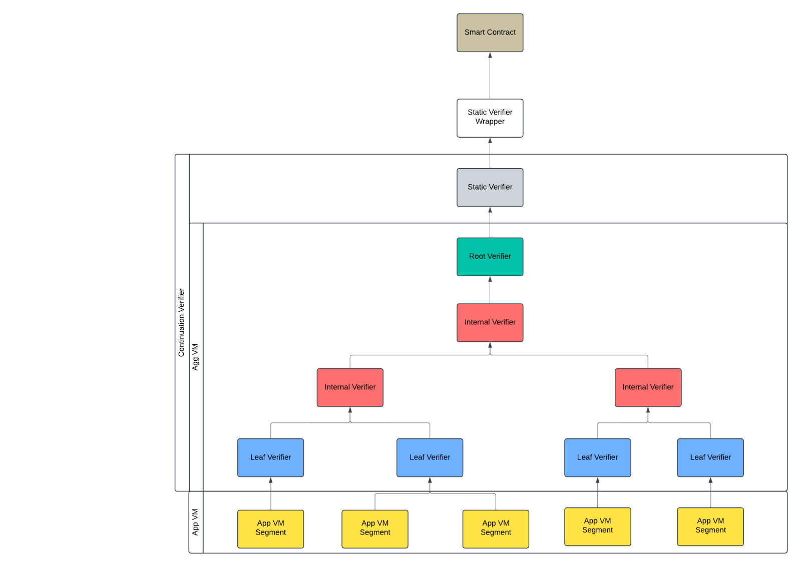
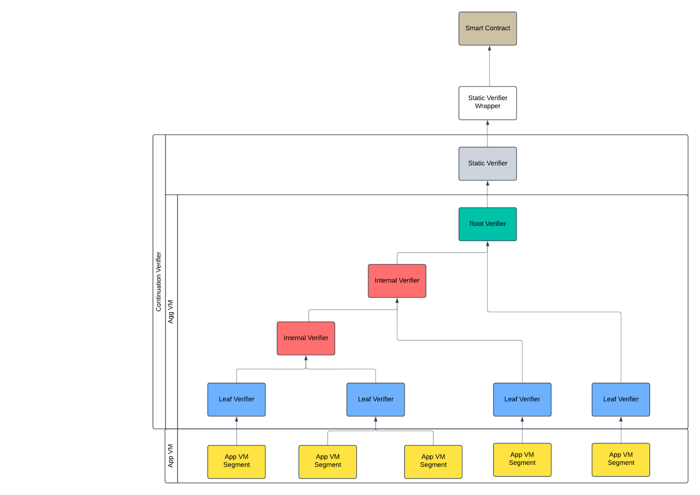
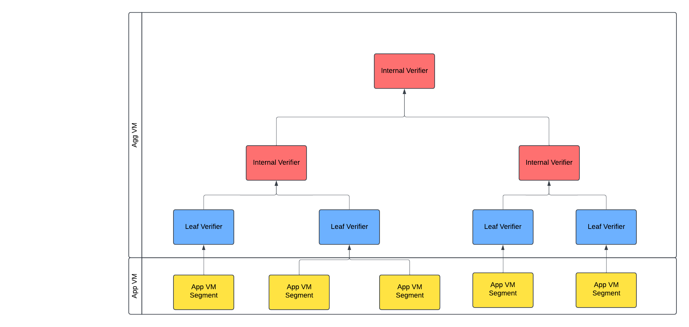

# Aggregation

Given the execution segments of a program, each segment will be proven in parallel within a **Application VM** (App VM).
These proofs are subsequently aggregated into an aggregation tree by a **leaf aggregation
program**. This segment aggregation program runs inside _a different VM_, referred to as the **Aggregation VM** (Agg
VM), which operates without continuations enabled.

The aggregation program takes a variable number of consecutive segment proofs and consolidates them into a single proof
that captures the entire range of segments.

The following figure shows that the shape of the aggregation tree is not fixed.

In some cases, a minimal SNARK proof is not needed. We can use the following aggregation architecture to generate a
STARK proof which proves the whole execution.

We will now give an overview of the steps of the overall aggregation, starting from the final smart contract verifier
and going down to the application proof.

## Smart Contract

A smart contract is deployed by on-chain, which provides a function to verify a Halo2 proof.

## Static Verifier Wrapper

The **Static Verifier Wrapper** is a Halo2 SNARK verifier circuit generated by OpenVM. The static verifier
wrapper is determined by the following parameters:

- Number of public values
- The Aggregation VM chip constraints (but **not** the App VM chips)

Public values:
- `accumulator`: `12 * 32` bytes representing the KZG accumulator of the SNARK proof.
- `exe_commit`: one `Bn254Fr` element (as `32` bytes) for the commitment of the app executable.
- `leaf_commit`: one `Bn254Fr` element (as `32` bytes) for the commitment of the executable verifying app VM proofs.
- `user_public_values`: sequence of `num_public_values` user-defined public values, each as a `Bn254Fr` element (`32` bytes). The number of user public values is a VM configuration parameter.

## Continuation Verifier

The continuation verifier is a Halo2 circuit (static verifier) together with some single segment VM circuits (Agg VM).
The continuation verifier depends on the specific circuit design of the static verifier and Aggregation VM, as well as
the number of user public values, but it does not depend on the App VM's circuit.

The continuation verifier ensures that a set of ordered App VM segment proofs collectively validates the execution of a
specific `VmExe` on a specific App VM, with given inputs.

### Static Verifier

The Static Verifier is a Halo2 verifier circuit that validates a Root VM Verifier proof and exposes its public values.

Static Verifier Requirements:

- The height of each trace is fixed.
- Trace heights are in a descending order.

Parameters (which could result in a different circuit):

- Number of public values (from upstream)
- k in Halo2 (determines the number of columns in the circuit)
- Root VM verifier
  - VK (including the heights of all traces)
  - Root verifier program commitment

Public values:
- `exe_commit`: one `Bn254Fr` element (as `32` bytes) for the commitment of the app executable.
- `leaf_commit`: one `Bn254Fr` element (as `32` bytes) for the commitment of the executable verifying app VM proofs.
- `user_public_values`: sequence of `num_public_values` user-defined public values, each as a `Bn254Fr` element (`32` bytes). The number of user public values is a VM configuration parameter.

### Aggregation VM

The Aggregation VM organizes proofs into an aggregation tree, where nodes include:

- Root VM Verifier
- Internal VM Verifier
- Leaf VM Verifier

Each node can have an arbitrary number of children, enabling flexible tree structures to optimize for cost reduction
(more children) or latency reduction (less children) during proving.

### Root VM Verifier

The Root VM Verifier is proven in RootConfig, using commitments via Bn254Poseidon2. All traces are padded to a constant
height for verification.

The Root VM Verifier verifies 1 or more proofs of:

- Leaf VM Verifier
- Internal VM Verifier

In practice, Root VM verifier only verifies one proof to guarantee constant heights.

Input:

- Root input (`RootVmVerifierInput<SC>` containing proofs and public values)

Output:

- `Proof<RootSC>`

Cached Trace Commit:

- `ProgramAir`: commits the root verifier program

Public Values (`RootVmVerifierPvs`):
  - `exe_commit: [F; DIGEST_SIZE]` - Original program execution commitment
  - `leaf_verifier_commit: [F; DIGEST_SIZE]` - Commitment to leaf verifier program
  - `public_values: Vec<F>` - Original user-defined public values preserved through chain

**Note:** the verifier program hardcodes the commitment to the internal program as a constant -- that is why it is not among public values.

Parameters:

- For circuit:
  - Root VM Config
- For root verifier program:
  - Root FRI parameters to compute its commitment
  - Internal verifier circuit \+ program commitment
  - Leaf verifier circuit \+ program commitment

### Internal VM Verifier

The Internal VM Verifier validates one or more proofs of:

- Leaf VM Verifier
- Internal VM Verifier

Input:

- `Vec<Proof<SC>>` (Leaf of other internal proofs)

Output:

- `Proof<SC>`

Cached Trace Commit:

- `ProgramAir`: commits the internal verifier program. `agg_vm_pk` contains it.

Public Values (`InternalVmVerifierPvs`):
  - `vm_verifier_pvs: VmVerifierPvs<F>` - See below
  - `extra_pvs: InternalVmVerifierExtraPvs<F>`:
    - `leaf_verifier_commit: [F; DIGEST_SIZE]` - The commitment of the leaf verifier program
    - `internal_program_commit: [F; DIGEST_SIZE]` - The commitment of the internal program

Parameters:

- For circuit:
  - Internal VM Config
- For root verifier program:
  - Internal FRI parameters to compute its commitment
  - Internal verifier circuit \+ program commitment
  - Leaf verifier circuit \+ program commitment

### Leaf VM Verifier

Verify 1 or more proofs of:

- segment circuits

Input:

- `ContinuationVmProof<SC>`

Output:

- `Vec<Proof<SC>>`

Cached Trace Commit:

- ProgramAir: commits the leaf verifier program. The leaf verifier program commits .

Public Values (`VmVerifierPvs`):
  - `app_commit: [F; DIGEST_SIZE]` - Commitment to program code
  - `connector`: Contains execution metadata:
    - `is_terminate: F` - Flag indicating if execution terminated
    - `initial_pc: F` - Starting program counter
    - `final_pc: F` - Final program counter
    - `exit_code: F` - Program exit code (0=success)
  - `memory`: Contains memory state information:
    - `initial_root: [F; DIGEST_SIZE]` - Merkle root of initial memory
    - `final_root: [F; DIGEST_SIZE]` - Merkle root of final memory
  - `public_values_commit: [F; DIGEST_SIZE]` - Merkle root of the subtree corresponding to the user public values

Parameters:

- For circuit:
  - Leaf VM Config
- For leaf verifier program:
  - It’s not a part of the Continuation Verifier because it depends on the VK of the App VM and it doesn’t affect the VK
    of the static verifier.

### App VM

App VM executes an executable with inputs and returns a list of segment proofs.

## Segment

Input:

- App VM input stream (`StdIn`)

Output: `ContinuationVmProof<SC>` containing:
  - `per_segment`: Collection of STARK proofs for each execution segment
  - `user_public_values`: Merkle proof of public values from memory Merkle root

Cached Trace Commit:

- ProgramAir: commits the program the App VM executed.

Public values:

- `VmConnectorPvs`
- `MemoryMerklePvs`

User Public Values:

- Up to `num_public_values` public values in a dedicated memory space. These public values are not exposed as public
  values of segment circuits, but will be exposed by the final proof.

Parameters:

- Number of public values (from upstream)
- For circuit:
  - App VM Config
- For App program:
  - App FRI parameters to compute its commitment.

# Continuations

Our high-level continuations framework follows previous standard designs (Starkware, Risc0), but uses a novel persistent
memory argument.

The overall runtime execution of a program is broken into **segments** (the logic of when to segment can be custom and
depend on many factors). Each segment is proven in a separate STARK VM circuit as described
in [Circuit Architecture](./circuit.md). The public values of the circuit must contain the pre- and post-state commitments
to the segment. The state consists of the active program counter and the full state of memory. (Recall in our
architecture that registers are part of memory, so register state is included in memory state).

While the runtime execution must be serial, we intend for the proofs of each VM segment circuit to be maximally
parallelizable. Therefore, we do **not** allow any shared randomness between different segment circuits.

## Persistent Memory

### Motivation

Inside a VM segment, we have a `PersistentBoundaryChip` chip, which verifies, with respect to the pre-state commitment,
the memory values for all addresses accessed in the segment and writes them into the `MEMORY_BUS` at timestamp 0.
Similarly, the chip verifies, with respect to the post-state commitment, the memory values for all addresses accessed
in the segment and reads them into the `MEMORY_BUS` at their final timestamps.

Thus the primary goal is an efficient commitment and verification format for the memory state. We designed our
persistent memory commitment such that the cost of verification is almost-linear in the
number of accesses done within the segment and logarithmic in the total size of memory used across all segments. As far
as we know, all known solutions that achieve this use Merkle trees in some form.

The basic design is to represent memory as a key-value store using a binary Merkle trie. The verification of an access
requires a Merkle proof, which takes time logarithmic in the total size of the tree. Previous optimizations assume
locality of memory accesses and use higher-arity Merkle tries to emulate page tables.

We present a design which does not assume any memory access patterns while still amortizing the Merkle proof cost across
multiple accesses.

### Design

Persistent memory requires three chips: the `PersistentBoundaryChip`, the `MemoryMerkleChip`, and a chip to assist in
hashing, which is by default the `Poseidon2Chip`. To simplify the discussion, define constants `C` equal to the number
of field elements in a hash value, `L` where the addresses in an address space are $0..2^L$, `M` and `ADDR_SPACE_OFFSET`
where the address spaces are `ADDR_SPACE_OFFSET..ADDR_SPACE_OFFSET + 2^M`, and `H = M + L - log2(C)`. `H` is the height
of the Merkle tree in the sense that the leaves are at distance `H` from the root. We define the following interactions:

On the MERKLE_BUS, we have interactions of the form
**(expand_direction: {-1, 0, 1}, height: F, labels: (F, F), hash: [F; C])**, where

- **expand_direction** represents whether **hash** is the initial (1) or final (-1) hash value of the node represented
  by **node_label**. If zero, the row is a dummy row.
- **height** indicates the height of the node represented in this interaction, i.e. `H` - its depth. `H = 0` indicates
  that a node is a leaf.
- **labels = (as_label, address_label)** are labels of the node. Concatenating the labels (or
  `as_label << address_bits + address_label`) produces the full label. The root has full label equal to 0. If a node has
  full label `x`, then its left child has label `2x` and its right child has label either `2x + 1`. We split the full
  label into `(as_label, address_label)` so that (1) we immediately have the address space and address and (2) do not
  overflow the field characteristic.
- **hash** is the hash value of the node represented by the interaction.

Rows that correspond to initial/final memory states are sent to the `MEMORY_BUS` with the corresponding timestamps and
data, as per the `MEMORY_BUS` interface.

We send the above interactions when we know the value and receive them when we would like to know the values. Below, the
frequency is 1 unless otherwise specified.

Each (IO part of a) row in the `MemoryMerkleChip` trace contains the fields
**(height, parent_labels, parent_hash, left_child_labels, left_hash, right_child_labels, right_hash)**
and has the following interactions:

- Send **(expand_direction, height + 1, parent_labels, parent_hash)**
  on MERKLE_BUS with multiplicity `expand_direction`
- Receive **(expand_direction, height, left_child_labels, left_hash)**
  on MERKLE_BUS with multiplicity `expand_direction`
- Receive **(expand_direction, height, right_child_labels, right_hash)**
  on MERKLE_BUS with multiplicity `expand_direction`

The `PersistentBoundaryChip` has rows of the form
`(expand_direction, address_space, leaf_label, values, hash, timestamp)`
and has the following interactions on the MERKLE_BUS:

- Send **(1, 0, (as - ADDR_SPACE_OFFSET) \* 2^L, node\*label, hash_initial)**
- Receive **(-1, 0, (as - ADDR_SPACE_OFFSET) \* 2^L, node_label, hash_final)**

It receives `values` from the `MEMORY_BUS` and constrains `hash = compress(values, 0)` via the `POSEIDON2_DIRECT_BUS`.
The aggregation program takes a variable number of consecutive segment proofs and consolidates them into a single proof
