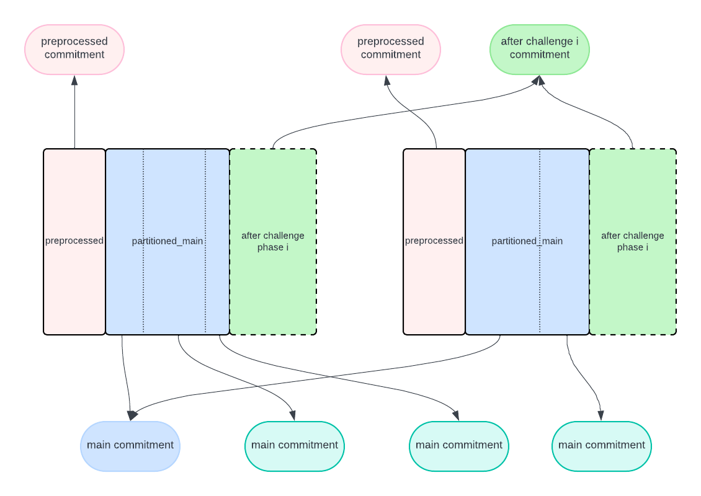

# STARK Backend

The backend is a low-level API built on top of Plonky3. Its goal is to prove multiple STARKs presented in the form of multiple RAPs and their trace matrices.
The backend is not intended to own trace generation, with some caveats (see Interactive AIRs below).

## RAPs

A RAP is a Randomized AIR with Preprocessing. An AIR is an Algebraic Intermediate Representation. A RAP can be summarized as a way to specify certain specific gates on
a trace matrix, where the trace matrix is segmented as follows:

where

- preprocessed columns are fixed and do not change depending on the inputs
- main columns are values the prover fills in on a per-proof basis, and the values can depend on inputs
- there may be additional columns corresponding to trace challenge phases: in each such phase (if any), the prover generates some random challenges via Fiat-Shamir, after observing commitments to all columns in previous phases, including preprocessed and main. The RAP may then define constraints that use these random challenges as constants. Note that all `after_challenge` columns must be in the extension field.
- constraints may depend on `public_values` which are viewable by prover and verifier
- there may also be other `exposed_values_after_challenge` which are shared by both the prover and verifier. These values are public values that depend on the random challenges in each phase.

Traditionally in STARKs, the preprocessed trace sub-matrix is committed into a single commitment. The main trace sub-matrix is committed into another **single** commitment.
The sub-matrix in each phase of the `after_challenge` trace is committed into another
single commitment. This uses a Matrix Commitment which commits to a matrix in-batch,
instead of a single vector.

To support _cached trace_, we extend the RAP interface to further allow **partitioning**
the main trace matrix into sub-matrices, where each sub-matrix can be committed to
separately.

Currently we only see a use case for partitioning the main trace matrix, and none of the other segments.

## Multiple STARKs

The backend supports the simultaenous proving of a system of multiple RAPs with trace matrices of different heights and widths. This brings additional nuance because Plonky3
supports the notion of a Mixed Matrix Commitment Scheme (MMCS), which allows the
simultaneous commitment to a set of matrices of different heights.

The backend currently supports the following:

- The preprocessed trace of each RAP is committed to individually.
  - The motivation is to allow switching out subsets of RAPs in the system flexibly.
  - If needed, it is possible to specify sets of RAPs that are always associated, so their preprocessed trace are always committed together
- There is a set of main trace multi-matrix commitments shared amongst all RAPs, where
  each part in the partition of the main trace of each RAP can belong to any of these commitments. The expectation is that most parts all share a single commitment, but
  parts of the trace that can be cached should have its own dedicated commitment.
- For each trace challenge phase, all trace matrices in that phase across all RAPs are
  committed together.

Due to the need to support cached trace, the backend does not fully own the
trace commitment process, although it does provide simple APIs to assist the process.

Given RAPs with all traces committed, the backend prover handles computations
and commitment of quotient polynomials and FRI commit and query phases.

## Interactive AIRs

There is currently no frontend to write general RAPs (e.g., a `RapBuilder`), although
it is not difficult to add one.

Instead, only a special type of RAP is supported: an AIR with Interactions.
An AIR with preprocessed and main trace can be extended to a RAP
with one challenge phase via the [Interactions API](./interaction/README.md).

The backend currently has special support for Interactive AIRs, and completely owns
the generation of the trace in the challenge phase for these RAPs -- for reference,
Plonky3 refers to this phase's trace as the **permutation** trace.

To fully support the Interaction API, the verifier also does a final cumulative
sum check. This can be framed as an additional operation to perform on the per-RAP
exposed values after the challenge phase.

## TODO

Codify special verifier instructions for operations that should be performed on
public values and exposed values, in a serializable way.
These instructions should be extended to equality constraints between public values
and trace commitments.
